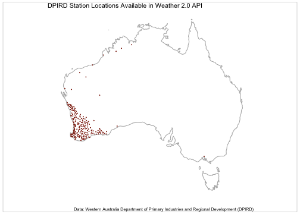
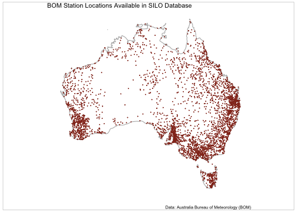

## Introduction

{weatherOz} provides automated downloading, parsing, and formatting of weather data for Australia through API endpoints provided by the Department of Primary Industries and Regional Development (DPIRD) of Western Australia, and by the Science and Technology Division of the Queensland Government's Department of Environment and Science (DES).
As well as Australian Government Bureau of Meteorology ('BOM') précis and coastal forecasts, agriculture bulletin data, and downloading and importing radar and satellite imagery files.

DPIRD weather data are accessed through public APIs provided by DPIRD, <https://www.agric.wa.gov.au/weather-api-20>, providing access to weather station data from DPIRD's own weather station network.
Detailed information on using {weatherOz} with DPIRD data is available in the [weatherOz for the DPIRD Weather 2.0 API](weatherOz_for_DPIRD.html) vignette.

Australia-wide weather data are based on data from the Australian Bureau of Meteorology (BOM) data and accessed through SILO (Scientific Information for Land Owners) (Jeffery et al., 2001).
More details on using {weatherOz} with SILO data are available in the [weatherOz for the SILO API](weatherOz_for_SILO.html) vignette.

The BOM also serves several types of data data as XML, JSON and SHTML files. This package fetches these files, parses them and return a data frame.
Satellite and radar imagery files are also made available to the public via anonymous FTP.
{weatherOz} provides functionality to query, fetch and create `terra::SpatRaster()` or {stars} objects of GeoTIFF satellite imagery or a {magick} object of radar image.png files.
For detailed information on using {weatherOz} with BOM data, please see the [weatherOz for BOM Data Resources](weatherOz_for_BOM.html) vignette.

Following is a quick demonstration of some common tasks that you may wish to undertake while using {weatherOz}.

## A Note on API Keys

All examples in this vignette assume that you have stored your API key in your .Renviron file.
See [Chapter 8](https://rstats.wtf/r-startup.html#renviron) in "What They Forgot to Teach You About R" by Bryan _et al._ for more on storing details in your .Renviron if you are unfamiliar.

## Using {weatherOz} to Fetch Daily Summary DPIRD Data

Daily summary weather data is frequently used.
The following example will demonstrate how you can find and download weather station data for stations in or near Northam, WA for the year of 2022.
This example assumes that you have stored your DPIRD API key in your .Renviron file.


``` r
library(weatherOz)
#> 
#> Attaching package: 'weatherOz'
#> The following object is masked from 'package:graphics':
#> 
#>     plot
#> The following object is masked from 'package:base':
#> 
#>     plot
```

``` r

Northam <-
  find_nearby_stations(
    longitude = 116.6620,
    latitude = -31.6540,
    which_api = "dpird",
    api_key = Sys.getenv("DPIRD_API_KEY"),
    distance_km = 20
  )

Northam
#>    station_code station_name longitude  latitude  state elev_m
#>          <fctr>       <char>     <num>     <num> <char>  <int>
#> 1:           NO      Northam  116.6942 -31.65161     WA    163
#> 2:           MK       Muresk  116.6913 -31.72772     WA    251
#>                                                                   owner
#>                                                                  <char>
#> 1: WA Department of Primary Industries and Regional Development (DPIRD)
#> 2: WA Department of Primary Industries and Regional Development (DPIRD)
#>    distance_km
#>          <num>
#> 1:        3.23
#> 2:        7.93
```

There are two stations within 20km of the coordinates for Northam, WA that we provided.
We'll choose the closest, Northam, station_code NO to fetch the daily weather data for all air temperature, rainfall and relative humidity values.


``` r
dpird_daily <- get_dpird_summaries(
  station_code = "NO",
  start_date = "2022-01-01",
  end_date = "2022-12-31",
  values = c("airTemperature", "rainfall", "relativeHumidity"),
  api_key = Sys.getenv("DPIRD_API_KEY")
)

dpird_daily
#> Key: <station_code>
#>      station_code station_name longitude  latitude  year month   day       date
#>            <fctr>       <char>     <num>     <num> <int> <int> <int>     <Date>
#>   1:           NO      Northam  116.6942 -31.65161  2022     1     1 2022-01-01
#>   2:           NO      Northam  116.6942 -31.65161  2022     1     2 2022-01-02
#>   3:           NO      Northam  116.6942 -31.65161  2022     1     3 2022-01-03
#>   4:           NO      Northam  116.6942 -31.65161  2022     1     4 2022-01-04
#>   5:           NO      Northam  116.6942 -31.65161  2022     1     5 2022-01-05
#>  ---                                                                           
#> 361:           NO      Northam  116.6942 -31.65161  2022    12    27 2022-12-27
#> 362:           NO      Northam  116.6942 -31.65161  2022    12    28 2022-12-28
#> 363:           NO      Northam  116.6942 -31.65161  2022    12    29 2022-12-29
#> 364:           NO      Northam  116.6942 -31.65161  2022    12    30 2022-12-30
#> 365:           NO      Northam  116.6942 -31.65161  2022    12    31 2022-12-31
#>      air_tavg air_tmax       air_tmax_time air_tmin       air_tmin_time
#>         <num>    <num>              <POSc>    <num>              <POSc>
#>   1:     23.8     32.5 2022-01-01 17:02:00     16.7 2022-01-01 05:17:00
#>   2:     25.4     36.1 2022-01-02 16:58:00     14.4 2022-01-02 05:19:00
#>   3:     28.0     39.9 2022-01-03 14:42:00     16.6 2022-01-03 05:18:00
#>   4:     26.1     36.3 2022-01-04 15:15:00     17.3 2022-01-04 04:22:00
#>   5:     27.3     39.1 2022-01-05 16:19:00     16.1 2022-01-05 05:14:00
#>  ---                                                                   
#> 361:     23.0     40.2 2022-12-27 14:48:20     13.7 2022-12-27 05:13:20
#> 362:     22.2     40.5 2022-12-28 19:58:20     11.9 2022-12-28 05:33:20
#> 363:     26.0     40.2 2022-12-30 03:03:20     13.8 2022-12-29 05:01:40
#> 364:     26.6     39.2 2022-12-30 13:50:50     14.5 2022-12-30 04:52:30
#> 365:     22.7     31.1 2022-12-31 15:45:50     16.2 2022-12-31 05:23:20
#>      rainfall rh_avg rh_tmax        rh_tmax_time rh_tmin        rh_tmin_time
#>         <num>  <num>   <num>              <POSc>   <num>              <POSc>
#>   1:        0   39.9    71.5 2022-01-01 04:10:00    14.5 2022-01-01 18:03:00
#>   2:        0   35.2    63.8 2022-01-02 05:39:00    16.4 2022-01-02 16:58:00
#>   3:        0   38.0    68.5 2022-01-03 05:22:00    14.4 2022-01-03 16:15:00
#>   4:        0   45.9    74.2 2022-01-04 04:33:00    20.1 2022-01-04 16:35:00
#>   5:        0   42.1    77.2 2022-01-05 05:22:00    14.4 2022-01-05 17:21:00
#>  ---                                                                        
#> 361:        0   41.8    81.1 2022-12-26 16:03:20    14.6 2022-12-27 16:47:30
#> 362:        0   32.8    65.4 2022-12-28 05:35:00     9.2 2022-12-28 16:11:40
#> 363:        0   29.2    62.5 2022-12-29 05:08:20     9.5 2022-12-29 17:31:40
#> 364:        0   34.4    61.2 2022-12-30 05:06:40     7.9 2022-12-30 14:00:00
#> 365:        0   59.0    98.9 2022-12-31 05:30:00    24.7 2022-12-31 16:01:40
```

## Using {weatherOz} to Fetch Patched Point SILO Data

Daily weather station observations with interpolated missing values are available from SILO.
The following example will demonstrate how you can find and download weather station data for stations in or near Toowoomba, Qld for the year of 2022.
This example assumes that you have stored your SILO API key (email address) in your .Renviron file.


``` r
library(weatherOz)

Tbar <-
  find_nearby_stations(
    longitude = 151.9507,
    latitude = -27.5598,
    which_api = "silo",
    api_key = Sys.getenv("SILO_API_KEY"),
    distance_km = 20
  )
#> No SILO stations found within a radius of <20 km
#>  from coordinates 151.9507 and -27.5598 (lon/lat).
```

``` r

Tbar
#> NULL
```

There are 11 stations within 20km of the coordinates for Toowoomba, Qld that we provided in the SILO database.
We'll choose the closest, Toowoomba, station_code 041103 to fetch the daily weather data for all air temperature, rainfall and relative humidity values.


``` r
ppd <- get_patched_point(
  station_code = "041103",
  start_date = "2022-01-01",
  end_date = "2022-12-31",
  values = c("max_temp", "min_temp", "rain", "rh_tmax", "rh_tmin"),
  api_key = Sys.getenv("SILO_API_KEY")
)

ppd
#>      station_code station_name  year month   day       date air_tmax
#>            <fctr>       <char> <num> <num> <int>     <Date>    <num>
#>   1:       041103    Toowoomba  2022     1     1 2022-01-01     22.8
#>   2:       041103    Toowoomba  2022     1     2 2022-01-02     27.7
#>   3:       041103    Toowoomba  2022     1     3 2022-01-03     29.4
#>   4:       041103    Toowoomba  2022     1     4 2022-01-04     30.0
#>   5:       041103    Toowoomba  2022     1     5 2022-01-05     29.5
#>  ---                                                                
#> 361:       041103    Toowoomba  2022    12    27 2022-12-27     26.2
#> 362:       041103    Toowoomba  2022    12    28 2022-12-28     26.7
#> 363:       041103    Toowoomba  2022    12    29 2022-12-29     27.6
#> 364:       041103    Toowoomba  2022    12    30 2022-12-30     27.0
#> 365:       041103    Toowoomba  2022    12    31 2022-12-31     27.7
#>      air_tmax_source air_tmin air_tmin_source  elev_m  extracted latitude
#>                <int>    <num>           <int>  <char>     <Date>    <num>
#>   1:              25     16.6              25 691.0 m 2024-05-20 -27.5836
#>   2:              25     14.2              25 691.0 m 2024-05-20 -27.5836
#>   3:              25     13.8              25 691.0 m 2024-05-20 -27.5836
#>   4:              25     16.8              25 691.0 m 2024-05-20 -27.5836
#>   5:              25     17.5              25 691.0 m 2024-05-20 -27.5836
#>  ---                                                                     
#> 361:              25     15.1              25 691.0 m 2024-05-20 -27.5836
#> 362:              25     13.0              25 691.0 m 2024-05-20 -27.5836
#> 363:              25     14.1              25 691.0 m 2024-05-20 -27.5836
#> 364:              25     17.0              25 691.0 m 2024-05-20 -27.5836
#> 365:              25     16.4              25 691.0 m 2024-05-20 -27.5836
#>      longitude rainfall rainfall_source rh_tmax rh_tmax_source rh_tmin
#>          <num>    <num>           <int>   <num>          <int>   <num>
#>   1:  151.9317      7.6              25    72.1             26   100.0
#>   2:  151.9317      0.1              25    47.1             26   100.0
#>   3:  151.9317      0.0              25    38.8             26   100.0
#>   4:  151.9317      0.0              25    43.1             26    95.7
#>   5:  151.9317      0.0              25    49.2             26   100.0
#>  ---                                                                  
#> 361:  151.9317      0.0              25    47.9             26    95.0
#> 362:  151.9317      0.2              25    43.7             26   100.0
#> 363:  151.9317      0.0              25    44.1             26   100.0
#> 364:  151.9317      0.7              25    60.3             26   100.0
#> 365:  151.9317      0.4              25    50.9             26   100.0
#>      rh_tmin_source
#>               <int>
#>   1:             26
#>   2:             26
#>   3:             26
#>   4:             26
#>   5:             26
#>  ---               
#> 361:             26
#> 362:             26
#> 363:             26
#> 364:             26
#> 365:             26
```

{weatherOz} offers much more functionality that is detailed in other vignettes that document how to use it to get station metadata for any station in the DPIRD or SILO databases, get extreme weather events for the DPIRD station network, get minute data for DPIRD stations, get APSIM formatted data from SILO, get ag bulletins, précis forecasts and various imagery files from BOM in the respective vignettes for DPIRD, SILO and BOM data available through {weatherOz}.

## Appendix 1 - Map of DPIRD Station Locations


``` r

# this chunk assumes that you have your DPIRD API key in your .Renviron file

if (requireNamespace("ggplot2", quietly = TRUE) &&
    requireNamespace("ggthemes", quietly = TRUE) &&
    requireNamespace("gridExtra", quietly = TRUE) &&
    requireNamespace("grid", quietly = TRUE) &&
    requireNamespace("maps", quietly = TRUE)) {
  library(ggplot2)
  library(mapproj)
  library(maps)
  library(ggthemes)
  library(grid)
  library(gridExtra)
  library(dplyr)

  dpird_stations <-
    get_stations_metadata(which_api = "DPIRD",
                         api_key = Sys.getenv("DPIRD_API_KEY")) |>
                         filter_at(vars(latitude, longitude),
                         all_vars(!is.na(.)))

  Aust_map <- map_data("world", region = "Australia")

  dpird_stations <-
    ggplot(dpird_stations, aes(x = longitude, y = latitude)) +
    geom_polygon(
      data = Aust_map,
      aes(x = long, y = lat, group = group),
      color = grey(0.7),
      fill = NA
    ) +
    geom_point(color = grDevices::rgb(0.58, 0.20, 0.13),
               size = 0.09) +
    coord_map(ylim = c(-44, -10),
              xlim = c(112, 154)) +
    theme_map() +
    labs(title = "DPIRD Station Locations Available in Weather 2.0 API",
         caption = "Data: Western Australia Department of Primary Industries and Regional Development (DPIRD)")

  # Using the gridExtra and grid packages add a neatline to the map
  grid.arrange(dpird_stations, ncol = 1)
  grid.rect(
    width = 0.98,
    height = 0.98,
    gp = grid::gpar(
      lwd = 0.25,
      col = "black",
      fill = NA
    )
  )
}
```

<div class="figure" style="text-align: center">

<p class="caption">plot of chunk dpird-station-locations-map</p>
</div>

## Appendix 2 - Map of SILO Station Locations


``` r
if (requireNamespace("ggplot2", quietly = TRUE) &&
    requireNamespace("ggthemes", quietly = TRUE) &&
    requireNamespace("gridExtra", quietly = TRUE) &&
    requireNamespace("grid", quietly = TRUE) &&
    requireNamespace("maps", quietly = TRUE)) {
  library(ggplot2)
  library(mapproj)
  library(maps)
  library(ggthemes)
  library(grid)
  library(gridExtra)

  silo_stations <- get_stations_metadata(which_api = "SILO") |>
                         filter_at(vars(latitude, longitude),
                         all_vars(!is.na(.)))

  Aust_map <- map_data("world", region = "Australia")

  SILO_stations <-
    ggplot(silo_stations, aes(x = longitude, y = latitude)) +
    geom_polygon(
      data = Aust_map,
      aes(x = long, y = lat, group = group),
      color = grey(0.7),
      fill = NA
    ) +
    geom_point(color = grDevices::rgb(0.58, 0.20, 0.13),
               size = 0.09) +
    coord_map(ylim = c(-44, -10),
              xlim = c(112, 154)) +
    theme_map() +
    labs(title = "BOM Station Locations Available in SILO Database",
         caption = "Data: Australia Bureau of Meteorology (BOM)")

  # Using the gridExtra and grid packages add a neatline to the map
  grid.arrange(SILO_stations, ncol = 1)
  grid.rect(
    width = 0.98,
    height = 0.98,
    gp = grid::gpar(
      lwd = 0.25,
      col = "black",
      fill = NA
    )
  )
}
```

<div class="figure" style="text-align: center">

<p class="caption">plot of chunk silo-station-locations-map</p>
</div>
