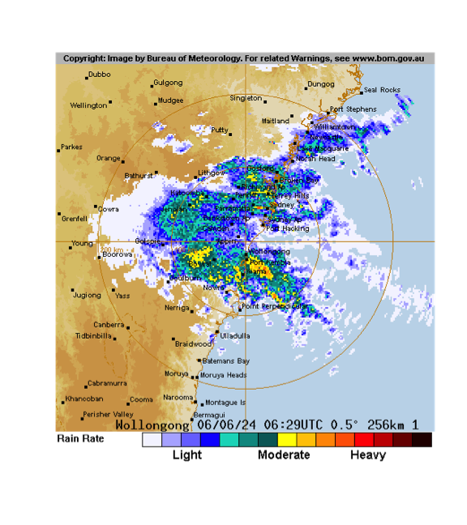

## Introduction

{weatherOz} provides automated downloading, parsing, cleaning, and formatting
of weather data for Australia through API endpoints provided by the Department
of Primary Industries and Regional Development (DPIRD) of Western Australia,
and by the Science and Technology Division of the Queensland Government's
Department of Environment and Science (DES).
As well as Australian Government Bureau of Meteorology ('BOM') précis and
coastal forecasts, agriculture bulletin data, and downloading and importing
radar and satellite imagery files.
DPIRD weather data are accessed through public APIs provided by DPIRD,
<https://www.agric.wa.gov.au/weather-api-20>, providing access to weather
station data from DPIRD's own weather station network.
Australia-wide weather data are based on data from the Australian Bureau of
Meteorology (BOM) data and accessed through SILO (Scientific Information for
Land Owners) (Jeffery et al., 2001).
BOM also serves several types of data data as XML, JSON and SHTML files.
This package fetches these files, parses them and return a data frame.
Satellite and radar imagery files are also made available to the public via anonymous FTP.
{weatherOz} provides functionality to query, fetch and create `terra::SpatRaster()` objects of the GeoTIFF imagery or a magick object of radar image.png files.

## Using {weatherOz}

Several functions are provided by {weatherOz} to retrieve Australian Bureau of Meteorology (BOM) data.
A family of functions retrieve weather data and return data frames;
 * `get_precis_forecast()`, which retrieves the précis (short) forecast;
 * `get_ag_bulletin()`, which retrieves the agriculture bulletin;
 * `get_coastal_forecast()`, which fetches coastal waters forecasts for each state; and
A second family of functions retrieve information pertaining to satellite and radar imagery, `get_available_imagery()` and the imagery itself, `_imagery()` for satellite, and `get_available_radar()` and `get_radar_imagery()` for radar images.
The last group functions provides internal functionality for {weatherOz} itself; `update_forecast_towns()`, which updates an internal database of forecast locations distributed with the package, `update_ag_station_locations()`, which updates an internal database of the stations reporting ag bulletins and `find_forecast_towns()` and find_nearby_stations()` which returns either the closest forecast locations or the nearest weather stations with an ag bulletin to a given point in Australia.

## Using get_precis_forecast()

This function only takes one argument, `state`. The `state` parameter allows the user to select the forecast for just one state or a national forecast.
States or territories are specified using the official postal codes or full name with fuzzy matching performed via `agrep()`.

- **ACT** - Australian Capital Territory

- **NSW** - New South Wales

- **NT** - Northern Territory

- **QLD** - Queensland

- **SA** - South Australia

- **TAS** - Tasmania

- **VIC** - Victoria

- **WA** - Western Australia

- **AUS** - Australia, returns national forecast including all states, NT and ACT.

### Results

The function, `get_precis_forecast()`, will return a data frame of the weather forecast for the daily forecast for selected towns.
See Appendix 1 for a full description of the fields and values.

### Example

Following is an example fetching the forecast for Queensland.


```r
(QLD_forecast <- get_precis_forecast(state = "QLD"))
#>   -----------  Australian Bureau of Meteorology (BOM) Précis Forecast. -
#>   The HTML version of Short Form (Précis) Forecast for 
#>   QLD can be found at:
#>   <http://www.bom.gov.au/qld/forecasts/state.shtml>
#>   Please note information at the page 
#>   <http://www.bom.gov.au/catalogue/data-feeds.shtml#precis>
#>   --------------------------------------------------------------------------------  
#>      index product_id state         town       aac       lat      lon elev    start_time_local
#>   1:     0   IDQ11295   QLD     Brisbane QLD_PT001 -27.48080 153.0389  8.1 2023-04-27 09:02:03
#>   2:     1   IDQ11295   QLD     Brisbane QLD_PT001 -27.48080 153.0389  8.1 2023-04-28 00:00:00
#>   3:     2   IDQ11295   QLD     Brisbane QLD_PT001 -27.48080 153.0389  8.1 2023-04-29 00:00:00
#>   4:     3   IDQ11295   QLD     Brisbane QLD_PT001 -27.48080 153.0389  8.1 2023-04-30 00:00:00
#>   5:     4   IDQ11295   QLD     Brisbane QLD_PT001 -27.48080 153.0389  8.1 2023-05-01 00:00:00
#>  ---                                                                                          
#> 787:     2   IDQ11295   QLD Port Douglas QLD_PT254 -16.48681 145.4635 70.4 2023-04-29 00:00:00
#> 788:     3   IDQ11295   QLD Port Douglas QLD_PT254 -16.48681 145.4635 70.4 2023-04-30 00:00:00
#> 789:     4   IDQ11295   QLD Port Douglas QLD_PT254 -16.48681 145.4635 70.4 2023-05-01 00:00:00
#> 790:     5   IDQ11295   QLD Port Douglas QLD_PT254 -16.48681 145.4635 70.4 2023-05-02 00:00:00
#> 791:     6   IDQ11295   QLD Port Douglas QLD_PT254 -16.48681 145.4635 70.4 2023-05-03 00:00:00
#>      end_time_local utc_offset      start_time_utc        end_time_utc minimum_temperature
#>   1:     2023-04-28      10:00 2023-04-26 23:02:03 2023-04-27 14:00:00                  NA
#>   2:     2023-04-29      10:00 2023-04-27 14:00:00 2023-04-28 14:00:00                  17
#>   3:     2023-04-30      10:00 2023-04-28 14:00:00 2023-04-29 14:00:00                  15
#>   4:     2023-05-01      10:00 2023-04-29 14:00:00 2023-04-30 14:00:00                  17
#>   5:     2023-05-02      10:00 2023-04-30 14:00:00 2023-05-01 14:00:00                  14
#>  ---                                                                                      
#> 787:     2023-04-30      10:00 2023-04-28 14:00:00 2023-04-29 14:00:00                  21
#> 788:     2023-05-01      10:00 2023-04-29 14:00:00 2023-04-30 14:00:00                  21
#> 789:     2023-05-02      10:00 2023-04-30 14:00:00 2023-05-01 14:00:00                  21
#> 790:     2023-05-03      10:00 2023-05-01 14:00:00 2023-05-02 14:00:00                  22
#> 791:     2023-05-04      10:00 2023-05-02 14:00:00 2023-05-03 14:00:00                  22
#>      maximum_temperature lower_precipitation_limit upper_precipitation_limit              precis
#>   1:                  25                         0                         2      Shower or two.
#>   2:                  25                         0                         1      Shower or two.
#>   3:                  25                         0                         4 Showers developing.
#>   4:                  26                         0                         3      Shower or two.
#>   5:                  26                        NA                        NA              Sunny.
#>  ---                                                                                            
#> 787:                  29                        NA                        NA       Mostly sunny.
#> 788:                  30                        NA                        NA       Mostly sunny.
#> 789:                  30                        NA                        NA       Mostly sunny.
#> 790:                  30                         0                         1      Partly cloudy.
#> 791:                  30                         0                         1      Partly cloudy.
#>      probability_of_precipitation
#>   1:                           70
#>   2:                           70
#>   3:                           80
#>   4:                           60
#>   5:                           10
#>  ---                             
#> 787:                           20
#> 788:                           20
#> 789:                           20
#> 790:                           30
#> 791:                           30
```


## Using get_ag_bulletin()

`get_ag_bulletin()` only takes one argument, `state`.
The `state` parameter allows the user to select the bulletin for just one state or a national forecast.
States or territories are specified using the official postal codes or full name with fuzzy matching performed via `agrep()`.

- **NSW** - New South Wales

- **NT** - Northern Territory

- **QLD** - Queensland

- **SA** - South Australia

- **TAS** - Tasmania

- **VIC** - Victoria

- **WA** - Western Australia

- **AUS** - Australia, returns bulletin for all states and NT.

### Results

The function, `get_ag_bulletin()`, will return a data frame of the agriculture bulletin for selected stations.
See Appendix 3 for a full list and description of the fields and values.

### Example

Following is an example fetching the ag bulletin for Queensland.


```r
(QLD_bulletin <- get_ag_bulletin(state = "QLD"))
#>   -----------  Australian Bureau of Meteorology (BOM) Ag Bulletin. -----------
#>   Please note information at the foot of:
#>   <http://www.bom.gov.au/cgi-bin/wrap_fwo.pl?IDQ60604.html>
#>   the HTML version of Agricultural Observations Bulletin for 
#>   QLD.  Also see: 
#>   <http://www.bom.gov.au/catalogue/observations/about-agricultural.shtml>.
#>   ----------------------------------------------------------------------------  
#>     product_id state dist                      name   wmo  site              station      obs_time_local
#>  1:   IDQ60604   QLD   27                WEIPA AERO 94170 27045                Weipa 2023-04-27 09:00:00
#>  2:   IDQ60604   QLD   29            MOUNT ISA AERO 94332 29127            Mount Isa 2023-04-27 09:00:00
#>  3:   IDQ60604   QLD   30        GEORGETOWN AIRPORT 94274 30124   Georgetown Airport 2023-04-27 09:00:00
#>  4:   IDQ60604   QLD   31               CAIRNS AERO 94287 31011               Cairns 2023-04-27 09:00:00
#>  5:   IDQ60604   QLD   31 WALKAMIN RESEARCH STATION 95284 31108             Walkamin 2023-04-27 09:00:00
#> ---                                                                                                     
#> 25:   IDQ60604   QLD   43      MITCHELL POST OFFICE 94514 43020             Mitchell 2023-04-27 09:00:00
#> 26:   IDQ60604   QLD   43              ROMA AIRPORT 94515 43091                 Roma 2023-04-27 09:00:00
#> 27:   IDQ60604   QLD   43         ST GEORGE AIRPORT 94517 43109            St George 2023-04-27 09:00:00
#> 28:   IDQ60604   QLD   44          CHARLEVILLE AERO 94510 44021          Charleville 2023-04-27 09:00:00
#> 29:   IDQ60604   QLD   45      THARGOMINDAH AIRPORT 95492 45025 Thargomindah Airport 2023-04-27 09:00:00
#>            obs_time_utc time_zone      lat      lon  elev bar_ht start  end   r   tn   tx twd ev   tg sn
#>  1: 2023-04-26 23:00:00       EST -12.6778 141.9208  18.0   18.6  1972 2023 0.0 22.6 32.9 3.0 NA   NA NA
#>  2: 2023-04-26 23:00:00       EST -20.6778 139.4875 340.3  341.0  1966 2023 0.0 15.6 32.4 6.9 NA   NA NA
#>  3: 2023-04-26 23:00:00       EST -18.3039 143.5306 301.8  302.5  2004 2023  NA   NA   NA 5.4 NA   NA NA
#>  4: 2023-04-26 23:00:00       EST -16.8736 145.7458   2.2    2.6  1941 2023 1.2 22.0 29.5 2.1 NA   NA NA
#>  5: 2023-04-26 23:00:00       EST -17.1347 145.4281 594.0     NA  1965 2023 0.0 17.8 26.7 2.5  4 16.9 NA
#> ---                                                                                                     
#> 25: 2023-04-26 23:00:00       EST -26.4888 147.9777 336.5  338.0  1884 2023 0.0 15.1 28.6 3.7 NA 13.8 NA
#> 26: 2023-04-26 23:00:00       EST -26.5477 148.7710 307.4  307.8  1985 2023 0.0 14.7 28.2 4.6 NA   NA NA
#> 27: 2023-04-26 23:00:00       EST -28.0478 148.5957 198.5  199.1  1997 2023 0.0 13.3 27.1 4.9 NA   NA NA
#> 28: 2023-04-26 23:00:00       EST -26.4139 146.2558 301.6  303.3  1942 2023 0.0 18.3 28.5 6.7 NA   NA NA
#> 29: 2023-04-26 23:00:00       EST -27.9867 143.8150 130.9  131.4  1999 2023 0.0 17.6 29.4 9.1 NA   NA NA
#>     solr   t5  t10  t20  t50  t1m  wr
#>  1: 22.1   NA   NA   NA   NA   NA  NA
#>  2: 18.1   NA   NA   NA   NA   NA  NA
#>  3: 20.5   NA   NA   NA   NA   NA  NA
#>  4: 17.9   NA   NA   NA   NA   NA  NA
#>  5: 21.1   NA 22.1 23.9   NA   NA 253
#> ---                                  
#> 25: 17.9   NA   NA   NA   NA   NA  NA
#> 26: 18.0 21.9 18.4 19.1 21.4   NA  NA
#> 27: 17.0 23.4 23.6 24.4 25.2 26.7  NA
#> 28: 17.7   NA   NA   NA   NA   NA  NA
#> 29: 17.0   NA   NA   NA   NA   NA  NA
```

## Using get_coastal_forecast()

This function only takes one argument, `state`.
The `state` parameter allows the user to select the forecast for just one state or a national forecast.
States or territories are specified using the official postal codes or full name with fuzzy matching performed via `agrep()`

- **ACT** - Australian Capital Territory

- **NSW** - New South Wales

- **NT** - Northern Territory

- **QLD** - Queensland

- **SA** - South Australia

- **TAS** - Tasmania

- **VIC** - Victoria

- **WA** - Western Australia

- **AUS** - Australia, returns national forecast including all states, NT and ACT.

### Results

The function, `get_coastal_forecast()`, will return a data frame of the coastal waters forecast for marine zones in each state.
See Appendix 6 for a full description of the fields and values.

### Example

Following is an example fetching the forecast for Queensland.


```r
(QLD_coastal_forecast <- get_coastal_forecast(state = "QLD"))
#>   -------  Australian Bureau of Meteorology (BOM) Coastal Waters Forecast. -------
#>   Please note information at the foot of:
#>   <http://www.bom.gov.au/cgi-bin/wrap_fwo.pl?IDQ11290.html>
#>   the HTML version of Coastal Waters Forecast for 
#>   QLD.
#>   Also see 
#>   <http://www.bom.gov.au/catalogue/observations/about-coastal-observations.shtml>.
#>   --------------------------------------------------------------------------------  
#>     index product_id type state_code                                                      dist_name
#>  1:  <NA>   IDQ11290 <NA>        QLD                                                     Queensland
#>  2:  <NA>   IDQ11290 <NA>        QLD                                 Queensland Gulf of Carpentaria
#>  3:  <NA>   IDQ11290 <NA>        QLD                                               North Queensland
#>  4:  <NA>   IDQ11290 <NA>        QLD                                               South Queensland
#>  5:     0   IDQ11290 <NA>        QLD South East Gulf of Carpentaria: QLD-NT Border to Cape Keerweer
#> ---                                                                                                
#> 45:     1   IDQ11290 <NA>        QLD                Gold Coast Waters: Cape Moreton to Point Danger
#> 46:     2   IDQ11290 <NA>        QLD                Gold Coast Waters: Cape Moreton to Point Danger
#> 47:     0   IDQ11290 <NA>        QLD                             Great Barrier Reef Offshore Waters
#> 48:     1   IDQ11290 <NA>        QLD                             Great Barrier Reef Offshore Waters
#> 49:     2   IDQ11290 <NA>        QLD                             Great Barrier Reef Offshore Waters
#>     pt_1_name pt_2_name       aac    start_time_local      end_time_local utc_offset      start_time_utc
#>  1:      <NA>      <NA> QLD_FA001 2023-04-27 04:45:13 2023-04-27 04:45:13      10:00 2023-04-27 04:45:13
#>  2:      <NA>      <NA> QLD_FA002 2023-04-27 05:00:00 2023-04-27 05:00:00      10:00 2023-04-27 05:00:00
#>  3:      <NA>      <NA> QLD_FA003 2023-04-27 05:00:00 2023-04-27 05:00:00      10:00 2023-04-27 05:00:00
#>  4:      <NA>      <NA> QLD_FA004 2023-04-27 05:00:00 2023-04-27 05:00:00      10:00 2023-04-27 05:00:00
#>  5:      <NA>      <NA> QLD_MW001 2023-04-27 05:00:00 2023-04-27 05:00:00      10:00 2023-04-27 05:00:00
#> ---                                                                                                     
#> 45:      <NA>      <NA> QLD_MW014 2023-04-28 00:00:00 2023-04-28 00:00:00      10:00 2023-04-28 00:00:00
#> 46:      <NA>      <NA> QLD_MW014 2023-04-29 00:00:00 2023-04-29 00:00:00      10:00 2023-04-29 00:00:00
#> 47:      <NA>      <NA> QLD_MW015 2023-04-27 05:00:00 2023-04-27 05:00:00      10:00 2023-04-27 05:00:00
#> 48:      <NA>      <NA> QLD_MW015 2023-04-28 00:00:00 2023-04-28 00:00:00      10:00 2023-04-28 00:00:00
#> 49:      <NA>      <NA> QLD_MW015 2023-04-29 00:00:00 2023-04-29 00:00:00      10:00 2023-04-29 00:00:00
#>            end_time_utc                                                     forecast_seas
#>  1: 2023-04-27 04:45:13                                                              <NA>
#>  2: 2023-04-27 05:00:00                                                              <NA>
#>  3: 2023-04-27 05:00:00                                                              <NA>
#>  4: 2023-04-27 05:00:00                                                              <NA>
#>  5: 2023-04-27 05:00:00                                                   Around 1 metre.
#> ---                                                                                      
#> 45: 2023-04-28 00:00:00                                                   Around 1 metre.
#> 46: 2023-04-29 00:00:00                                                    Below 1 metre.
#> 47: 2023-04-27 05:00:00 1 to 1.5 metres, increasing to 1 to 2 metres north of Creal Reef.
#> 48: 2023-04-28 00:00:00                                                  1 to 1.5 metres.
#> 49: 2023-04-29 00:00:00     1 to 1.5 metres, decreasing below 1 metre during the morning.
#>                                                        forecast_weather
#>  1:                                                                <NA>
#>  2:                                                                <NA>
#>  3:                                                                <NA>
#>  4:                                                                <NA>
#>  5:                                                              Sunny.
#> ---                                                                    
#> 45:                               Partly cloudy. 70% chance of showers.
#> 46: Partly cloudy. 80% chance of showers. The chance of a thunderstorm.
#> 47:                                                       Mostly sunny.
#> 48:                                                       Mostly sunny.
#> 49:                               Partly cloudy. 50% chance of showers.
#>                                                                                                                                       forecast_winds
#>  1:                                                                                                                                             <NA>
#>  2:                                                                                                                                             <NA>
#>  3:                                                                                                                                             <NA>
#>  4:                                                                                                                                             <NA>
#>  5:                                           East to southeasterly 15 to 20 knots tending southeast to southwesterly 10 to 15 knots in the evening.
#> ---                                                                                                                                                 
#> 45: Southeasterly 10 to 15 knots, reaching up to 20 knots offshore north of Point Lookout during the morning. Winds turning easterly in the evening.
#> 46:                 East to southeasterly about 10 knots tending northeasterly 10 to 15 knots in the afternoon and tending northerly in the evening.
#> 47:                                                                                                                    Southeasterly 15 to 20 knots.
#> 48:                                                                                                                    Southeasterly 15 to 20 knots.
#> 49:                                                                 Southeasterly 15 to 20 knots turning easterly below 10 knots during the morning.
#>                                                                                         forecast_swell1
#>  1:                                                                                                <NA>
#>  2:                                                                                                <NA>
#>  3:                                                                                                <NA>
#>  4:                                                                                                <NA>
#>  5:                                                                        Northeasterly below 1 metre.
#> ---                                                                                                    
#> 45:                                                                           Easterly 2 to 2.5 metres.
#> 46:                                                                           Easterly 2 to 2.5 metres.
#> 47: East to southeasterly 1 to 1.5 metres, increasing to 2 to 2.5 metres through the Capricorn Channel.
#> 48: East to southeasterly 1 to 1.5 metres, increasing to 2 to 2.5 metres through the Capricorn Channel.
#> 49:            Easterly 1 to 1.5 metres, increasing to 1.5 to 2.5 metres through the Capricorn Channel.
#>     forecast_swell2 forecast_caution marine_forecast tropical_system_location forecast_waves
#>  1:            <NA>             <NA>            <NA>                       NA             NA
#>  2:            <NA>             <NA>            <NA>                       NA             NA
#>  3:            <NA>             <NA>            <NA>                       NA             NA
#>  4:            <NA>             <NA>            <NA>                       NA             NA
#>  5:            <NA>             <NA>            <NA>                       NA             NA
#> ---                                                                                         
#> 45:            <NA>             <NA>            <NA>                       NA             NA
#> 46:            <NA>             <NA>            <NA>                       NA             NA
#> 47:            <NA>             <NA>            <NA>                       NA             NA
#> 48:            <NA>             <NA>            <NA>                       NA             NA
#> 49:            <NA>             <NA>            <NA>                       NA             NA
```


## Using find_nearby_stations()

`sweep_for_stations()` only takes one argument, `latlon`, a length-2 numeric vector.
By default, this is Canberra (approximately).

### Results

This function will search for weather stations and return a data frame of all weather stations (in this package) sorted by distance from `latlon`, ascending.
The fields in the data frame are:

**name** - station name

**lat** - latitude (decimal degrees)

**lon** - longitude (decimal degrees)

**distance** - distance from provided `latlon` value (kilometres).

### Example 1

Following is an example sweeping for stations starting with Canberra.
Note that this code chunk is not executed due to the need of an API key.
We get the station distances in this function from the DPIRD API so you will need to supply your own API key.


```r
# Show only the first ten stations in the list
find_nearby_stations(
  latitude = -35.4,
  longitude = 149.2,
  distance_km = 10,
  api_key = YOUR_API_KEY
)
```

## Using find_forecast_towns()

`find_forecast_towns()` only takes one argument, `latlon`, a length-2 numeric vector.
By default, this is Canberra (approximately).

### Results

This function will search for weather stations and return a data frame of all weather stations (in this package) sorted by distance from `latlon`, ascending.
The fields in the data frame are:

**name** - forecast town

**lat** - latitude (decimal degrees)

**lon** - longitude (decimal degrees)

**distance** - distance from provided `latlon` value (kilometres).

### Example

Following is an example sweeping for forecast towns starting with Canberra.
As this function is executed locally using great circle distances, it doesn't need an API key.


```r
# Show only the first ten towns in the list
head(find_forecast_towns(latitude = -35.3, longitude = 149.2, distance_km = 10))
#>          aac              town      lon       lat  elev   distance
#> 1: NSW_PT027          Canberra 149.2003 -35.30880 577.6  0.9787094
#> 2: NSW_PT235        Queanbeyan 149.2346 -35.34850 612.0  6.2389373
#> 3: NSW_PT329 Portable RFSACT03 149.3162 -35.31110 719.0 10.6153185
#> 4: NSW_PT281      Woden Valley 149.0845 -35.34844 610.0 11.7771502
#> 5: NSW_PT254         Belconnen 149.0677 -35.23538 570.0 13.9952635
#> 6: NSW_PT267         Gungahlin 149.1376 -35.18473 621.5 14.0125549
```

## Using the update functions

{weatherOz} uses internal databases of station location data from BOM to provide location and other metadata, _e.g._ elevation, station names, WMO codes, etc. to make the process of querying for weather data faster.
These databases are created and packaged with {weatherOz} for distribution and are updated with new releases.
Users have the option of updating these databases after installing {weatherOz}.
While this option gives the users the ability to keep the databases up-to-date and gives {weatherOz}'s authors flexibility in maintaining it, this also means that reproducibility may be affected since the same version of {weatherOz} may have different databases on different machines.
If reproducibility is necessary, care should be taken to ensure that the version of the databases is the same across different machines.

The databases consist of three files, used by {weatherOz}, `AAC_codes.rda`, `JSONurl_latlon_by_station_name.rda` and `stations_site_list.rda`.
These files can be located on your local system by using the following command,


```r
paste0(.libPaths(), "/weatherOz/extdata")[1]
```

unless you have specified another location for library installations and installed {weatherOz} there, in which case it would still be in `weatherOz/extdata`.

### Using update_forecast_towns()

`update_forecast_towns()` downloads the latest précis forecast locations from the BOM server and updates {weatherOz}'s internal database of towns used for forecast locations.
This database is distributed with the package to make the process faster when fetching the forecast.

### Example

Following is an example updating the précis forecast locations internal database.


```r
update_forecast_towns()
```

### Using update_station_locations

`update_station_locations()` downloads the latest station locations and metadata and updates {weatherOz}'s internal databases that support the use of `get_current_weather()` and `get_ag_bulletin()`.
There is no need to use this unless you know that a station exists in BOM's database that is not available in the databases distributed with {weatherOz}.

### Example

Following is an example updating the précis forecast locations internal database.


```r
update_station_locations()
```

## Using {weatherOz} to retrieve satellite imagery

{weatherOz} provides functionality to retrieve high-definition GeoTIFF satellite imagery provided by BOM through public FTP with the following types of imagery being available: i.) [Infrared images](http://www.bom.gov.au/australia/satellite/about_images.shtml#ir), ii.)
[Visible images](http://www.bom.gov.au/australia/satellite/about_images.shtml#vis) and iii.) [Clouds/surface composite](http://www.bom.gov.au/australia/satellite/about_images.shtml#cloud).

Valid BOM satellite Product IDs for GeoTIFF files include:

<table>
<tr><th>Product ID</th><th>Description</th><th>Type</th><th>Delete time</th></tr>
<tr><td>IDE00420</td><td>AHI cloud cover only 2km FD GEOS </td><td>Satellite</td><td style= "text-align: center;">24</td></tr>
<tr><td>IDE00421</td><td>AHI IR (Ch13) greyscale 2km FD GEOS </td><td>Satellite</td><td style= "text-align: center;">24</td></tr>
<tr><td>IDE00422</td><td>AHI VIS (Ch3) greyscale 2km FD GEOS </td><td>Satellite</td><td style= "text-align: center;">24</td></tr>
<tr><td>IDE00423</td><td>AHI IR (Ch13) Zehr 2km FD GEOS </td><td>Satellite</td><td style= "text-align: center;">24</td></tr>
<tr><td>IDE00425</td><td>AHI VIS (true colour) / IR (Ch13 greyscale) composite 1km FD GEOS </td><td>Satellite</td><td style= "text-align: center;">24</td></tr>
<tr><td>IDE00426</td><td>AHI VIS (true colour) / IR (Ch13 greyscale) composite 2km FD GEOS </td><td>Satellite</td><td style= "text-align: center;">24</td></tr>
<tr><td>IDE00427</td><td>AHI WV (Ch8) 2km FD GEOS </td><td>Satellite</td><td style= "text-align: center;">24</td></tr>
<tr><td>IDE00430</td><td>AHI cloud cover only 2km AUS equirect. </td><td>Satellite</td><td style= "text-align: center;">24</td></tr>
<tr><td>IDE00431</td><td>AHI IR (Ch13) greyscale 2km AUS equirect. </td><td>Satellite</td><td style= "text-align: center;">24</td></tr>
<tr><td>IDE00432</td><td>AHI VIS (Ch3) greyscale 2km AUS equirect. </td><td>Satellite</td><td style= "text-align: center;">24</td></tr>
<tr><td>IDE00433</td><td>AHI IR (Ch13) Zehr 2km AUS equirect. </td><td>Satellite</td><td style= "text-align: center;">24</td></tr>
<tr><td>IDE00435</td><td>AHI VIS (true colour) / IR (Ch13 greyscale) composite 1km AUS equirect. </td><td>Satellite</td><td style= "text-align: center;">24</td></tr>
<tr><td>IDE00436</td><td>AHI VIS (true colour) / IR (Ch13 greyscale) composite 2km AUS equirect. </td><td>Satellite</td><td style= "text-align: center;">24</td></tr>
<tr><td>IDE00437</td><td>AHI WV (Ch8) 2km AUS equirect. </td><td>Satellite</td><td style= "text-align: center;">24</td></tr>
<tr><td>IDE00439</td><td>AHI VIS (Ch3) greyscale 0.5km AUS equirect. </td><td>Satellite</td><td style= "text-align: center;">24</td></tr>
<tr><td colspan = 3><strong>Information gathered from Australian Bureau of Meteorology (BOM)</strong></td></tr>
</table>

### Using get_available_imagery()

`get_available_imagery()` only takes one argument, `product_id`, a BOM identifier for the imagery that you wish to check for available imagery.
Using this function will fetch a listing of BOM GeoTIFF satellite imagery from [ftp://ftp.bom.gov.au/anon/gen/gms/](ftp://ftp.bom.gov.au/anon/gen/gms/) to display which files are currently available for download.
These files are available at ten minute update frequency with a 24 hour delete time.
This function can be used see the most recent files available and then specify in the `_imagery()` function.
If no valid Product ID is supplied, defaults to all GeoTIFF images currently available.


```r
(avail <- get_available_imagery(product_id = "IDE00425"))
#>   [1] "IDE00425.202304260410.tif" "IDE00425.202304260420.tif" "IDE00425.202304260430.tif"
#>   [4] "IDE00425.202304260440.tif" "IDE00425.202304260450.tif" "IDE00425.202304260500.tif"
#>   [7] "IDE00425.202304260510.tif" "IDE00425.202304260520.tif" "IDE00425.202304260530.tif"
#>  [10] "IDE00425.202304260540.tif" "IDE00425.202304260550.tif" "IDE00425.202304260600.tif"
#>  [13] "IDE00425.202304260610.tif" "IDE00425.202304260620.tif" "IDE00425.202304260630.tif"
#>  [16] "IDE00425.202304260640.tif" "IDE00425.202304260650.tif" "IDE00425.202304260700.tif"
#>  [19] "IDE00425.202304260710.tif" "IDE00425.202304260720.tif" "IDE00425.202304260730.tif"
#>  [22] "IDE00425.202304260740.tif" "IDE00425.202304260750.tif" "IDE00425.202304260800.tif"
#>  [25] "IDE00425.202304260810.tif" "IDE00425.202304260820.tif" "IDE00425.202304260830.tif"
#>  [28] "IDE00425.202304260840.tif" "IDE00425.202304260850.tif" "IDE00425.202304260900.tif"
#>  [31] "IDE00425.202304260910.tif" "IDE00425.202304260920.tif" "IDE00425.202304260930.tif"
#>  [34] "IDE00425.202304260940.tif" "IDE00425.202304260950.tif" "IDE00425.202304261000.tif"
#>  [37] "IDE00425.202304261010.tif" "IDE00425.202304261020.tif" "IDE00425.202304261030.tif"
#>  [40] "IDE00425.202304261040.tif" "IDE00425.202304261050.tif" "IDE00425.202304261100.tif"
#>  [43] "IDE00425.202304261110.tif" "IDE00425.202304261120.tif" "IDE00425.202304261130.tif"
#>  [46] "IDE00425.202304261140.tif" "IDE00425.202304261150.tif" "IDE00425.202304261200.tif"
#>  [49] "IDE00425.202304261210.tif" "IDE00425.202304261220.tif" "IDE00425.202304261230.tif"
#>  [52] "IDE00425.202304261240.tif" "IDE00425.202304261250.tif" "IDE00425.202304261300.tif"
#>  [55] "IDE00425.202304261310.tif" "IDE00425.202304261320.tif" "IDE00425.202304261330.tif"
#>  [58] "IDE00425.202304261340.tif" "IDE00425.202304261350.tif" "IDE00425.202304261400.tif"
#>  [61] "IDE00425.202304261410.tif" "IDE00425.202304261420.tif" "IDE00425.202304261430.tif"
#>  [64] "IDE00425.202304261450.tif" "IDE00425.202304261500.tif" "IDE00425.202304261510.tif"
#>  [67] "IDE00425.202304261520.tif" "IDE00425.202304261530.tif" "IDE00425.202304261540.tif"
#>  [70] "IDE00425.202304261550.tif" "IDE00425.202304261600.tif" "IDE00425.202304261610.tif"
#>  [73] "IDE00425.202304261620.tif" "IDE00425.202304261630.tif" "IDE00425.202304261640.tif"
#>  [76] "IDE00425.202304261650.tif" "IDE00425.202304261700.tif" "IDE00425.202304261710.tif"
#>  [79] "IDE00425.202304261720.tif" "IDE00425.202304261730.tif" "IDE00425.202304261740.tif"
#>  [82] "IDE00425.202304261750.tif" "IDE00425.202304261800.tif" "IDE00425.202304261810.tif"
#>  [85] "IDE00425.202304261820.tif" "IDE00425.202304261830.tif" "IDE00425.202304261840.tif"
#>  [88] "IDE00425.202304261850.tif" "IDE00425.202304261900.tif" "IDE00425.202304261910.tif"
#>  [91] "IDE00425.202304261920.tif" "IDE00425.202304261930.tif" "IDE00425.202304261940.tif"
#>  [94] "IDE00425.202304261950.tif" "IDE00425.202304262000.tif" "IDE00425.202304262010.tif"
#>  [97] "IDE00425.202304262020.tif" "IDE00425.202304262030.tif" "IDE00425.202304262040.tif"
#> [100] "IDE00425.202304262050.tif" "IDE00425.202304262100.tif" "IDE00425.202304262110.tif"
#> [103] "IDE00425.202304262120.tif" "IDE00425.202304262130.tif" "IDE00425.202304262140.tif"
#> [106] "IDE00425.202304262150.tif" "IDE00425.202304262200.tif" "IDE00425.202304262210.tif"
#> [109] "IDE00425.202304262220.tif" "IDE00425.202304262230.tif" "IDE00425.202304262240.tif"
#> [112] "IDE00425.202304262250.tif" "IDE00425.202304262300.tif" "IDE00425.202304262310.tif"
#> [115] "IDE00425.202304262320.tif" "IDE00425.202304262330.tif" "IDE00425.202304262340.tif"
#> [118] "IDE00425.202304262350.tif" "IDE00425.202304270000.tif" "IDE00425.202304270010.tif"
#> [121] "IDE00425.202304270020.tif" "IDE00425.202304270030.tif" "IDE00425.202304270040.tif"
#> [124] "IDE00425.202304270050.tif" "IDE00425.202304270100.tif" "IDE00425.202304270110.tif"
#> [127] "IDE00425.202304270120.tif" "IDE00425.202304270130.tif" "IDE00425.202304270140.tif"
#> [130] "IDE00425.202304270150.tif" "IDE00425.202304270200.tif" "IDE00425.202304270210.tif"
#> [133] "IDE00425.202304270220.tif" "IDE00425.202304270230.tif" "IDE00425.202304270250.tif"
#> [136] "IDE00425.202304270300.tif" "IDE00425.202304270310.tif" "IDE00425.202304270320.tif"
#> [139] "IDE00425.202304270330.tif" "IDE00425.202304270340.tif" "IDE00425.202304270350.tif"
#> [142] "IDE00425.202304270400.tif" "IDE00425.202304270410.tif" "IDE00425.202304270420.tif"
#> [145] "IDE00425.202304270430.tif" "IDE00425.202304270440.tif" "IDE00425.202304270450.tif"
```

### Using get_satellite_imagery()

`get_satellite_imagery()` fetches BOM satellite GeoTIFF imagery, returning a SpatRaster object and takes two arguments.
Files are available at ten minute update frequency with a 24 hour delete time.
It is suggested to check file availability first by using `get_available_imagery()`.
The arguments are:

- `product_id`, a character value of the BOM product ID to download.
Alternatively, a vector of values from `get_available_imagery()` may be used here.
This argument is mandatory.

- `scans` a numeric value for the number of scans to download, starting with the most recent and progressing backwards, *e.g.*, `1` - the most recent single scan available , `6` - the most recent hour available, `12` - the most recent 2 hours available, etc.
Negating will return the oldest files first.
Defaults to 1.
This argument is optional.


```r
# Specify product ID and scans
i <- get_satellite_imagery(product_id = "IDE00425", scans = 1)

# Same, but use "avail" from prior to specify images for download
i <- get_satellite_imagery(product_id = avail, scans = 1)
```

`terra::plot()` has been re-exported to simplify visualising these files while using {weatherOz}.


```r
plot(i)
```


## Using {weatherOz} to retrieve radar imagery

{weatherOz} provides functionality to retrieve the latest radar imagery provided by BOM through public FTP.
These are the latest snapshots for each radar locations at various radar ranges _e.g._, 512km, 256km, 128km and 64km for some stations.

### Using get_available_radar()

`get_available_radar()` fetches the available radar imagery from the BOM FTP and returns a data frame for reference.
This data frame contains the product_id, which is required when using the `get_radar_imagery()` function.
The files available are the latest `.png` files of BOM radar imagery which are typically updated each 6-10 minutes. Only the most recent image is retrieved for each radar location.
There are usually several radar ranges available for each radar location, such as 512km, 256km, 128km and possibly 64km.
The arguments are:

* `radar_id`  which is the BOM radar ID number; this defaults to 'all' which will return a data frame of all radar IDs in Australia.


```r
x <- get_available_radar()
head(x)
#>    product_id LocationID range     Name Longitude Latitude Radar_id                Full_Name IDRnn0name
#> 1:     IDR641         64 512km Adelaide  138.4689 -34.6169       64 Adelaide (Buckland Park)     BuckPk
#> 2:     IDR642         64 256km Adelaide  138.4689 -34.6169       64 Adelaide (Buckland Park)     BuckPk
#> 3:     IDR643         64 128km Adelaide  138.4689 -34.6169       64 Adelaide (Buckland Park)     BuckPk
#> 4:     IDR644         64  64km Adelaide  138.4689 -34.6169       64 Adelaide (Buckland Park)     BuckPk
#> 5:     IDR311         31 512km   Albany  117.8163 -34.9418       31                   Albany     Albany
#> 6:     IDR312         31 256km   Albany  117.8163 -34.9418       31                   Albany     Albany
#>    IDRnn1name State    Type Group_ Status Archive
#> 1: BucklandPk    SA Doppler    Yes Public  BuckPk
#> 2: BucklandPk    SA Doppler    Yes Public  BuckPk
#> 3: BucklandPk    SA Doppler    Yes Public  BuckPk
#> 4: BucklandPk    SA Doppler    Yes Public  BuckPk
#> 5:     Albany    WA Doppler    Yes Public  Albany
#> 6:     Albany    WA Doppler    Yes Public  Albany
```

### Using get_radar_imagery()

`get_radar_imagery()` fetches the latest BOM radar imagery for a given product ID.
The files available are the latest `.png` files of BOM radar imagery, which are typically updated each 6-10 minutes.
Only the most recent image is retrieved for each radar location.
There are usually several radar ranges available for each radar location, such as 512km, 256km, 128km and possibly 64km.
The only argument is:

* `product_id` the BOM product_id associated with each radar imagery file.
These can be obtained from the `get_available_radar()` function.
This value must be specified and the function will accept only one at a time.


```r
y <- get_radar_imagery(product_id = "IDR032")
#> file downloaded to:/var/folders/zr/tn9srhvn5gz2hk2g81lfsxx40000gn/T//RtmplUYU4y/file14d3072f58ae3.png
plot(y)
```



## References

[Australian Bureau of Meteorology (BOM) Weather Data Services](http://www.bom.gov.au/catalogue/data-feeds.shtml)

[Australian Bureau of Meteorology (BOM) FTP Public Products](http://www.bom.gov.au/catalogue/anon-ftp.shtml)

[Australian Bureau of Meteorology (BOM) Weather Data Services Agriculture Bulletins](http://www.bom.gov.au/catalogue/observations/about-agricultural.shtml)

[Australian Bureau of Meteorology (BOM) Weather Data Services Observation of Rainfall](http://www.bom.gov.au/climate/how/observations/rain-measure.shtml)

[Australian Bureau of Meteorology (BOM) High-definition satellite images](http://www.bom.gov.au/australia/satellite/index.shtml)

Stephen J. Jeffrey, John O. Carter, Keith B. Moodie, Alan R. Beswick, Using spatial interpolation to construct a comprehensive archive of Australian climate data, _Environmental Modelling & Software_, Volume 16, Issue 4, 2001,
pages 309-330, ISSN 1364-8152, [DOI: 10.1016/S1364-8152(01)00008-1](https://doi.org/10.1016/S1364-8152(01)00008-1).

## Appendix 1 - Output from get_precis_forecast()

The function, `get_precis_forecast()`, will return a data frame of the 7 day short forecast with the following fields:

<table>
<tr><th>Field Name</th><th>Description</th></tr>
<tr><td>index</td><td>Forecast index number, 0 = current day ... 7 day</td></tr>
<tr><td>product_id</td><td>BOM Product ID from which the data are derived</td>
</tr>
<tr><td>state</td><td>State name (postal code abbreviation)</td></tr>
<tr><td>town</td><td>Town name for forecast location</td></tr>
<tr><td>aac</td><td>AMOC Area Code, _e.g._, WA_MW008, a unique identifier for
each location</td></tr>
<tr><td>lat</td><td>Latitude of named location (decimal degrees)</td></tr>
<tr><td>lon</td><td>Longitude of named location (decimal degrees)</td></tr>
<tr><td>elev</td><td>Elevation of named location (metres)</td></tr>
<tr><td>start_time_local</td><td>Start of forecast date and time in local
TZ</td></tr>
<tr><td>end_time_local</td><td>End of forecast date and time in local
TZ</td></tr>
<tr><td>UTC_offset</td><td> Hours offset from difference in hours and minutes
from Coordinated Universal Time (UTC) for `start_time_local` and
`end_time_local`</td></tr>
<tr><td>start_time_utc</td><td>Start of forecast date and time in UTC</td></tr>
<tr><td>end_time_utc</td><td>End of forecast date and time in UTC</td></tr>
<tr><td>maximum_temperature</td><td>Maximum forecast temperature (degrees
Celsius)</td></tr>
<tr><td>minimum_temperature</td><td>Minimum forecast temperature (degrees
Celsius)</td></tr>
<tr><td>lower_precipitation_limit</td><td>Lower forecast precipitation limit
(millimetres)</td></tr>
<tr><td>upper_precipitation_limit</td><td>Upper forecast precipitation limit
(millimetres)</td></tr>
<tr><td>precis</td><td>Précis forecast (a short summary, less than 30
characters)</td></tr>
<tr><td>probability_of_precipitation</td><td>Probability of precipitation
(percent)</td></tr>
</table>

## Appendix 2 - Output from get_ag_bulletin()

The function, `get_ag_bulletin()`, will return a data frame of the agriculture bulletin with the following fields:

<table>
<tr><th>Field Name</th><th>Description</th></tr>
<tr><td>product_id</td><td>BOM Product ID from which the data are derived</td>
</tr>
<tr><td>state</td><td>State name (postal code abbreviation)</td></tr>
<tr><td>dist</td><td>BOM rainfall district</td></tr>
<tr><td>name</td><td>Full station name (some stations have been retired so
"station" will be same, this is the full designation</td></tr>
<tr><td>wmo</td><td>World Meteorological Organization number (unique ID used
worldwide)</td></tr>
<tr><td>site</td><td>Unique BOM identifier for each station</td></tr>
<tr><td>station</td><td>Station name</td></tr>
<tr><td>obs-time-local</td><td>Observation time</td></tr>
<tr><td>obs-time-utc</td><td>Observation time (time in UTC)</td></tr>
<tr><td>time-zone</td><td>Time zone for observation</td></tr>
<tr><td>lat</td><td>Latitude (decimal degrees)</td></tr>
<tr><td>lon</td><td>Longitude (decimal degrees)</td></tr>
<tr><td>elev_m</td><td>Station elevation (metres)</td></tr>
<tr><td>bar_ht</td><td>Bar height (metres)</td></tr>
<tr><td>station</td><td>BOM station name</td></tr>
<tr><td>start</td><td>Year data collection starts</td></tr>
<tr><td>end</td><td>Year data collection ends (will always be current)</td></tr>
<tr><td>r</td><td>Rain to 9am (millimetres). <em>Trace will be reported as
0.01</em></td></tr>
<tr><td>tn</td><td>Minimum temperature (degrees Celsius)</td></tr>
<tr><td>tx</td><td>Maximum temperature (degrees Celsius)</td></tr>
<tr><td>twd</td><td>Wet bulb depression (degrees Celsius)</td></tr>
<tr><td>ev</td><td>Evaporation (millimetres)</td></tr>
<tr><td>tg</td><td>Terrestrial minimum temperature (degrees Celsius)</td></tr>
<tr><td>sn</td><td>Sunshine (hours)</td></tr>
<tr><td>solr</td><td>Solar Radiation MJ/sq m</td></tr>
<tr><td>t5</td><td>5cm soil temperature (degrees Celsius)</td></tr>
<tr><td>t10</td><td>10cm soil temperature (degrees Celsius)</td></tr>
<tr><td>t20</td><td>20cm soil temperature (degrees Celsius)</td></tr>
<tr><td>t50</td><td>50cm soil temperature (degrees Celsius)</td></tr>
<tr><td>t1m</td><td>1m soil temperature (degrees Celsius)</td></tr>
<tr><td>wr</td><td>Wind run (kilometres)</td></tr>
</table>

## Appendix 3 - Output from get_weather_bulletin()

The function `get_weather_bulletin()` returns a data frame of weather observations for 0900 or 1500 for a nominated state.
Observations differ between states, but contain some or all of the following fields.
All units are metric (temperatures in Celsius; wind speeds in kilometres per hour; rainfall amounts in millimetres; pressure in hectoPascals).
"AWS" in a station name denotes observations from an Automatic Weather Station.


<table>
<tr><th>Field Name</th><th>Description</th></tr>
<tr><td>stations</td><td>Name of observing station</td></tr>
<tr><td>cld8ths</td><td>Octas (eights) of cloud (0-8); `NA` indicates sky obscured</td></tr>
<tr><td>wind_dir</td><td>Direction from which wind blows (16 compass directions,
measured at height of 10m)</td></tr>
<tr><td>wind_speed_kmh</td><td</td></tr>
<tr><td>temp / temp_c_dry/_terr</td><td>Ambient dry air temperature measured at height of 1.2 metres</td></tr>
<tr><td>temp_c_dew</td><td>Dew-point temperature measured at height of 1.2 metres</td></tr>
<tr><td>temp_c_max</td><td>Maximum temperature for last 24 hours (0900 bulletin) or 6 hours (1500 bulletin).</td></tr>
<tr><td>temp_c_min</td><td>Minimum temperature for last 24 hours (0900 bulletin only)</td></tr>
<tr><td>temp_c_gr</td><td>Wet bulb temperature measured at height of 1.2 metres</td></tr>
<tr><td>rhpercent</td><td>Relative humidity</td></tr>
<tr><td>barhpa / mslpresshpa</td><td>Barometric pressure</td></tr>
<tr><td>rain_mm</td><td>Total rainfall since previous bulletin (`NA` denotes amount less than 1mm)</td></tr>
<tr><td>days</td><td>If present, denotes number of days since previous bulletin</td></tr>
<tr><td>weather</td><td>Description of current weather</td></tr>
<tr><td>seastate (QLD only)</td><td>See below for description</td></tr>
</table><br>


Seastate is described by a text string formed from the three components of (sea state, swell, direction). Sea state is denoted "C" (Calm), "SM" (Smooth), "SL" (Slight), "M" (Moderate), "R" (Rough), "VR" (Very Rough), "H" (High), "VH" (Very High), or "PH" (Phenomenal). Swell is denoted "LS" (Low Short), "LA" (Low
Average), "LL" (Low Long), "MS" (Moderate Short), "MA" (Mod Average), "ML" (Mod Long), "HS" (Heavy Short), "HA" (heavy Average), "HL" (Heavy Long), or "C" (Confused).
Direction denotes direction from which the swell is coming.

Names of rainfall and temperature variables for some states include prefixes or suffixes defining the time period over which observations apply (for example, "temp_c_6hmax" for maximum temperature between 0980 and 1500, or "temp_c_9ammin" for minimum temperature observed at 9am yet included in 1500 bulletin).


## Appendix 4 - Output from get_coastal_forecast()

The output of `get_coastal_forecast()` will return a data frame with coastal waters forecast values of each area within the given state with the following fields:

<table>
<tr><th>Field Name</th><th>Description</th></tr>
<tr><td>index</td><td>Forecast index number.  0 = current day </td></tr>
<tr><td>product_id</td><td>BOM Product ID from which the data are derived</td></tr>
<tr><td>type</td><td>Forecast Region type e.g. Coastal</td></tr>
<tr><td>state_code</td><td>State name (postal code abbreviation)</td></tr>
<tr><td>dist_name</td><td>Name of forecast district</td></tr>
<tr><td>pt_1_name</td><td>Start of forecast district</td></tr>
<tr><td>pt_2_name</td><td>End of forecast district</td></tr>
<tr><td>aac</td><td>AMOC Area Code, _e.g._, WA_MW008, a unique identifier for each location</td></tr>
<tr><td>start_time_local</td><td>Start of forecast date and time in local TZ</td></tr>
<tr><td>end_time_local</td><td>End of forecast date and time in local TZ</td></tr>
<tr><td>UTC_offset</td><td>Hours offset from difference in hours and minutes from Coordinated Universal Time (UTC) for `start_time_local` and `end_time_local`</td></tr>
<tr><td>start_time_utc</td><td>Start of forecast date and time in UTC</td></tr>
<tr><td>end_time_utc</td><td>End of forecast date and time in UTC</td></tr>
<tr><td>forecast_seas</td><td>Forecast sea conditions</td></tr>
<tr><td>forecast_weather</td><td>Forecast weather summary</td></tr>
<tr><td>forecast_winds</td><td>Forecast winds summary</td></tr>
<tr><td>forecast_swell1</td><td>Forecast primary swell summary</td></tr>
<tr><td>forecast_swell2</td><td>Forecast seondary swell summary (not always provided)</td></tr>
<tr><td>forecast_caution</td><td>Forecast caution issued (not always provided)</td></tr>
<tr><td>marine_forecast</td><td>Additional marine forecast warning information (not always provided)</td></tr>
</table><br>

## Appendix 5 - Map of station locations


```r
if (requireNamespace("ggplot2", quietly = TRUE) &&
    requireNamespace("ggthemes", quietly = TRUE) &&
    requireNamespace("maps", quietly = TRUE) &&
    requireNamespace("mapproj", quietly = TRUE) &&
    requireNamespace("gridExtra", quietly = TRUE) &&
    requireNamespace("grid", quietly = TRUE)) {
  library(ggplot2)
  library(mapproj)
  library(ggthemes)
  library(maps)
  library(data.table)
  library(grid)
  library(gridExtra)
  load(system.file("extdata", "stations_site_list.rda", package = "weatherOz"))
  setDT(stations_site_list)

  Aust_stations <-
    stations_site_list[(!(state %in% c("ANT", "null"))) & !grepl("VANUATU|HONIARA", name)]

  Aust_map <- map_data("world", region = "Australia")

  BOM_stations <- ggplot(Aust_stations, aes(x = lon, y = lat)) +
    geom_polygon(data = Aust_map, aes(x = long, y = lat, group = group),
                 color = grey(0.7),
                 fill = NA) +
    geom_point(color = "red",
               size = 0.05) +
    coord_map(ylim = c(-45, -5),
              xlim = c(96, 167)) +
    theme_map() +
    labs(title = "BOM Station Locations",
         subtitle = "Australia, outlying islands and buoys (excl. Antarctic stations)",
         caption = "Data: Australia Bureau of Meteorology (BOM)\n
         and NaturalEarthdata, http://naturalearthdata.com")

  # Using the gridExtra and grid packages add a neatline to the map
  grid.arrange(BOM_stations, ncol = 1)
  grid.rect(width = 0.98,
            height = 0.98,
            gp = grid::gpar(lwd = 0.25,
                            col = "black",
                            fill = NA))
}
```
