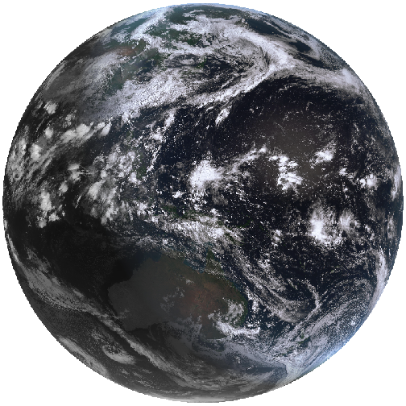
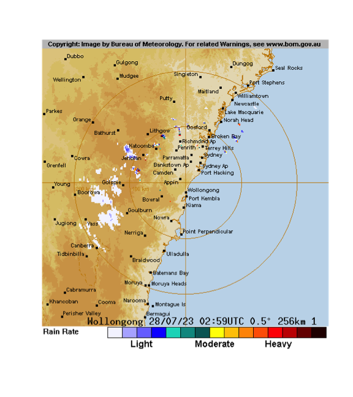

---
title: "weatherOz for BOM"
author: "Jonathan Carroll, Dean Marchiori, Paul Melloy, Mark Padgham, Hugh Parsonage, Keith Pembleton and Adam H. Sparks"
output:
  rmarkdown::html_vignette:
    toc: true
vignette: >
  %\VignetteIndexEntry{weatherOz for BOM}
  %\VignetteEngine{knitr::rmarkdown_notangle}
  %\VignetteEncoding{UTF-8}
---


# Using {weatherOz} With BOM Data

Several functions are provided by {weatherOz} to retrieve Australian Bureau of Meteorology (BOM) data.
A family of functions retrieve data files from BOM or parse local files from BOM and return data frames;

 * `get_precis_forecast()` and `parse_precis_forecast(), which return the précis (short) forecast;
 * `get_ag_bulletin()` and `parse_ag_bulletin(), which return the agriculture bulletin;
 * `get_coastal_forecast()` and `parse_coastal_forecast(), which return coastal waters forecasts for each state.

## Using get_precis_forecast()

This function only takes one argument, `state`. The `state` parameter allows the user to select the forecast for just one state or a national forecast.
States or territories are specified using the official postal codes or full name with fuzzy matching performed via `agrep()`.

- **ACT** - Australian Capital Territory

- **NSW** - New South Wales

- **NT** - Northern Territory

- **QLD** - Queensland

- **SA** - South Australia

- **TAS** - Tasmania

- **VIC** - Victoria

- **WA** - Western Australia

- **AUS** - Australia, returns national forecast including all states, NT and ACT.

### Results

The function, `get_precis_forecast()`, will return a data frame of the weather forecast for the daily forecast for selected towns.
See Appendix 1 for a full description of the fields and values.

### Example 1: Getting a Forecast

Following is an example fetching the forecast for Queensland.


``` r
library(weatherOz)
(QLD_forecast <- get_precis_forecast(state = "QLD"))
#>   -----------  Australian Bureau of Meteorology (BOM) Precis Forecast. -
#>   The HTML version of Short Form (Precis) Forecast for 
#>   QLD can be found at:
#>   <http://www.bom.gov.au/qld/forecasts/state.shtml>
#>   Please note information at the page 
#>   <http://www.bom.gov.au/catalogue/data-feeds.shtml#precis>.
#>   --------------------------------------------------------------------------------  
#>       index product_id  state         town       aac       lat      lon
#>      <fctr>     <char> <char>       <char>    <char>     <num>    <num>
#>   1:      0   IDQ11295    QLD     Brisbane QLD_PT001 -27.48080 153.0389
#>   2:      1   IDQ11295    QLD     Brisbane QLD_PT001 -27.48080 153.0389
#>   3:      2   IDQ11295    QLD     Brisbane QLD_PT001 -27.48080 153.0389
#>   4:      3   IDQ11295    QLD     Brisbane QLD_PT001 -27.48080 153.0389
#>   5:      4   IDQ11295    QLD     Brisbane QLD_PT001 -27.48080 153.0389
#>  ---                                                                   
#> 900:      3   IDQ11295    QLD Port Douglas QLD_PT254 -16.48681 145.4635
#> 901:      4   IDQ11295    QLD Port Douglas QLD_PT254 -16.48681 145.4635
#> 902:      5   IDQ11295    QLD Port Douglas QLD_PT254 -16.48681 145.4635
#> 903:      6   IDQ11295    QLD Port Douglas QLD_PT254 -16.48681 145.4635
#> 904:      7   IDQ11295    QLD Port Douglas QLD_PT254 -16.48681 145.4635
#>       elev    start_time_local end_time_local utc_offset
#>      <num>              <POSc>         <POSc>     <fctr>
#>   1:   8.1 2024-06-06 17:00:00     2024-06-07      10:00
#>   2:   8.1 2024-06-07 00:00:00     2024-06-08      10:00
#>   3:   8.1 2024-06-08 00:00:00     2024-06-09      10:00
#>   4:   8.1 2024-06-09 00:00:00     2024-06-10      10:00
#>   5:   8.1 2024-06-10 00:00:00     2024-06-11      10:00
#>  ---                                                    
#> 900:  70.4 2024-06-09 00:00:00     2024-06-10      10:00
#> 901:  70.4 2024-06-10 00:00:00     2024-06-11      10:00
#> 902:  70.4 2024-06-11 00:00:00     2024-06-12      10:00
#> 903:  70.4 2024-06-12 00:00:00     2024-06-13      10:00
#> 904:  70.4 2024-06-13 00:00:00     2024-06-14      10:00
#>           start_time_utc        end_time_utc minimum_temperature
#>                   <POSc>              <POSc>               <num>
#>   1: 2024-06-06 07:00:00 2024-06-06 14:00:00                  NA
#>   2: 2024-06-06 14:00:00 2024-06-07 14:00:00                  10
#>   3: 2024-06-07 14:00:00 2024-06-08 14:00:00                   9
#>   4: 2024-06-08 14:00:00 2024-06-09 14:00:00                  11
#>   5: 2024-06-09 14:00:00 2024-06-10 14:00:00                  10
#>  ---                                                            
#> 900: 2024-06-08 14:00:00 2024-06-09 14:00:00                  15
#> 901: 2024-06-09 14:00:00 2024-06-10 14:00:00                  15
#> 902: 2024-06-10 14:00:00 2024-06-11 14:00:00                  16
#> 903: 2024-06-11 14:00:00 2024-06-12 14:00:00                  17
#> 904: 2024-06-12 14:00:00 2024-06-13 14:00:00                  16
#>      maximum_temperature lower_precipitation_limit
#>                    <num>                     <num>
#>   1:                  NA                        NA
#>   2:                  20                        NA
#>   3:                  21                        NA
#>   4:                  23                        NA
#>   5:                  23                        NA
#>  ---                                              
#> 900:                  26                        NA
#> 901:                  26                        NA
#> 902:                  26                        NA
#> 903:                  27                        NA
#> 904:                  27                        NA
#>      upper_precipitation_limit        precis probability_of_precipitation
#>                          <num>        <char>                        <num>
#>   1:                        NA Mostly clear.                           10
#>   2:                        NA        Sunny.                            0
#>   3:                        NA Mostly sunny.                            0
#>   4:                        NA Mostly sunny.                            0
#>   5:                        NA        Sunny.                            0
#>  ---                                                                     
#> 900:                        NA        Sunny.                            0
#> 901:                        NA        Sunny.                            0
#> 902:                        NA Mostly sunny.                            5
#> 903:                        NA        Sunny.                           10
#> 904:                        NA        Sunny.                           10
```

## Using get_ag_bulletin()

`get_ag_bulletin()` only takes one argument, `state`.
The `state` parameter allows the user to select the bulletin for just one state or a national forecast.
States or territories are specified using the official postal codes or full name with fuzzy matching performed via `agrep()`.

- **NSW** - New South Wales

- **NT** - Northern Territory

- **QLD** - Queensland

- **SA** - South Australia

- **TAS** - Tasmania

- **VIC** - Victoria

- **WA** - Western Australia

- **AUS** - Australia, returns bulletin for all states and NT.

### Results

The function, `get_ag_bulletin()`, will return a data frame of the agriculture bulletin for selected stations.
See Appendix 3 for a full list and description of the fields and values.

### Example 2: Getting an Ag Bulletin

Following is an example fetching the ag bulletin for Western Australia.


``` r
library(weatherOz)
(WA_bulletin <- get_ag_bulletin(state = "WA"))
#>   -----------  Australian Bureau of Meteorology (BOM) Ag Bulletin. -----------
#>   Please note information at the foot of
#>   <http://www.bom.gov.au/cgi-bin/wrap_fwo.pl?IDW65176.html>,
#>   the HTML version of Agricultural Observations Bulletin for 
#>   WA.  Also see 
#>   <http://www.bom.gov.au/catalogue/observations/about-agricultural.shtml>.
#>   ----------------------------------------------------------------------------  
#>     product_id  state         station   site      obs_time_local
#>         <fctr> <char>          <char> <fctr>              <POSc>
#>  1:   IDW65176     WA        Beverley  10515 2024-06-06 09:00:00
#>  2:   IDW65176     WA        Brookton  10524 2024-06-06 09:00:00
#>  3:   IDW65176     WA          Broome  03003 2024-06-06 09:00:00
#>  4:   IDW65176     WA        Carnamah  08025 2024-06-06 09:00:00
#>  5:   IDW65176     WA       Carnarvon  06011 2024-06-06 09:00:00
#> ---                                                             
#> 32:   IDW65176     WA  Salmon Gums RS  12071 2024-06-06 09:00:00
#> 33:   IDW65176     WA           Wagin  10647 2024-06-06 09:00:00
#> 34:   IDW65176     WA       Wandering  10917 2024-06-06 09:00:00
#> 35:   IDW65176     WA Wongan Hills RS  08137 2024-06-06 09:00:00
#> 36:   IDW65176     WA            York  10311 2024-06-06 09:00:00
#>            obs_time_utc time_zone     r    tn    tx   twd    ev    tg
#>                  <POSc>    <char> <num> <num> <num> <num> <num> <num>
#>  1: 2024-06-06 01:00:00       WST  0.00   9.0  22.8   2.8    NA    NA
#>  2: 2024-06-06 01:00:00       WST  0.01   6.1  21.6   2.1    NA    NA
#>  3: 2024-06-06 01:00:00       WST    NA    NA    NA   7.0    NA    NA
#>  4: 2024-06-06 01:00:00       WST  0.00  10.0  25.0   3.5    NA    NA
#>  5: 2024-06-06 01:00:00       WST  0.00  12.0  28.7   3.5    NA    NA
#> ---                                                                  
#> 32: 2024-06-06 01:00:00       WST  0.00  10.4  21.8    NA    NA    NA
#> 33: 2024-06-06 01:00:00       WST  0.00   7.6  20.3   3.4    NA    NA
#> 34: 2024-06-06 01:00:00       WST    NA   5.3  20.3    NA    NA    NA
#> 35: 2024-06-06 01:00:00       WST  0.00   9.5  22.8   1.4    NA   8.3
#> 36: 2024-06-06 01:00:00       WST  0.00    NA  23.1   1.5    NA    NA
#>        sn  solr    t5   t10   t20   t50   t1m    wr
#>     <num> <num> <num> <num> <num> <num> <num> <num>
#>  1:    NA  10.6    NA    NA    NA    NA    NA    NA
#>  2:    NA   9.9    NA    NA    NA    NA    NA    NA
#>  3:    NA  18.2    NA    NA    NA    NA    NA    NA
#>  4:    NA  13.2    NA    NA    NA    NA    NA    NA
#>  5:    NA  15.3    NA    NA    NA    NA    NA    NA
#> ---                                                
#> 32:    NA  11.4    NA    NA    NA    NA    NA    NA
#> 33:    NA   9.2    NA    NA    NA    NA    NA    NA
#> 34:    NA   9.7    NA    NA    NA    NA    NA    NA
#> 35:    NA  12.5    NA    NA    NA    NA    NA    NA
#> 36:    NA  10.9    NA    NA    NA    NA    NA    NA
```

## Using get_coastal_forecast()

This function only takes one argument, `state`.
The `state` parameter allows the user to select the forecast for just one state or a national forecast.
States or territories are specified using the official postal codes or full name with fuzzy matching performed via `agrep()`

- **ACT** - Australian Capital Territory

- **NSW** - New South Wales

- **NT** - Northern Territory

- **QLD** - Queensland

- **SA** - South Australia

- **TAS** - Tasmania

- **VIC** - Victoria

- **WA** - Western Australia

- **AUS** - Australia, returns national forecast including all states, NT and ACT.

### Results

The function, `get_coastal_forecast()`, will return a data frame of the coastal waters forecast for marine zones in each state.
See Appendix 6 for a full description of the fields and values.

### Example 3: Getting a Coastal Forecast

Following is an example fetching the forecast for Queensland.


``` r
library(weatherOz)
(QLD_coastal_forecast <- get_coastal_forecast(state = "QLD"))
#>   -------  Australian Bureau of Meteorology (BOM) Coastal Waters Forecast. -------
#>   Please note information at the foot of
#>   <http://www.bom.gov.au/cgi-bin/wrap_fwo.pl?IDQ11290.html>,
#>   the HTML version of Coastal Waters Forecast for 
#>   QLD.
#>   Also see 
#>   <http://www.bom.gov.au/catalogue/observations/about-coastal-observations.shtml>.
#>   --------------------------------------------------------------------------------  
#>      index product_id   type state_code
#>     <fctr>     <char> <char>     <char>
#>  1:   <NA>   IDQ11290   <NA>        QLD
#>  2:   <NA>   IDQ11290   <NA>        QLD
#>  3:   <NA>   IDQ11290   <NA>        QLD
#>  4:   <NA>   IDQ11290   <NA>        QLD
#>  5:      0   IDQ11290   <NA>        QLD
#> ---                                    
#> 60:      3   IDQ11290   <NA>        QLD
#> 61:      0   IDQ11290   <NA>        QLD
#> 62:      1   IDQ11290   <NA>        QLD
#> 63:      2   IDQ11290   <NA>        QLD
#> 64:      3   IDQ11290   <NA>        QLD
#>                                                          dist_name
#>                                                             <char>
#>  1:                                                     Queensland
#>  2:                                 Queensland Gulf of Carpentaria
#>  3:                                               North Queensland
#>  4:                                               South Queensland
#>  5: South East Gulf of Carpentaria: QLD-NT Border to Cape Keerweer
#> ---                                                               
#> 60:                Gold Coast Waters: Cape Moreton to Point Danger
#> 61:                             Great Barrier Reef Offshore Waters
#> 62:                             Great Barrier Reef Offshore Waters
#> 63:                             Great Barrier Reef Offshore Waters
#> 64:                             Great Barrier Reef Offshore Waters
#>     pt_1_name pt_2_name       aac    start_time_local      end_time_local
#>        <char>    <char>    <char>              <POSc>              <POSc>
#>  1:      <NA>      <NA> QLD_FA001 2024-06-06 15:50:19 2024-06-06 15:50:19
#>  2:      <NA>      <NA> QLD_FA002 2024-06-06 17:00:00 2024-06-06 17:00:00
#>  3:      <NA>      <NA> QLD_FA003 2024-06-06 17:00:00 2024-06-06 17:00:00
#>  4:      <NA>      <NA> QLD_FA004 2024-06-06 17:00:00 2024-06-06 17:00:00
#>  5:      <NA>      <NA> QLD_MW001 2024-06-06 17:00:00 2024-06-06 17:00:00
#> ---                                                                      
#> 60:      <NA>      <NA> QLD_MW014 2024-06-09 00:00:00 2024-06-09 00:00:00
#> 61:      <NA>      <NA> QLD_MW015 2024-06-06 17:00:00 2024-06-06 17:00:00
#> 62:      <NA>      <NA> QLD_MW015 2024-06-07 00:00:00 2024-06-07 00:00:00
#> 63:      <NA>      <NA> QLD_MW015 2024-06-08 00:00:00 2024-06-08 00:00:00
#> 64:      <NA>      <NA> QLD_MW015 2024-06-09 00:00:00 2024-06-09 00:00:00
#>     utc_offset      start_time_utc        end_time_utc
#>         <fctr>              <POSc>              <POSc>
#>  1:      10:00 2024-06-06 15:50:19 2024-06-06 15:50:19
#>  2:      10:00 2024-06-06 17:00:00 2024-06-06 17:00:00
#>  3:      10:00 2024-06-06 17:00:00 2024-06-06 17:00:00
#>  4:      10:00 2024-06-06 17:00:00 2024-06-06 17:00:00
#>  5:      10:00 2024-06-06 17:00:00 2024-06-06 17:00:00
#> ---                                                   
#> 60:      10:00 2024-06-09 00:00:00 2024-06-09 00:00:00
#> 61:      10:00 2024-06-06 17:00:00 2024-06-06 17:00:00
#> 62:      10:00 2024-06-07 00:00:00 2024-06-07 00:00:00
#> 63:      10:00 2024-06-08 00:00:00 2024-06-08 00:00:00
#> 64:      10:00 2024-06-09 00:00:00 2024-06-09 00:00:00
#>                                                                   forecast_seas
#>                                                                          <char>
#>  1:                                                                        <NA>
#>  2:                                                                        <NA>
#>  3:                                                                        <NA>
#>  4:                                                                        <NA>
#>  5: 1 to 1.5 metres, increasing to 1.5 to 2 metres offshore north of Kowanyama.
#> ---                                                                            
#> 60:               1 to 1.5 metres, decreasing below 1 metre during the morning.
#> 61:                                                              Below 1 metre.
#> 62:                                                             Around 1 metre.
#> 63:                                                              Below 1 metre.
#> 64:                                                              Below 1 metre.
#>     forecast_weather
#>               <char>
#>  1:             <NA>
#>  2:             <NA>
#>  3:             <NA>
#>  4:             <NA>
#>  5:           Clear.
#> ---                 
#> 60:    Mostly sunny.
#> 61:   Partly cloudy.
#> 62:           Sunny.
#> 63:           Sunny.
#> 64:    Mostly sunny.
#>                                                                                         forecast_winds
#>                                                                                                 <char>
#>  1:                                                                                               <NA>
#>  2:                                                                                               <NA>
#>  3:                                                                                               <NA>
#>  4:                                                                                               <NA>
#>  5: Southerly 15 to 20 knots, reaching up to 25 knots offshore south of Kowanyama in the late evening.
#> ---                                                                                                   
#> 60:                  West to southwesterly 15 to 20 knots decreasing to about 10 knots during the day.
#> 61:                                                                          Southerly 10 to 15 knots.
#> 62:                                                                          Southerly 10 to 15 knots.
#> 63:                                                                          Southerly 10 to 15 knots.
#> 64:                          Southerly 10 to 15 knots decreasing to about 10 knots during the evening.
#>                          forecast_swell1 forecast_swell2 forecast_caution
#>                                   <char>          <char>           <char>
#>  1:                                 <NA>            <NA>             <NA>
#>  2:                                 <NA>            <NA>             <NA>
#>  3:                                 <NA>            <NA>             <NA>
#>  4:                                 <NA>            <NA>             <NA>
#>  5:                                 <NA>            <NA>             <NA>
#> ---                                                                      
#> 60:             Easterly around 1 metre.            <NA>             <NA>
#> 61:              Easterly below 1 metre.            <NA>             <NA>
#> 62: East to northeasterly below 1 metre.            <NA>             <NA>
#> 63:              Easterly below 1 metre.            <NA>             <NA>
#> 64:             Easterly around 1 metre.            <NA>             <NA>
#>     marine_forecast tropical_system_location forecast_waves
#>              <char>                   <lgcl>         <lgcl>
#>  1:            <NA>                       NA             NA
#>  2:            <NA>                       NA             NA
#>  3:            <NA>                       NA             NA
#>  4:            <NA>                       NA             NA
#>  5:            <NA>                       NA             NA
#> ---                                                        
#> 60:            <NA>                       NA             NA
#> 61:            <NA>                       NA             NA
#> 62:            <NA>                       NA             NA
#> 63:            <NA>                       NA             NA
#> 64:            <NA>                       NA             NA
```
## Working with BOM Image Files

A second family of functions retrieve information pertaining to satellite and radar imagery.

 * `get_available_imagery()`, which returns available satellite imagery;
 * `get_satelllite_imagery()` which returns a [terra::SpatRaster] or [stars] object as requested;
 * `get_available_radar()`, which returns available radar images; and
 * `get_radar_imagery()` which returns radar images as a [magick] object.

### Using {weatherOz} to retrieve BOM satellite imagery

{weatherOz} provides functionality to retrieve high-definition GeoTIFF satellite imagery provided by BOM through public FTP with the following types of imagery being available: i.) [Infrared images](http://www.bom.gov.au/australia/satellite/about_images.shtml#ir), ii.)
[Visible images](http://www.bom.gov.au/australia/satellite/about_images.shtml#vis) and iii.) [Clouds/surface composite](http://www.bom.gov.au/australia/satellite/about_images.shtml#cloud).

#### Working with Satellite Imagery

Valid BOM satellite Product IDs for GeoTIFF files include:

<table>
<tr><th>Product ID</th><th>Description</th><th>Type</th><th>Delete time</th></tr>
<tr><td>IDE00420</td><td>AHI cloud cover only 2km FD GEOS </td><td>Satellite</td><td style= "text-align: center;">24</td></tr>
<tr><td>IDE00421</td><td>AHI IR (Ch13) greyscale 2km FD GEOS </td><td>Satellite</td><td style= "text-align: center;">24</td></tr>
<tr><td>IDE00422</td><td>AHI VIS (Ch3) greyscale 2km FD GEOS </td><td>Satellite</td><td style= "text-align: center;">24</td></tr>
<tr><td>IDE00423</td><td>AHI IR (Ch13) Zehr 2km FD GEOS </td><td>Satellite</td><td style= "text-align: center;">24</td></tr>
<tr><td>IDE00425</td><td>AHI VIS (true colour) / IR (Ch13 greyscale) composite 1km FD GEOS </td><td>Satellite</td><td style= "text-align: center;">24</td></tr>
<tr><td>IDE00426</td><td>AHI VIS (true colour) / IR (Ch13 greyscale) composite 2km FD GEOS </td><td>Satellite</td><td style= "text-align: center;">24</td></tr>
<tr><td>IDE00427</td><td>AHI WV (Ch8) 2km FD GEOS </td><td>Satellite</td><td style= "text-align: center;">24</td></tr>
<tr><td>IDE00430</td><td>AHI cloud cover only 2km AUS equirect.</td><td>Satellite</td><td style= "text-align: center;">24</td></tr>
<tr><td>IDE00431</td><td>AHI IR (Ch13) greyscale 2km AUS equirect.</td><td>Satellite</td><td style= "text-align: center;">24</td></tr>
<tr><td>IDE00432</td><td>AHI VIS (Ch3) greyscale 2km AUS equirect.</td><td>Satellite</td><td style= "text-align: center;">24</td></tr>
<tr><td>IDE00433</td><td>AHI IR (Ch13) Zehr 2km AUS equirect.</td><td>Satellite</td><td style= "text-align: center;">24</td></tr>
<tr><td>IDE00435</td><td>AHI VIS (true colour) / IR (Ch13 greyscale) composite 1km AUS equirect. </td><td>Satellite</td><td style= "text-align: center;">24</td></tr>
<tr><td>IDE00436</td><td>AHI VIS (true colour) / IR (Ch13 greyscale) composite 2km AUS equirect. </td><td>Satellite</td><td style= "text-align: center;">24</td></tr>
<tr><td>IDE00437</td><td>AHI WV (Ch8) 2km AUS equirect.</td><td>Satellite</td><td style= "text-align: center;">24</td></tr>
<tr><td>IDE00439</td><td>AHI VIS (Ch3) greyscale 0.5km AUS equirect.</td><td>Satellite</td><td style= "text-align: center;">24</td></tr>
<tr><td colspan = 3><strong>Information gathered from Australian Bureau of Meteorology (BOM)</strong></td></tr>
</table>

#### Using get_available_imagery()

`get_available_imagery()` only takes one argument, `product_id`, a BOM identifier for the imagery that you wish to check for available imagery.
Using this function will fetch a listing of BOM GeoTIFF satellite imagery from [ftp://ftp.bom.gov.au/anon/gen/gms/](ftp://ftp.bom.gov.au/anon/gen/gms/) to display which files are currently available for download.
These files are available at ten minute update frequency with a 24 hour delete time.
This function can be used see the most recent files available and then specify in the `_imagery()` function.
If no valid Product ID is supplied, defaults to all GeoTIFF images currently available.

#### Example 4: Checking Available Imagery


``` r
library(weatherOz)

(avail <- get_available_imagery(product_id = "IDE00425"))
#>   [1] "IDE00425.202406050610.tif" "IDE00425.202406050620.tif"
#>   [3] "IDE00425.202406050630.tif" "IDE00425.202406050640.tif"
#>   [5] "IDE00425.202406050650.tif" "IDE00425.202406050700.tif"
#>   [7] "IDE00425.202406050710.tif" "IDE00425.202406050720.tif"
#>   [9] "IDE00425.202406050730.tif" "IDE00425.202406050740.tif"
#>  [11] "IDE00425.202406050750.tif" "IDE00425.202406050800.tif"
#>  [13] "IDE00425.202406050810.tif" "IDE00425.202406050820.tif"
#>  [15] "IDE00425.202406050830.tif" "IDE00425.202406050840.tif"
#>  [17] "IDE00425.202406050850.tif" "IDE00425.202406050900.tif"
#>  [19] "IDE00425.202406050910.tif" "IDE00425.202406050920.tif"
#>  [21] "IDE00425.202406050930.tif" "IDE00425.202406050940.tif"
#>  [23] "IDE00425.202406050950.tif" "IDE00425.202406051000.tif"
#>  [25] "IDE00425.202406051010.tif" "IDE00425.202406051020.tif"
#>  [27] "IDE00425.202406051030.tif" "IDE00425.202406051040.tif"
#>  [29] "IDE00425.202406051050.tif" "IDE00425.202406051100.tif"
#>  [31] "IDE00425.202406051110.tif" "IDE00425.202406051120.tif"
#>  [33] "IDE00425.202406051130.tif" "IDE00425.202406051140.tif"
#>  [35] "IDE00425.202406051150.tif" "IDE00425.202406051200.tif"
#>  [37] "IDE00425.202406051210.tif" "IDE00425.202406051220.tif"
#>  [39] "IDE00425.202406051230.tif" "IDE00425.202406051240.tif"
#>  [41] "IDE00425.202406051250.tif" "IDE00425.202406051300.tif"
#>  [43] "IDE00425.202406051310.tif" "IDE00425.202406051320.tif"
#>  [45] "IDE00425.202406051330.tif" "IDE00425.202406051340.tif"
#>  [47] "IDE00425.202406051350.tif" "IDE00425.202406051400.tif"
#>  [49] "IDE00425.202406051410.tif" "IDE00425.202406051420.tif"
#>  [51] "IDE00425.202406051430.tif" "IDE00425.202406051450.tif"
#>  [53] "IDE00425.202406051500.tif" "IDE00425.202406051510.tif"
#>  [55] "IDE00425.202406051520.tif" "IDE00425.202406051530.tif"
#>  [57] "IDE00425.202406051540.tif" "IDE00425.202406051550.tif"
#>  [59] "IDE00425.202406051600.tif" "IDE00425.202406051610.tif"
#>  [61] "IDE00425.202406051620.tif" "IDE00425.202406051630.tif"
#>  [63] "IDE00425.202406051640.tif" "IDE00425.202406051650.tif"
#>  [65] "IDE00425.202406051700.tif" "IDE00425.202406051710.tif"
#>  [67] "IDE00425.202406051720.tif" "IDE00425.202406051730.tif"
#>  [69] "IDE00425.202406051740.tif" "IDE00425.202406051750.tif"
#>  [71] "IDE00425.202406051800.tif" "IDE00425.202406051810.tif"
#>  [73] "IDE00425.202406051820.tif" "IDE00425.202406051830.tif"
#>  [75] "IDE00425.202406051840.tif" "IDE00425.202406051850.tif"
#>  [77] "IDE00425.202406051900.tif" "IDE00425.202406051910.tif"
#>  [79] "IDE00425.202406051920.tif" "IDE00425.202406051930.tif"
#>  [81] "IDE00425.202406051940.tif" "IDE00425.202406051950.tif"
#>  [83] "IDE00425.202406052000.tif" "IDE00425.202406052010.tif"
#>  [85] "IDE00425.202406052020.tif" "IDE00425.202406052030.tif"
#>  [87] "IDE00425.202406052040.tif" "IDE00425.202406052050.tif"
#>  [89] "IDE00425.202406052100.tif" "IDE00425.202406052110.tif"
#>  [91] "IDE00425.202406052120.tif" "IDE00425.202406052130.tif"
#>  [93] "IDE00425.202406052140.tif" "IDE00425.202406052150.tif"
#>  [95] "IDE00425.202406052200.tif" "IDE00425.202406052210.tif"
#>  [97] "IDE00425.202406052220.tif" "IDE00425.202406052230.tif"
#>  [99] "IDE00425.202406052240.tif" "IDE00425.202406052250.tif"
#> [101] "IDE00425.202406052300.tif" "IDE00425.202406052310.tif"
#> [103] "IDE00425.202406052320.tif" "IDE00425.202406052330.tif"
#> [105] "IDE00425.202406052340.tif" "IDE00425.202406052350.tif"
#> [107] "IDE00425.202406060000.tif" "IDE00425.202406060010.tif"
#> [109] "IDE00425.202406060020.tif" "IDE00425.202406060030.tif"
#> [111] "IDE00425.202406060040.tif" "IDE00425.202406060050.tif"
#> [113] "IDE00425.202406060100.tif" "IDE00425.202406060110.tif"
#> [115] "IDE00425.202406060120.tif" "IDE00425.202406060130.tif"
#> [117] "IDE00425.202406060140.tif" "IDE00425.202406060150.tif"
#> [119] "IDE00425.202406060200.tif" "IDE00425.202406060210.tif"
#> [121] "IDE00425.202406060220.tif" "IDE00425.202406060230.tif"
#> [123] "IDE00425.202406060250.tif" "IDE00425.202406060300.tif"
#> [125] "IDE00425.202406060310.tif" "IDE00425.202406060320.tif"
#> [127] "IDE00425.202406060330.tif" "IDE00425.202406060340.tif"
#> [129] "IDE00425.202406060350.tif" "IDE00425.202406060400.tif"
#> [131] "IDE00425.202406060410.tif" "IDE00425.202406060420.tif"
#> [133] "IDE00425.202406060430.tif" "IDE00425.202406060440.tif"
#> [135] "IDE00425.202406060450.tif" "IDE00425.202406060500.tif"
#> [137] "IDE00425.202406060510.tif" "IDE00425.202406060520.tif"
#> [139] "IDE00425.202406060530.tif" "IDE00425.202406060540.tif"
#> [141] "IDE00425.202406060550.tif" "IDE00425.202406060600.tif"
#> [143] "IDE00425.202406060610.tif" "IDE00425.202406060620.tif"
```

#### Using get_satellite_imagery()

`get_satellite_imagery()` fetches BOM satellite GeoTIFF imagery, returning a SpatRaster object and takes two arguments.
Files are available at ten minute update frequency with a 24 hour delete time.
It is suggested to check file availability first by using `get_available_imagery()`.
The arguments are:

* `product_id`, a character value of the BOM product ID to download.
Alternatively, a vector of values from `get_available_imagery()` may be used here.
This argument is mandatory.

* `scans` a numeric value for the number of scans to download, starting with the most recent and progressing backwards, *e.g.*, `1` - the most recent single scan available , `6` - the most recent hour available, `12` - the most recent 2 hours available, etc.
Negating will return the oldest files first.
Defaults to 1.
This argument is optional.

#### Example 6: Fetching Satellite Imagery and Viewing It


``` r
library(weatherOz)

# Specify product ID and scans
i <- get_satellite_imagery(product_id = "IDE00425", scans = 1)
```

`terra::plot()` has been re-exported to simplify visualising these files while using {weatherOz}.


``` r
plot(i)
```

<div class="figure" style="text-align: center">

<p class="caption">plot of chunk plot_satellite</p>
</div>

### Using {weatherOz} With BOM Radar Imagery

{weatherOz} provides functionality to retrieve the latest radar imagery provided by BOM through a public FTP server.
These are the latest snapshots for each radar locations at various radar ranges _e.g._, 512km, 256km, 128km and 64km for some stations.

#### Using get_available_radar()

`get_available_radar()` fetches the available radar imagery from the BOM FTP and returns a data frame for reference.
This data frame contains the product_id, which is required when using the `get_radar_imagery()` function.
The files available are the latest `.png` files of BOM radar imagery which are typically updated each 6-10 minutes. Only the most recent image is retrieved for each radar location.
There are usually several radar ranges available for each radar location, such as 512km, 256km, 128km and possibly 64km.
The arguments are:

* `radar_id`  which is the BOM radar ID number; this defaults to 'all' which will return a data frame of all radar IDs in Australia.

#### Example 7: Getting Available Radar Imagery


``` r
library(weatherOz)
x <- get_available_radar()
head(x)
#>    product_id LocationID  range     Name Longitude Latitude Radar_id
#>        <char>     <char> <char>   <fctr>     <num>    <num>    <int>
#> 1:     IDR641         64  512km Adelaide  138.4689 -34.6169       64
#> 2:     IDR642         64  256km Adelaide  138.4689 -34.6169       64
#> 3:     IDR643         64  128km Adelaide  138.4689 -34.6169       64
#> 4:     IDR644         64   64km Adelaide  138.4689 -34.6169       64
#> 5:     IDR311         31  512km   Albany  117.8163 -34.9418       31
#> 6:     IDR312         31  256km   Albany  117.8163 -34.9418       31
#>                   Full_Name IDRnn0name IDRnn1name  State    Type Group_
#>                      <fctr>     <fctr>     <fctr> <fctr>  <fctr> <fctr>
#> 1: Adelaide (Buckland Park)     BuckPk BucklandPk     SA Doppler    Yes
#> 2: Adelaide (Buckland Park)     BuckPk BucklandPk     SA Doppler    Yes
#> 3: Adelaide (Buckland Park)     BuckPk BucklandPk     SA Doppler    Yes
#> 4: Adelaide (Buckland Park)     BuckPk BucklandPk     SA Doppler    Yes
#> 5:                   Albany     Albany     Albany     WA Doppler    Yes
#> 6:                   Albany     Albany     Albany     WA Doppler    Yes
#>    Status Archive  as.is
#>    <fctr>  <fctr> <lgcl>
#> 1: Public  BuckPk   TRUE
#> 2: Public  BuckPk   TRUE
#> 3: Public  BuckPk   TRUE
#> 4: Public  BuckPk   TRUE
#> 5: Public  Albany   TRUE
#> 6: Public  Albany   TRUE
```

#### Using get_radar_imagery()

`get_radar_imagery()` fetches the latest BOM radar imagery for a given product ID.
The files available are the latest `.png` files of BOM radar imagery, which are typically updated each 6-10 minutes.
Only the most recent image is retrieved for each radar location.
There are usually several radar ranges available for each radar location, such as 512km, 256km, 128km and possibly 64km.
The only argument is:

* `product_id` the BOM product_id associated with each radar imagery file.
These can be obtained from the `get_available_radar()` function.
This value must be specified and the function will accept only one at a time.

#### Example 8: Fetching Radar Imagery


``` r
library(weatherOz)

y <- get_radar_imagery(product_id = "IDR032")
#> file downloaded to:/var/folders/r4/wwsd3hsn48j5gck6qv6npkpc0000gr/T//Rtmp5OTcoN/file149607e32074c.png
```

``` r
plot(y)
```

<div class="figure" style="text-align: center">

<p class="caption">plot of chunk get_radar_imagery</p>
</div>

## References

[Australian Bureau of Meteorology (BOM) Weather Data Services](http://www.bom.gov.au/catalogue/data-feeds.shtml)

[Australian Bureau of Meteorology (BOM) FTP Public Products](http://www.bom.gov.au/catalogue/anon-ftp.shtml)

[Australian Bureau of Meteorology (BOM) Weather Data Services Agriculture Bulletins](http://www.bom.gov.au/catalogue/observations/about-agricultural.shtml)

[Australian Bureau of Meteorology (BOM) Weather Data Services Observation of Rainfall](http://www.bom.gov.au/climate/how/observations/rain-measure.shtml)

[Australian Bureau of Meteorology (BOM) High-definition satellite images](http://www.bom.gov.au/australia/satellite/index.shtml)

## Appendix 1 - Output From get_precis_forecast()

The functions, `get_precis_forecast()` or `parse_precis_forecast(), will return a data frame of the 7 day short forecast with the following fields:

<dl>
<dt>index</dt><dd>Forecast index number, 0 = current day ... 7 day</dd>
<dt>product_id</dt><dd>BOM Product ID from which the data are derived</dd>
<dt>state</dt><dd>State name (postal code abbreviation)</dd>
<dt>town</dt><dd>Town name for forecast location</dd>
<dt>aac</dt><dd>AMOC Area Code, _e.g._, WA_MW008, a unique identifier for each location</dd>
<dt>lat</dt><dd>Latitude of named location (decimal degrees)</dd>
<dt>lon</dt><dd>Longitude of named location (decimal degrees)</dd>
<dt>elev</dt><dd>Elevation of named location (metres)</dd>
<dt>start_time_local</dt><dd>Start of forecast date and time in local TZ</dd>
<dt>end_time_local</dt><dd>End of forecast date and time in local TZ</dd>
<dt>UTC_offset</dt><dd> Hours offset from difference in hours and minutes from Coordinated Universal Time (UTC) for `start_time_local` and `end_time_local`</dd>
<dt>start_time_utc</dt><dd>Start of forecast date and time in UTC</dd>
<dt>end_time_utc</dt><dd>End of forecast date and time in UTC</dd>
<dt>maximum_temperature</dt><dd>Maximum forecast temperature (degrees Celsius)</dd>
<dt>minimum_temperature</dt><dd>Minimum forecast temperature (degrees Celsius)</dd>
<dt>lower_precipitation_limit</dt><dd>Lower forecast precipitation limit (millimetres)</dd>
<dt>upper_precipitation_limit</dt><dd>Upper forecast precipitation limit (millimetres)</dd>
<dt>precis</dt><dd>Précis forecast (a short summary, less than 30 characters)</dd>
<dt>probability_of_precipitation</dt><dd>Probability of precipitation (percent)</dd>
</dl>

## Appendix 2 - Output From get_ag_bulletin()

The functions, `get_ag_bulletin()` or `parse_ag_bulletin(), will return a data frame of the agriculture bulletin with the following fields:

<dl>
<dt>product_id</dt><dd>BOM Product ID from which the data are derived</dd>
<dt>state</dt><dd>State name (postal code abbreviation)</dd>
<dt>dist</dt><dd>BOM rainfall district</dd>
<dt>name</dt><dd>Full station name (some stations have been retired so "station" will be same, this is the full designation</dd>
<dt>wmo</dt><dd>World Meteorological Organization number (unique ID used worldwide)</dd>
<dt>site</dt><dd>Unique BOM identifier for each station</dd>
<dt>station</dt><dd>Station name</dd>
<dt>obs-time-local</dt><dd>Observation time</dd>
<dt>obs-time-utc</dt><dd>Observation time (time in UTC)</dd>
<dt>time-zone</dt><dd>Time zone for observation</dd>
<dt>lat</dt><dd>Latitude (decimal degrees)</dd>
<dt>lon</dt><dd>Longitude (decimal degrees)</dd>
<dt>elev_m</dt><dd>Station elevation (metres)</dd>
<dt>bar_ht</dt><dd>Bar height (metres)</dd>
<dt>station</dt><dd>BOM station name</dd>
<dt>start</dt><dd>Year data collection starts</dd>
<dt>end</dt><dd>Year data collection ends (will always be current)</dd>
<dt>r</dt><dd>Rain to 9am (millimetres). <em>Trace will be reported as 0.01</em></dd>
<dt>tn</dt><dd>Minimum temperature (degrees Celsius)</dd>
<dt>tx</dt><dd>Maximum temperature (degrees Celsius)</dd>
<dt>twd</dt><dd>Wet bulb depression (degrees Celsius)</dd>
<dt>ev</dt><dd>Evaporation (millimetres)</dd>
<dt>tg</dt><dd>Terrestrial minimum temperature (degrees Celsius)</dd>
<dt>sn</dt><dd>Sunshine (hours)</dd>
<dt>solr</dt><dd>Solar Radiation MJ/sq m</dd>
<dt>t5</dt><dd>5cm soil temperature (degrees Celsius)</dd>
<dt>t10</dt><dd>10cm soil temperature (degrees Celsius)</dd>
<dt>t20</dt><dd>20cm soil temperature (degrees Celsius)</dd>
<dt>t50</dt><dd>50cm soil temperature (degrees Celsius)</dd>
<dt>t1m</dt><dd>1m soil temperature (degrees Celsius)</dd>
<dt>wr</dt><dd>Wind run (kilometres)</dd>
</dl>

## Appendix 3 - Output From get_coastal_forecast()

The output of `get_coastal_forecast()` or `parse_coastal_forecast()` will return a data frame with coastal waters forecast values of each area within the given state with the following fields:

<dl>
<dt>index</dt><dd>Forecast index number.  0 = current day</dd>
<dt>product_id</dt><dd>BOM Product ID from which the data are derived</dd>
<dt>type</dt><dd>Forecast Region type e.g. Coastal</dd>
<dt>state_code</dt><dd>State name (postal code abbreviation)</dd>
<dt>dist_name</dt><dd>Name of forecast district</dd>
<dt>pt_1_name</dt><dd>Start of forecast district</dd>
<dt>pt_2_name</dt><dd>End of forecast district</dd>
<dt>aac</dt><dd>AMOC Area Code, _e.g._, WA_MW008, a unique identifier for each location</dd>
<dt>start_time_local</dt><dd>Start of forecast date and time in local TZ</dd>
<dt>end_time_local</dt><dd>End of forecast date and time in local TZ</dt>
<dt>UTC_offset</dt><dd>Hours offset from difference in hours and minutes from Coordinated Universal Time (UTC) for `start_time_local` and `end_time_local`</dd>
<dt>start_time_utc</dt><dd>Start of forecast date and time in UTC</dd>
<dt>end_time_utc</dt><dd>End of forecast date and time in UTC</dd>
<dt>forecast_seas</dt><dd>Forecast sea conditions</dd>
<dt>forecast_weather</dt><dd>Forecast weather summary</dd>
<dt>forecast_winds</dt><dd>Forecast winds summary</dd>
<dt>forecast_swell1</dt><dd>Forecast primary swell summary</dd>
<dt>forecast_swell2</dt><dd>Forecast seondary swell summary (not always provided)</dd>
<dt>forecast_caution</dt><dd>Forecast caution issued (not always provided)</dd>
<dt>marine_forecast</dt><dd>Additional marine forecast warning information (not always provided)</dd>
</dl>
