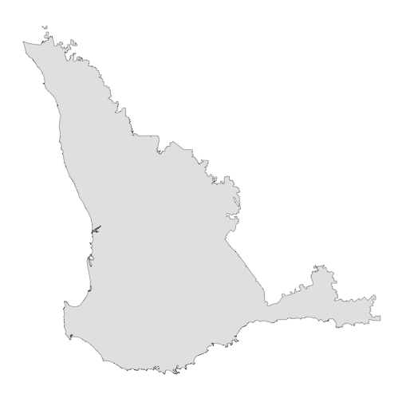
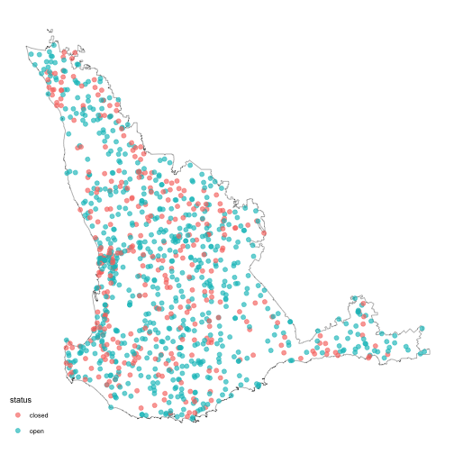

---
title: "weatherOz for DPIRD"
author: "Rodrigo Pires, Anna Hepworth, Rebecca O'Leary and Adam H. Sparks"
output:
  rmarkdown::html_vignette:
    toc: true
vignette: >
  %\VignetteIndexEntry{weatherOz for DPIRD}
  %\VignetteEngine{knitr::rmarkdown_notangle}
  %\VignetteEncoding{UTF-8}
---


## About DPIRD Data

From the DPIRD Weather Website's ["About" Page](https://weather.agric.wa.gov.au/about).

> The Department of Primary Industries and Regional Development's (DPIRD) network of automatic weather stations and radars throughout the state provide timely, relevant and local weather data to assist growers and regional communities make more-informed decisions.
>
> The weather station data includes air temperature, humidity, rainfall, wind speed and direction, with most stations also measuring incoming solar radiation to calculate evaporation. This website includes dashboards for each station to visualise this data.

Data from the DPIRD API are licenced under the [Creative Commons Attribution 3.0 Licence (CC BY 3.0 AU)](https://creativecommons.org/licenses/by/3.0/au/deed.en).

## A Note on API Keys

All examples in this vignette assume that you have stored your API key in your .Renviron file.
See [Chapter 8](https://rstats.wtf/r-startup.html#renviron) in "What They Forgot to Teach You About R" by Bryan _et al._ for more on storing details in your .Renviron if you are unfamiliar.

## Working With DPIRD Data

Three functions are provided to streamline fetching data from the DPIRD Weather 2.0 API endpoints.

 * `get_dpird_extremes()`, which returns the recorded extreme values for the given station in the DPIRD weather station network.;
 * `get_dpird_minute()`, which returns weather data in minute increments for stations in the DPIRD weather station network with only the past two years being available; and
 * `get_dpird_summaries()`, which returns weather data in 15 and 30 minute, hourly, daily, monthly or yearly summary values for stations in the DPIRD weather station network.

## Getting Extreme Weather Values

The `get_dpird_extremes()` function fetches and returns nicely formatted individual extreme weather summaries from the DPIRD Weather 2.0 API.
You must provide a `station_code` and `API_key`, the other arguments, `values` and `include_closed` are optional.

### Available Values for Extreme Weather

 * all (which will return all of the following values),
 * erosionCondition,
 * erosionConditionLast7Days,
 * erosionConditionLast7DaysDays,
 * erosionConditionLast7DaysMinutes,
 * erosionConditionLast14Days,
 * erosionConditionLast14DaysDays,
 * erosionConditionLast14DaysMinutes,
 * erosionConditionMonthToDate,
 * erosionConditionMonthToDateDays,
 * erosionConditionMonthToDateMinutes,
 * erosionConditionMonthToDateStartTime,
 * erosionConditionSince12AM,
 * erosionConditionSince12AMMinutes,
 * erosionConditionSince12AMStartTime,
 * erosionConditionYearToDate,
 * erosionConditionYearToDateDays,
 * erosionConditionYearToDateMinutes,
 * erosionConditionYearToDateStartTime,
 * frostCondition,
 * frostConditionLast7Days,
 * frostConditionLast7DaysDays,
 * frostConditionLast7DaysMinutes,
 * frostConditionLast14Days,
 * frostConditionLast14DaysDays,
 * frostConditionLast14DaysMinutes,
 * frostConditionMonthToDate,
 * frostConditionMonthToDateDays,
 * frostConditionMonthToDateMinutes,
 * frostConditionMonthToDateStartTime,
 * frostConditionSince9AM,
 * frostConditionSince9AMMinutes,
 * frostConditionSince9AMStartTime,
 * frostConditionTo9AM,
 * frostConditionTo9AMMinutes,
 * frostConditionTo9AMStartTime,
 * frostConditionYearToDate,
 * frostConditionYearToDate,
 * frostConditionYearToDateMinutes,
 * frostConditionYearToDateStartTime,
 * heatCondition,
 * heatConditionLast7Days,
 * heatConditionLast7DaysDays,
 * heatConditionLast7DaysMinutes,
 * heatConditionLast14Days,
 * heatConditionLast14DaysDays,
 * heatConditionLast14DaysMinutes,
 * heatConditionMonthToDate,
 * heatConditionMonthToDateDays,
 * heatConditionMonthToDateMinutes,
 * heatConditionMonthToDateStartTime,
 * heatConditionSince12AM,
 * heatConditionSince12AMMinutes,
 * heatConditionSince12AMStartTime,
 * heatConditionYearToDate,
 * heatConditionYearToDateDays,
 * heatConditionYearToDateMinutes, and
 * heatConditionYearToDateStartTime

### Example 1: Get All Extremes for Northam, WA

In the first example, we illustrate how to fetch all extreme values available for Northam.


``` r
library(weatherOz)

(extremes <- get_dpird_extremes(
  station_code = "NO"
))
#> Key: <station_code>
#>    station_code longitude  latitude frost_condition_since9_am_minutes
#>          <fctr>     <num>     <num>                             <int>
#> 1:           NO  116.6942 -31.65161                                 0
#>    frost_condition_since9_am_start_time frost_condition_to9_am_minutes
#>                                  <POSc>                          <int>
#> 1:                                 <NA>                              0
#>    frost_condition_to9_am_start_time frost_condition_last7_days_minutes
#>                               <POSc>                              <int>
#> 1:                              <NA>                                  0
#>    frost_condition_last7_days_days frost_condition_last14_days_minutes
#>                              <int>                               <int>
#> 1:                               0                                   0
#>    frost_condition_last14_days_days frost_condition_month_to_date_minutes
#>                               <int>                                 <int>
#> 1:                                0                                     0
#>    frost_condition_month_to_date_start_time frost_condition_month_to_date_days
#>                                      <POSc>                              <int>
#> 1:                                     <NA>                                  0
#>    frost_condition_year_to_date_minutes frost_condition_year_to_date_start_time
#>                                   <int>                                  <POSc>
#> 1:                                 5693                     2025-05-24 03:07:00
#>    frost_condition_year_to_date_days heat_condition_since12_am_minutes
#>                                <int>                             <int>
#> 1:                                27                                 0
#>    heat_condition_since12_am_start_time heat_condition_last7_days_minutes
#>                                  <POSc>                             <int>
#> 1:                                 <NA>                               380
#>    heat_condition_last7_days_days heat_condition_last14_days_minutes
#>                             <int>                              <int>
#> 1:                              2                                765
#>    heat_condition_last14_days_days heat_condition_month_to_date_minutes
#>                              <int>                                <int>
#> 1:                               3                                  380
#>    heat_condition_month_to_date_start_time heat_condition_month_to_date_days
#>                                     <POSc>                             <int>
#> 1:                     2025-11-03 13:35:00                                 2
#>    heat_condition_year_to_date_minutes heat_condition_year_to_date_start_time
#>                                  <int>                                 <POSc>
#> 1:                               45270                    2025-01-01 09:12:00
#>    heat_condition_year_to_date_days erosion_condition_since12_am_minutes
#>                               <int>                                <int>
#> 1:                               99                                    0
#>    erosion_condition_since12_am_start_time erosion_condition_last7_days_minutes
#>                                     <POSc>                                <int>
#> 1:                                    <NA>                                    0
#>    erosion_condition_last7_days_days erosion_condition_last14_days_minutes
#>                                <int>                                 <int>
#> 1:                                 0                                     0
#>    erosion_condition_last14_days_days erosion_condition_month_to_date_minutes
#>                                 <int>                                   <int>
#> 1:                                  0                                       0
#>    erosion_condition_month_to_date_start_time
#>                                        <POSc>
#> 1:                                       <NA>
#>    erosion_condition_month_to_date_days erosion_condition_year_to_date_minutes
#>                                   <int>                                  <int>
#> 1:                                    0                                     29
#>    erosion_condition_year_to_date_start_time
#>                                       <POSc>
#> 1:                       2025-02-19 17:54:00
#>    erosion_condition_year_to_date_days
#>                                  <int>
#> 1:                                   5
```

### Example 2: Get Selected Extremes for Northam, WA

Fetch only soil erosion extreme conditions for Northam, WA.
The documentation for `get_dpird_extremes()` contains a full listing of the values that are available to query from this API endpoint.


``` r
library(weatherOz)

(
  extremes <- get_dpird_extremes(
    station_code = "NO",
    values = "erosionCondition"
  )
)
#> Key: <station_code>
#>    station_code longitude  latitude erosion_condition_since12_am_minutes
#>          <fctr>     <num>     <num>                                <int>
#> 1:           NO  116.6942 -31.65161                                    0
#>    erosion_condition_since12_am_start_time erosion_condition_last7_days_minutes
#>                                     <POSc>                                <int>
#> 1:                                    <NA>                                    0
#>    erosion_condition_last7_days_days erosion_condition_last14_days_minutes
#>                                <int>                                 <int>
#> 1:                                 0                                     0
#>    erosion_condition_last14_days_days erosion_condition_month_to_date_minutes
#>                                 <int>                                   <int>
#> 1:                                  0                                       0
#>    erosion_condition_month_to_date_start_time
#>                                        <POSc>
#> 1:                                       <NA>
#>    erosion_condition_month_to_date_days erosion_condition_year_to_date_minutes
#>                                   <int>                                  <int>
#> 1:                                    0                                     29
#>    erosion_condition_year_to_date_start_time
#>                                       <POSc>
#> 1:                       2025-02-19 17:54:00
#>    erosion_condition_year_to_date_days
#>                                  <int>
#> 1:                                   5
```

## Getting Minute Data

This function fetches nicely formatted minute weather station data from the DPIRD Weather 2.0 API for a maximum 24-hour period.
You must provide a `station_code` and `API_key`, the other arguments, `start_date_time`, `minutes` and `values` are optional.

### Available Values for Minute Data

   * all (which will return all of the following values),
   * airTemperature,
   * dateTime,
   * dewPoint,
   * rainfall,
   * relativeHumidity,
   * soilTemperature,
   * solarIrradiance,
   * wetBulb,
   * wind,
   * windAvgSpeed,
   * windMaxSpeed, and
   * windMinSpeed

### Example 3: Get All Minute Data for the Past 24 Hours


``` r
library(weatherOz)

(
  min_dat <- get_dpird_minute(
    station_code = "NO"
  )
)
#> Key: <station_code>
#>       station_code           date_time air_temperature relative_humidity
#>             <fctr>              <POSc>           <num>             <num>
#>    1:           NO 2025-11-04 11:05:00            30.6              17.4
#>    2:           NO 2025-11-04 11:06:00            30.5              18.0
#>    3:           NO 2025-11-04 11:07:00            30.4              17.6
#>    4:           NO 2025-11-04 11:08:00            30.3              18.1
#>    5:           NO 2025-11-04 11:09:00            30.5              18.2
#>   ---                                                                   
#> 1432:           NO 2025-11-05 10:56:00            24.5              48.0
#> 1433:           NO 2025-11-05 10:57:00            24.4              48.7
#> 1434:           NO 2025-11-05 10:58:00            24.9              48.3
#> 1435:           NO 2025-11-05 10:59:00            25.2              46.5
#> 1436:           NO 2025-11-05 11:00:00            25.4              46.5
#>       soil_temperature solar_irradiance rainfall dew_point wet_bulb wind_height
#>                  <num>            <int>    <int>     <num>    <num>       <int>
#>    1:             32.0              503        0       3.1     15.7           3
#>    2:             32.0              467        0       3.5     15.8           3
#>    3:             32.0              421        0       3.1     15.6           3
#>    4:             32.0              444        0       3.4     15.7           3
#>    5:             32.0              546        0       3.7     15.9           3
#>   ---                                                                          
#> 1432:             26.8              994        0      12.8     17.9           3
#> 1433:             26.9             1314        0      12.9     17.9           3
#> 1434:             27.0             1167        0      13.2     18.3           3
#> 1435:             27.0             1107        0      12.9     18.2           3
#> 1436:             27.1             1171        0      13.1     18.4           3
#>       wind_avg_speed wind_avg_direction_compass_point
#>                <num>                           <char>
#>    1:          11.23                               NE
#>    2:           5.18                               NE
#>    3:           9.72                               NE
#>    4:           6.19                               NE
#>    5:           6.70                               NE
#>   ---                                                
#> 1432:           2.16                              NNE
#> 1433:           7.70                              NNW
#> 1434:           6.70                                N
#> 1435:           5.18                              NNW
#> 1436:           5.18                                N
#>       wind_avg_direction_degrees wind_min_speed wind_max_speed
#>                            <int>          <num>          <num>
#>    1:                         44          6.696          20.77
#>    2:                         50          1.656          14.22
#>    3:                         54          6.192          12.20
#>    4:                         52          3.672          10.22
#>    5:                         55          3.168           9.72
#>   ---                                                         
#> 1432:                         21          0.144           6.19
#> 1433:                        341          2.664          11.74
#> 1434:                        360          5.184          11.74
#> 1435:                        345          4.176           7.70
#> 1436:                          2          3.168           7.70
```

### Example 4: Get Specific Time and Date Data for Specific Values

If you wish to supply a specific start date and time and values, you may do so as shown here.


``` r
library(weatherOz)

(
  min_dat_t_rad_wind <- get_dpird_minute(
    station_code = "NO",
    start_date_time = "2023-02-01 13:00:00",
    minutes = 1440,
    values = c("airTemperature",
               "solarIrradiance",
               "wind")
  )
)
#> Key: <station_code>
#>       station_code           date_time air_temperature solar_irradiance
#>             <fctr>              <POSc>           <num>            <int>
#>    1:           NO 2023-02-01 13:00:00            29.7             1087
#>    2:           NO 2023-02-01 13:00:50            29.4             1086
#>    3:           NO 2023-02-01 13:01:40            29.5             1084
#>    4:           NO 2023-02-01 13:02:30            29.5             1084
#>    5:           NO 2023-02-01 13:03:20            29.6             1084
#>   ---                                                                  
#> 1436:           NO 2023-02-02 12:55:00            30.2             1105
#> 1437:           NO 2023-02-02 12:55:50            30.1             1104
#> 1438:           NO 2023-02-02 12:56:40            30.0             1102
#> 1439:           NO 2023-02-02 12:57:30            29.9             1102
#> 1440:           NO 2023-02-02 12:58:20            30.1             1104
#>       wind_height wind_avg_speed wind_avg_direction_compass_point
#>             <int>          <num>                           <char>
#>    1:           3          11.66                               SE
#>    2:           3          10.80                               SE
#>    3:           3          11.81                              SSE
#>    4:           3          12.71                               SE
#>    5:           3          12.96                               SE
#>   ---                                                            
#> 1436:           3           9.54                              ESE
#> 1437:           3           9.90                              ESE
#> 1438:           3          13.03                              ESE
#> 1439:           3          10.91                                E
#> 1440:           3          10.40                                E
#>       wind_avg_direction_degrees wind_min_speed wind_max_speed
#>                            <int>          <num>          <num>
#>    1:                        139          4.176          26.82
#>    2:                        136          4.176          19.26
#>    3:                        156          6.696          19.26
#>    4:                        133          6.696          26.82
#>    5:                        139          6.696          19.26
#>   ---                                                         
#> 1436:                        112          4.176          16.74
#> 1437:                        120          4.176          19.26
#> 1438:                        121          4.176          24.30
#> 1439:                         93          6.696          21.78
#> 1440:                         97          4.176          16.74
```

## Getting Summary Data

The function, `get_dpird_summary()`, fetches nicely formatted minute weather station data from the DPIRD Weather 2.0 API for a maximum 24-hour period.
You must provide a `station_code` and `API_key`, the other arguments, `start_date_time`, `minutes` and `values` are optional.

### Available Values for Summary Data

   * all (which will return all of the following values),
   * airTemperature,
   * airTemperatureAvg,
   * airTemperatureMax,
   * airTemperatureMaxTime,
   * airTemperatureMin,
   * airTemperatureMinTime,
   * apparentAirTemperature,
   * apparentAirTemperatureAvg,
   * apparentAirTemperatureMax,
   * apparentAirTemperatureMaxTime,
   * apparentAirTemperatureMin,
   * apparentAirTemperatureMinTime,
   * barometricPressure,
   * barometricPressureAvg,
   * barometricPressureMax,
   * barometricPressureMaxTime,
   * barometricPressureMin,
   * barometricPressureMinTime,
   * battery,
   * batteryMinVoltage,
   * batteryMinVoltageDateTime,
   * chillHours,
   * deltaT,
   * deltaTAvg,
   * deltaTMax,
   * deltaTMaxTime,
   * deltaTMin,
   * deltaTMinTime,
   * dewPoint,
   * dewPointAvg,
   * dewPointMax,
   * dewPointMaxTime,
   * dewPointMin,
   * dewPointMinTime,
   * erosionCondition,
   * erosionConditionMinutes,
   * erosionConditionStartTime,
   * errors,
   * etoShortCrop,
   * etoTallCrop,
   * evapotranspiration,
   * frostCondition,
   * frostConditionMinutes,
   * frostConditionStartTime,
   * heatCondition,
   * heatConditionMinutes,
   * heatConditionStartTime,
   * observations,
   * observationsCount,
   * observationsPercentage,
   * panEvaporation,
   * rainfall,
   * relativeHumidity,
   * relativeHumidityAvg,
   * relativeHumidityMax,
   * relativeHumidityMaxTime,
   * relativeHumidityMin,
   * relativeHumidityMinTime,
   * richardsonUnits,
   * soilTemperature,
   * soilTemperatureAvg,
   * soilTemperatureMax,
   * soilTemperatureMaxTime,
   * soilTemperatureMin,
   * soilTemperatureMinTime,
   * solarExposure,
   * wetBulb,
   * wetBulbAvg,
   * wetBulbMax,
   * wetBulbMaxTime,
   * wetBulbMin,
   * wetBulbMinTime,
   * wind,
   * windAvgSpeed, and
   * windMaxSpeed

### What You Get Back

This function returns a `data.table` with `station_code` and the date interval queried together with the requested weather variables in alphabetical order.  Please note this function converts date-time columns from Coordinated Universal Time 'UTC'} to Australian Western Standard Time 'AWST'.  The first ten columns will always be:

   * `station_code`,
   * `station_name`,
   * `longitude`,
   * `latitude`,
   * `year`,
   * `month`,
   * `day`,
   * `hour`,
   * `minute`, and if `month` or finer is present,
   * `date` (a combination of year, month, day, hour, minute as appropriate)

### Example 5: Get Annual Rainfall Since 2017

Use the default value for end date (current system date) to get annual rainfall since 2017 until current year for Capel.


``` r
library(weatherOz)

(
  annual_rain <- get_dpird_summaries(
    station_code = "CL001",
    start_date = "20170101",
    interval = "yearly",
    values = "rainfall"
  )
)
#> Key: <station_code>
#>    station_code station_name longitude  latitude  year rainfall
#>          <fctr>       <char>     <num>     <num> <int>    <num>
#> 1:        CL001        Capel  115.6376 -33.61576  2017    711.4
#> 2:        CL001        Capel  115.6376 -33.61576  2018    822.0
#> 3:        CL001        Capel  115.6376 -33.61576  2019    660.6
#> 4:        CL001        Capel  115.6376 -33.61576  2020    862.4
#> 5:        CL001        Capel  115.6376 -33.61576  2021    928.0
#> 6:        CL001        Capel  115.6376 -33.61576  2022    670.4
#> 7:        CL001        Capel  115.6376 -33.61576  2023    570.0
#> 8:        CL001        Capel  115.6376 -33.61576  2024    786.4
#> 9:        CL001        Capel  115.6376 -33.61576  2025    967.4
```

### Example 6: Get Monthly Rainfall Since 2017

Use the default value for end date (current system date) to get monthly rainfall since 2017 until current year for Capel.


``` r
library(weatherOz)

(
  monthly_rain <- get_dpird_summaries(
    station_code = "CL001",
    start_date = "20170101",
    interval = "monthly",
    values = "rainfall"
  )
)
#> Key: <station_code>
#>      station_code station_name longitude  latitude  year month       date
#>            <fctr>       <char>     <num>     <num> <int> <int>     <Date>
#>   1:        CL001        Capel  115.6376 -33.61576  2017     1 2017-01-01
#>   2:        CL001        Capel  115.6376 -33.61576  2017     2 2017-02-01
#>   3:        CL001        Capel  115.6376 -33.61576  2017     3 2017-03-01
#>   4:        CL001        Capel  115.6376 -33.61576  2017     4 2017-04-01
#>   5:        CL001        Capel  115.6376 -33.61576  2017     5 2017-05-01
#>  ---                                                                     
#> 103:        CL001        Capel  115.6376 -33.61576  2025     7 2025-07-01
#> 104:        CL001        Capel  115.6376 -33.61576  2025     8 2025-08-01
#> 105:        CL001        Capel  115.6376 -33.61576  2025     9 2025-09-01
#> 106:        CL001        Capel  115.6376 -33.61576  2025    10 2025-10-01
#> 107:        CL001        Capel  115.6376 -33.61576  2025    11 2025-11-01
#>      rainfall
#>         <num>
#>   1:      0.0
#>   2:      0.0
#>   3:     59.6
#>   4:      0.0
#>   5:     84.0
#>  ---         
#> 103:    285.0
#> 104:    168.8
#> 105:     84.4
#> 106:    108.2
#> 107:      9.6
```

### Example 7: Get Daily Rainfall and Wind From Beginning of 2017 to End of 2018

Use the default value for end date (current system date) to get daily rainfall and wind records from 2017-01-01 to 2018-12-31 for Binnu.
Note that the Binnu station has two wind heights, 3m and 10m.


``` r
library(weatherOz)

(
  daily_wind_rain <- get_dpird_summaries(
    station_code = "BI",
    start_date = "20170101",
    end_date = "2018-12-31",
    interval = "daily",
    values = c("rainfall",
               "wind")
  )
)
#> Key: <station_code>
#>       station_code station_name longitude latitude  year month   day       date
#>             <fctr>       <char>     <num>    <num> <int> <int> <int>     <Date>
#>    1:           BI        Binnu  114.6958  -28.051  2017     1     1 2017-01-01
#>    2:           BI        Binnu  114.6958  -28.051  2017     1     1 2017-01-01
#>    3:           BI        Binnu  114.6958  -28.051  2017     1     2 2017-01-02
#>    4:           BI        Binnu  114.6958  -28.051  2017     1     2 2017-01-02
#>    5:           BI        Binnu  114.6958  -28.051  2017     1     3 2017-01-03
#>   ---                                                                          
#> 1456:           BI        Binnu  114.6958  -28.051  2018    12    29 2018-12-29
#> 1457:           BI        Binnu  114.6958  -28.051  2018    12    30 2018-12-30
#> 1458:           BI        Binnu  114.6958  -28.051  2018    12    30 2018-12-30
#> 1459:           BI        Binnu  114.6958  -28.051  2018    12    31 2018-12-31
#> 1460:           BI        Binnu  114.6958  -28.051  2018    12    31 2018-12-31
#>       rainfall wind_avg_speed wind_height wind_max_direction_compass_point
#>          <num>          <num>       <int>                           <char>
#>    1:        0          17.61           3                               SW
#>    2:        0          20.25           3                              SSW
#>    3:        0          23.30          10                              ESE
#>    4:        0          25.59          10                              SSW
#>    5:        0          16.89           3                              SSW
#>   ---                                                                     
#> 1456:        0          26.38          10                              SSW
#> 1457:        0          17.37           3                              SSW
#> 1458:        0          19.32           3                              SSW
#> 1459:        0          22.30          10                              SSW
#> 1460:        0          24.58          10                              SSW
#>       wind_max_direction_degrees wind_max_speed       wind_max_time
#>                            <int>          <num>              <POSc>
#>    1:                        220          42.73 2017-01-01 17:56:00
#>    2:                        200          42.73 2018-01-01 17:25:00
#>    3:                        104          46.30 2017-01-01 08:08:00
#>    4:                        208          44.64 2018-01-01 17:42:00
#>    5:                        198          47.77 2017-01-02 17:02:00
#>   ---                                                              
#> 1456:                        193          50.15 2018-12-30 16:13:00
#> 1457:                        201          47.77 2017-12-31 16:41:00
#> 1458:                        196          41.90 2018-12-31 17:13:00
#> 1459:                        198          51.73 2017-12-31 16:19:00
#> 1460:                        197          44.78 2018-12-31 18:12:00
```

### Example 8: Get Hourly Rainfall and Wind From Beginning of 2022 to Current

Use the default value for end date (current system date) to get hourly rainfall and wind records from 2022-01-01 to Current Date for Binnu.
Note that the Binnu station has two wind heights, 3m and 10m.


``` r
library(weatherOz)

(
  hourly_wind_rain <- get_dpird_summaries(
    station_code = "BI",
    start_date = "20220101",
    interval = "hourly",
    values = c("rainfall",
               "wind")
  )
)
#> Key: <station_code>
#>        station_code station_name longitude latitude  year month   day  hour
#>              <fctr>       <char>     <num>    <num> <int> <int> <int> <int>
#>     1:           BI        Binnu  114.6958  -28.051  2022     1     1     0
#>     2:           BI        Binnu  114.6958  -28.051  2022     1     1     0
#>     3:           BI        Binnu  114.6958  -28.051  2022     1     1     1
#>     4:           BI        Binnu  114.6958  -28.051  2022     1     1     1
#>     5:           BI        Binnu  114.6958  -28.051  2022     1     1     2
#>    ---                                                                     
#> 67390:           BI        Binnu  114.6958  -28.051  2025    11     4    22
#> 67391:           BI        Binnu  114.6958  -28.051  2025    11     4    23
#> 67392:           BI        Binnu  114.6958  -28.051  2025    11     4    23
#> 67393:           BI        Binnu  114.6958  -28.051  2025    11     5     0
#> 67394:           BI        Binnu  114.6958  -28.051  2025    11     5     0
#>                       date rainfall wind_avg_direction_compass_point
#>                     <POSc>    <num>                           <char>
#>     1: 2022-01-01 00:00:00        0                                S
#>     2: 2022-01-01 00:00:00        0                                S
#>     3: 2022-01-01 01:00:00        0                                S
#>     4: 2022-01-01 01:00:00        0                                S
#>     5: 2022-01-01 02:00:00        0                                S
#>    ---                                                              
#> 67390: 2025-11-04 22:00:00        0                              NNW
#> 67391: 2025-11-04 23:00:00        0                                S
#> 67392: 2025-11-04 23:00:00        0                              NNW
#> 67393: 2025-11-05 00:00:00        0                                S
#> 67394: 2025-11-05 00:00:00        0                              NNW
#>        wind_avg_direction_degrees wind_avg_speed wind_height
#>                             <int>          <num>       <int>
#>     1:                        190          16.66           3
#>     2:                        180          26.84          10
#>     3:                        189          22.23          10
#>     4:                        180          17.53           3
#>     5:                        190          22.65           3
#>    ---                                                      
#> 67390:                        334          14.45          10
#> 67391:                        183          30.01          10
#> 67392:                        343           6.94           3
#> 67393:                        187          20.16           3
#> 67394:                        335          12.95          10
#>        wind_max_direction_compass_point wind_max_direction_degrees
#>                                  <char>                      <int>
#>     1:                                S                        184
#>     2:                                S                        182
#>     3:                                S                        180
#>     4:                                S                        184
#>     5:                              SSW                        192
#>    ---                                                            
#> 67390:                               NW                        317
#> 67391:                                S                        183
#> 67392:                               NW                        319
#> 67393:                                S                        191
#> 67394:                               NW                        314
#>        wind_max_speed       wind_max_time
#>                 <num>              <POSc>
#>     1:          30.13 2021-12-31 23:58:00
#>     2:          37.76 2023-12-03 23:10:00
#>     3:          32.08 2021-12-31 23:58:00
#>     4:          28.80 2023-12-04 00:27:00
#>     5:          32.65 2022-01-01 00:29:00
#>    ---                                   
#> 67390:          24.01 2025-11-04 23:00:00
#> 67391:          44.71 2023-12-03 22:07:00
#> 67392:          16.92 2025-11-04 23:02:00
#> 67393:          31.32 2023-12-03 23:16:00
#> 67394:          21.17 2025-11-04 23:03:00
```

## Getting APSIM-ready Data

For work with APSIM, you can use `get_dpird_apsim()` to get an object of DPIRD weather data in your R session that's ready for saving using `write_apsim_met()`, which is re-exported from the CRAN package [apsimx] for your convenience.
This function only needs the `station_code`, `start_date`, `end_date` and your `api_key` values to return the necessary values.

### What You Get Back

An object of {apsimx} 'met' class, compatible with a `data.frame`, that has daily data that include year, day, radiation, max temperature, min temperature, rainfall, relative humidity, evaporation and windspeed.

### Example 9: Get APSIM Formatted Data for Binnu From 2022-04-01 to 2022-11-01


``` r
library(weatherOz)

(
  binnu <- get_dpird_apsim(
    station_code = "BI",
    start_date = "20220101",
    end_date = "20221231"
  )
)
#> weather.met.met 
#> site = Binnu 
#> latitude = -28.051 
#> longitude = 114.69575 
#> tav = 20.5987671232877 (oC) ! calculated annual average ambient temperature 2025-11-05 11:06:05.023805 
#> amp = 15.3 !calculated with the apsimx R package: 2025-11-05 11:06:05.026731 
#> year day radn maxt mint rain evap rh windspeed 
#> () () (MJ/m2/day) (oC) (oC) (mm) (mm) (%) (m/s) 
#>   year day    radn maxt mint rain evap   rh windspeed
#> 1 2022   1 33137.3 35.3 18.5 10.0    0 63.9     20.52
#> 2 2022   2 33419.1 38.3 15.2 11.0    0 54.6     15.03
#> 3 2022   3 33467.9 34.8 17.1 10.9    0 65.6     18.62
#> 4 2022   4 32784.2 39.9 17.6 10.7    0 64.2     18.44
#> 5 2022   5 32981.1 45.7 19.1 12.0    0 37.1     18.09
#> 6 2022   6 33182.6 39.1 18.3 14.1    0 60.5     18.37
#> Warning in check_apsim_met(x): Radiation is greater than 40 (MJ/m2/day)
#> weather.met.met 
#> site = Binnu 
#> latitude = -28.051 
#> longitude = 114.69575 
#> tav = 20.5987671232877 (oC) ! calculated annual average ambient temperature 2025-11-05 11:06:05.023805 
#> amp = 15.3 !calculated with the apsimx R package: 2025-11-05 11:06:05.026731 
#> year day radn maxt mint rain evap rh windspeed 
#> () () (MJ/m2/day) (oC) (oC) (mm) (mm) (%) (m/s) 
#>   year day    radn maxt mint rain evap   rh windspeed
#> 1 2022   1 33137.3 35.3 18.5 10.0    0 63.9     20.52
#> 2 2022   2 33419.1 38.3 15.2 11.0    0 54.6     15.03
#> 3 2022   3 33467.9 34.8 17.1 10.9    0 65.6     18.62
#> 4 2022   4 32784.2 39.9 17.6 10.7    0 64.2     18.44
#> 5 2022   5 32981.1 45.7 19.1 12.0    0 37.1     18.09
#> 6 2022   6 33182.6 39.1 18.3 14.1    0 60.5     18.37
```

## Working With DPIRD Metadata

Three functions are provided to assist in fetching metadata about the stations.

 * `find_nearby_stations()`, which returns a `data.table` with the nearest weather stations to a given geographic point or known station in either the DPIRD or BOM (from SILO) networks.
 * `find_stations_in()`, which returns a `data.table` with the weather stations falling within a given geographic area in either the DPIRD or BOM (from SILO) networks.
 * `get_dpird_availability()`, which returns a `data.table` with the availability for weather stations in the DPIRD network providing the up time and data availability for a given period of time.
 * `get_stations_metadata()`, which returns a `data.table` with the latest and most up-to-date information available from the Weather 2.0 API on the stations' geographic locations, hardware details, *e.g.,* wind mast height, and recording capabilities.

### Finding Nearby Stations

### Example 10: Finding Stations Nearby a Known Station

Query WA only stations and return DPIRD's stations nearest to the Northam, WA station, "NO", returning stations with 50 km of this station.


``` r
library(weatherOz)

(
  wa_stn <- find_nearby_stations(
    station_code = "NO",
    distance_km = 50,
    which_api = "dpird"
  )
)
#>    station_code             station_name longitude  latitude  state elev_m
#>          <fctr>                   <char>     <num>     <num> <char>  <int>
#> 1:           NO                  Northam  116.6942 -31.65161     WA    163
#> 2:           MK                   Muresk  116.6913 -31.72772     WA    251
#> 3:        YE001                York East  116.9211 -31.83588     WA    229
#> 4:         BTSB       DFES-B Talbot West  116.6898 -31.96060     WA    356
#> 5:         ROGR Morangup (Rolling Green)  116.3184 -31.69527     WA    315
#>                                                                   owner
#>                                                                  <char>
#> 1: WA Department of Primary Industries and Regional Development (DPIRD)
#> 2: WA Department of Primary Industries and Regional Development (DPIRD)
#> 3: WA Department of Primary Industries and Regional Development (DPIRD)
#> 4:                  WA Department of Fire and Emergency Services (DFES)
#> 5:   WA Department of Biodiversity, Conservation and Attractions (DBCA)
#>    distance_km
#>          <num>
#> 1:        0.00
#> 2:        7.62
#> 3:       29.23
#> 4:       30.90
#> 5:       37.83
```

### Example 11: Finding Stations Nearby a Given Longitude and Latitude

Using the longitude and latitude for Northam, WA, find all DPIRD stations within a 50km radius of this geographic point.


``` r
library(weatherOz)

(
  wa_stn_lonlat <- find_nearby_stations(
    longitude = 116.6620,
    latitude = -31.6540,
    distance_km = 50,
    which_api = "dpird"
  )
)
#>    station_code             station_name longitude  latitude  state elev_m
#>          <fctr>                   <char>     <num>     <num> <char>  <int>
#> 1:           NO                  Northam  116.6942 -31.65161     WA    163
#> 2:           MK                   Muresk  116.6913 -31.72772     WA    251
#> 3:         BTSB       DFES-B Talbot West  116.6898 -31.96060     WA    356
#> 4:        YE001                York East  116.9211 -31.83588     WA    229
#> 5:         ROGR Morangup (Rolling Green)  116.3184 -31.69527     WA    315
#>                                                                   owner
#>                                                                  <char>
#> 1: WA Department of Primary Industries and Regional Development (DPIRD)
#> 2: WA Department of Primary Industries and Regional Development (DPIRD)
#> 3:                  WA Department of Fire and Emergency Services (DFES)
#> 4: WA Department of Primary Industries and Regional Development (DPIRD)
#> 5:   WA Department of Biodiversity, Conservation and Attractions (DBCA)
#>    distance_km
#>          <num>
#> 1:        3.23
#> 2:        7.93
#> 3:       30.79
#> 4:       31.65
#> 5:       34.61
```

### Example 12: Finding Stations in Both the DPIRD and SILO Data Sets

Query stations nearest DPIRD's Northam, WA station, "NO" and return both DPIRD and SILO/BOM stations within 50 km of this station.


``` r
library(weatherOz)

(
  wa_stn_all <- find_nearby_stations(
    station_code = "NO",
    distance_km = 50,
    which_api = "all"
  )
)
#>     station_code             station_name longitude  latitude  state elev_m
#>           <fctr>                   <char>     <num>     <num> <char>  <num>
#>  1:           NO                  Northam  116.6942 -31.65161     WA    163
#>  2:       010111                  Northam  116.6586 -31.65080     WA    170
#>  3:           MK                   Muresk  116.6913 -31.72772     WA    251
#>  4:       010150             Grass Valley  116.7969 -31.63580     WA    200
#>  5:       010152         Muresk Institute  116.6833 -31.75000     WA    166
#>  6:       010115              Quellington  116.8647 -31.77140     WA    220
#>  7:       010125                  Toodyay  116.4703 -31.55170     WA    140
#>  8:       010244              Bakers Hill  116.4561 -31.74690     WA    330
#>  9:       010311                     York  116.7650 -31.89970     WA    179
#> 10:       010023           Warradong Farm  116.9411 -31.50030     WA    240
#> 11:        YE001                York East  116.9211 -31.83588     WA    229
#> 12:       010091                Meckering  117.0081 -31.63220     WA    195
#> 13:         BTSB       DFES-B Talbot West  116.6898 -31.96060     WA    356
#> 14:         ROGR Morangup (Rolling Green)  116.3184 -31.69527     WA    315
#> 15:       010138                 Wooroloo  116.3413 -31.81500     WA    277
#> 16:       010058               Goomalling  116.8269 -31.29940     WA    239
#> 17:       010134                Wattening  116.5150 -31.31190     WA    240
#> 18:       010165              Green Hills  116.9839 -31.94080     WA    244
#> 19:       010163                   Jaroma  117.1433 -31.77060     WA    265
#> 20:       010009                  Bolgart  116.5092 -31.27440     WA    240
#> 21:       010160              Quella Park  117.1194 -31.45330     WA    265
#> 22:       009007                  Chidlow  116.2658 -31.86220     WA    300
#> 23:       010120             Doodenanning  117.0986 -31.90920     WA    290
#> 24:       009066              Gidgegannup  116.1976 -31.79060     WA    290
#>     station_code             station_name longitude  latitude  state elev_m
#>                                                                    owner
#>                                                                   <char>
#>  1: WA Department of Primary Industries and Regional Development (DPIRD)
#>  2:                                                                  BOM
#>  3: WA Department of Primary Industries and Regional Development (DPIRD)
#>  4:                                                                  BOM
#>  5:                                                                  BOM
#>  6:                                                                  BOM
#>  7:                                                                  BOM
#>  8:                                                                  BOM
#>  9:                                                                  BOM
#> 10:                                                                  BOM
#> 11: WA Department of Primary Industries and Regional Development (DPIRD)
#> 12:                                                                  BOM
#> 13:                  WA Department of Fire and Emergency Services (DFES)
#> 14:   WA Department of Biodiversity, Conservation and Attractions (DBCA)
#> 15:                                                                  BOM
#> 16:                                                                  BOM
#> 17:                                                                  BOM
#> 18:                                                                  BOM
#> 19:                                                                  BOM
#> 20:                                                                  BOM
#> 21:                                                                  BOM
#> 22:                                                                  BOM
#> 23:                                                                  BOM
#> 24:                                                                  BOM
#>                                                                    owner
#>     distance_km
#>           <num>
#>  1:    0.000000
#>  2:    3.369959
#>  3:    7.620000
#>  4:    9.878912
#>  5:   10.986728
#>  6:   20.914807
#>  7:   23.934879
#>  8:   24.889495
#>  9:   28.381350
#> 10:   28.808439
#> 11:   29.230000
#> 12:   29.790490
#> 13:   30.900000
#> 14:   37.830000
#> 15:   37.993263
#> 16:   41.128932
#> 17:   41.412805
#> 18:   42.226585
#> 19:   44.489821
#> 20:   45.457855
#> 21:   45.923973
#> 22:   46.778842
#> 23:   47.759247
#> 24:   49.440793
#>     distance_km
```

### Example 13: Finding Stations in the Southwest Agriculture Region of Western Australia

Using `find_stations_in()` is different than `find_nearby_stations()` as it finds any stations that fall within a boundary that you provide rather than using a single point to search from.
For detailed examples using named places or bounding boxes, see the "weatherOz for SILO" vignette.

The {sf} object, `south_west_agricultural_region`, is provided with {weatherOz} under the [CC BY 4.0 Licence](https://creativecommons.org/licenses/by/4.0/deed.en) from the Department of Primary Industries and Regional Development (DPIRD), so we can extract stations within this area of Western Australia.

First, we can plot the  `south_west_agricultural_region` to see what it looks like.


``` r
library(weatherOz)
library(ggplot2)
library(ggthemes)
library(sf)
#> Linking to GEOS 3.13.0, GDAL 3.8.5, PROJ 9.5.1; sf_use_s2() is TRUE

ggplot(south_west_agricultural_region) +
   geom_sf() +
   theme_map()
```

<div class="figure" style="text-align: center">

<p class="caption">plot of chunk view_sw_ag_region</p>
</div>

Now we can use that to find stations that fall only within that part of Western Australia.
We'll use the coordinate reference system (CRS) provided by this {sf} object and find all stations, including those that have closed.


``` r
sw_wa <- find_stations_in(
  x = south_west_agricultural_region,
  include_closed = TRUE,
  crs = sf::st_crs(south_west_agricultural_region)
)

sw_wa
#>       station_code              station_name      start        end  latitude
#>             <fctr>                    <char>     <Date>     <Date>     <num>
#>    1:       009804                     Adina 1969-01-01 2025-11-05 -33.88110
#>    2:       008000                     Ajana 1917-01-01 2025-11-05 -27.96070
#>    3:       009500                    Albany 1877-01-01 2025-11-05 -35.02890
#>    4:       009741 Albany Airport Comparison 1942-01-01 2014-01-01 -34.94140
#>    5:       010501     Aldersyde Post Office 1909-01-01 1976-01-01 -32.36670
#>   ---                                                                       
#> 1040:       008146                  Ytiniche 1913-01-01 2025-11-05 -30.07060
#> 1041:       008147                      Yuna 1909-01-01 2025-11-05 -28.32500
#> 1042:        YU001                      Yuna 2012-06-21 2025-11-05 -28.33763
#> 1043:        YU002                   Yuna NE 2016-03-24 2025-11-05 -28.20032
#> 1044:        YU003                Yuna North 2018-08-08 2025-11-05 -28.12088
#>       longitude  state elev_m
#>           <num> <char>  <num>
#>    1:  122.2167     WA     60
#>    2:  114.6336     WA    210
#>    3:  117.8808     WA      3
#>    4:  117.8022     WA     68
#>    5:  117.2833     WA     NA
#>   ---                        
#> 1040:  116.2092     WA    300
#> 1041:  114.9589     WA    270
#> 1042:  114.9898     WA    329
#> 1043:  115.2616     WA    267
#> 1044:  114.9626     WA    264
#>                                                                     source
#>                                                                     <char>
#>    1:                                          Bureau of Meteorology (BOM)
#>    2:                                          Bureau of Meteorology (BOM)
#>    3:                                          Bureau of Meteorology (BOM)
#>    4:                                          Bureau of Meteorology (BOM)
#>    5:                                          Bureau of Meteorology (BOM)
#>   ---                                                                     
#> 1040:                                          Bureau of Meteorology (BOM)
#> 1041:                                          Bureau of Meteorology (BOM)
#> 1042: WA Department of Primary Industries and Regional Development (DPIRD)
#> 1043: WA Department of Primary Industries and Regional Development (DPIRD)
#> 1044: WA Department of Primary Industries and Regional Development (DPIRD)
#>       status   wmo
#>       <char> <num>
#>    1:   open    NA
#>    2:   open    NA
#>    3:   open 94801
#>    4: closed 95802
#>    5: closed    NA
#>   ---             
#> 1040:   open    NA
#> 1041:   open    NA
#> 1042:   open    NA
#> 1043:   open    NA
#> 1044:   open    NA
```

We need to convert the `sw_wa` object from a `data.table` to an `sf` object and transform it to use the same CRS as the `south_west_agricultural_region` object to map the results.


``` r
sw_wa <- st_as_sf(
  x = sw_wa,
  coords = c("longitude", "latitude"),
  crs = "EPSG:4326"
)

sw_wa <- st_transform(x = sw_wa, crs = st_crs(south_west_agricultural_region))
```

Now we can use {ggplot2} to plot the stations indicating whether they are still open or they are closed.


``` r
ggplot(south_west_agricultural_region) +
  geom_sf(fill = "white") +
  geom_sf(data = sw_wa,
          alpha = 0.65,
          size = 2,
          aes(colour = status)) +
  theme_map()
```

<div class="figure" style="text-align: center">

<p class="caption">plot of chunk plot_sw_land_div_map</p>
</div>

### Checking Station Uptime or Availability

### Example 14: Checking Station Availability for Current Year

Check the availability of the Westonia station since the start of the current year using the default functionality with no `start_date` or `end_date`.


``` r
library(weatherOz)

(WS001 <- get_dpird_availability(
  station_code = "WS001"
))
#> Key: <station_code>
#>    station_code station_name to9_am since9_am since12_am current_hour
#>          <fctr>       <char>  <int>     <int>      <int>        <int>
#> 1:        WS001     Westonia    100       100        100          100
#>    last24_hours last7_days_since9_am last7_days_since12_am
#>           <int>                <int>                 <int>
#> 1:          100                  100                   100
#>    last14_days_since9_am last14_days_since12_am month_to_date_to9_am
#>                    <int>                  <int>                <int>
#> 1:                   100                    100                  100
#>    month_to_date_since12_am year_to_date_to9_am year_to_date_since12_am
#>                       <int>               <int>                   <int>
#> 1:                      100                 100                     100
```

### Example 15: Checking Station Availability for a Set Time Period

Check the availability of the Binnu station for January of 2018.
When a custom `start_date` is provided an `end_date` must also be provided.


``` r
library(weatherOz)

(
  BI_201801 <- get_dpird_availability(
    station_code = "BI",
    start_date = "2018-01-01",
    end_date = "2018-01-31"
  )
)
#> Key: <station_code>
#>    station_code station_name start_date   end_date availability_since_9_am
#>          <fctr>       <char>     <POSc>     <POSc>                   <int>
#> 1:           BI        Binnu 2018-01-01 2018-01-31                     100
#>    availability_since_12_am
#>                       <int>
#> 1:                      100
```

### Getting Station Metadata for the DPIRD Network Stations

The `get_stations_metadata()` function is shared with the SILO functions as well, so this function will retrieve data from both weather APIs.
Shown here is how to use it for DPIRD data only and with an example of DPIRD specific information, namely including closed stations and rich metadata.

### Example 16: Get DPIRD Station Metadata

The `get_stations_metadata()` function allows you to get details about the stations themselves for stations in the DPIRD and SILO (BOM) networks in one function.
Here we demonstrate how to get the metadata for the DPIRD stations only.


``` r
library(weatherOz)

(metadata <- get_stations_metadata(which_api = "dpird"))
#>      station_code station_name      start        end  latitude longitude  state
#>            <char>       <char>     <Date>     <Date>     <num>     <num> <char>
#>   1:        AN001    Allanooka 2012-06-19 2025-11-05 -29.06361  114.9972     WA
#>   2:        AM001       Amelup 2019-10-09 2025-11-05 -34.27083  118.2685     WA
#>   3:        SH002      Babakin 2016-06-22 2025-11-05 -32.12548  118.0041     WA
#>   4:           BA  Badgingarra 2008-11-19 2025-11-05 -30.33805  115.5395     WA
#>   5:        BP001     Balingup 2014-10-24 2025-11-05 -33.79620  116.0640     WA
#>  ---                                                                           
#> 231:           YS      Yilgarn 2008-11-01 2025-11-05 -31.91562  119.2561     WA
#> 232:        YE001    York East 2013-11-08 2025-11-05 -31.83588  116.9211     WA
#> 233:        YU001         Yuna 2012-06-21 2025-11-05 -28.33763  114.9898     WA
#> 234:        YU002      Yuna NE 2016-03-24 2025-11-05 -28.20032  115.2616     WA
#> 235:        YU003   Yuna North 2018-08-08 2025-11-05 -28.12088  114.9626     WA
#>      elev_m
#>       <int>
#>   1:    131
#>   2:    200
#>   3:    313
#>   4:    284
#>   5:    227
#>  ---       
#> 231:    468
#> 232:    229
#> 233:    329
#> 234:    267
#> 235:    264
#>                                                                    source
#>                                                                    <char>
#>   1: WA Department of Primary Industries and Regional Development (DPIRD)
#>   2: WA Department of Primary Industries and Regional Development (DPIRD)
#>   3: WA Department of Primary Industries and Regional Development (DPIRD)
#>   4: WA Department of Primary Industries and Regional Development (DPIRD)
#>   5: WA Department of Primary Industries and Regional Development (DPIRD)
#>  ---                                                                     
#> 231: WA Department of Primary Industries and Regional Development (DPIRD)
#> 232: WA Department of Primary Industries and Regional Development (DPIRD)
#> 233: WA Department of Primary Industries and Regional Development (DPIRD)
#> 234: WA Department of Primary Industries and Regional Development (DPIRD)
#> 235: WA Department of Primary Industries and Regional Development (DPIRD)
#>      status    wmo
#>      <char> <lgcl>
#>   1:   open     NA
#>   2:   open     NA
#>   3:   open     NA
#>   4:   open     NA
#>   5:   open     NA
#>  ---              
#> 231:   open     NA
#> 232:   open     NA
#> 233:   open     NA
#> 234:   open     NA
#> 235:   open     NA
```

### Example 17: Get Rich DPIRD Station Metadata and Include Closed Stations

You can fetch additional information about the DPIRD stations as well as getting data for stations that are no longer open like so with the `rich` and `include_closed` arguments set to `TRUE`.


``` r
library(weatherOz)

(metadata <- get_stations_metadata(which_api = "dpird",
                                  include_closed = TRUE,
                                  rich = TRUE))
#>      station_code station_name      start        end  latitude longitude  state
#>            <char>       <char>     <Date>     <Date>     <num>     <num> <char>
#>   1:        AN001    Allanooka 2012-06-19 2025-11-05 -29.06361  114.9972     WA
#>   2:        AM001       Amelup 2019-10-09 2025-11-05 -34.27083  118.2685     WA
#>   3:        SH002      Babakin 2016-06-22 2025-11-05 -32.12548  118.0041     WA
#>   4:           BA  Badgingarra 2008-11-19 2025-11-05 -30.33805  115.5395     WA
#>   5:        BP001     Balingup 2014-10-24 2025-11-05 -33.79620  116.0640     WA
#>  ---                                                                           
#> 246:           YS      Yilgarn 2008-11-01 2025-11-05 -31.91562  119.2561     WA
#> 247:        YE001    York East 2013-11-08 2025-11-05 -31.83588  116.9211     WA
#> 248:        YU001         Yuna 2012-06-21 2025-11-05 -28.33763  114.9898     WA
#> 249:        YU002      Yuna NE 2016-03-24 2025-11-05 -28.20032  115.2616     WA
#> 250:        YU003   Yuna North 2018-08-08 2025-11-05 -28.12088  114.9626     WA
#>      elev_m
#>       <int>
#>   1:    131
#>   2:    200
#>   3:    313
#>   4:    284
#>   5:    227
#>  ---       
#> 246:    468
#> 247:    229
#> 248:    329
#> 249:    267
#> 250:    264
#>                                                                    source
#>                                                                    <char>
#>   1: WA Department of Primary Industries and Regional Development (DPIRD)
#>   2: WA Department of Primary Industries and Regional Development (DPIRD)
#>   3: WA Department of Primary Industries and Regional Development (DPIRD)
#>   4: WA Department of Primary Industries and Regional Development (DPIRD)
#>   5: WA Department of Primary Industries and Regional Development (DPIRD)
#>  ---                                                                     
#> 246: WA Department of Primary Industries and Regional Development (DPIRD)
#> 247: WA Department of Primary Industries and Regional Development (DPIRD)
#> 248: WA Department of Primary Industries and Regional Development (DPIRD)
#> 249: WA Department of Primary Industries and Regional Development (DPIRD)
#> 250: WA Department of Primary Industries and Regional Development (DPIRD)
#>      status    wmo probe_height rain_gauge_height wind_probe_heights
#>      <char> <lgcl>        <num>             <num>             <list>
#>   1:   open     NA         1.25               0.5                  3
#>   2:   open     NA         1.25               1.0                  3
#>   3:   open     NA         1.25               0.5                  3
#>   4:   open     NA         1.25               0.5                  3
#>   5:   open     NA         1.25               0.5                  3
#>  ---                                                                
#> 246:   open     NA         1.25               0.5                  3
#> 247:   open     NA         1.25               0.5                  3
#> 248:   open     NA         1.25               0.5                  3
#> 249:   open     NA         1.25               0.5                  3
#> 250:   open     NA         1.25               0.5                  3
#>      air_temperature battery_voltage delta_t dew_point pan_evaporation
#>               <lgcl>          <lgcl>  <lgcl>    <lgcl>          <lgcl>
#>   1:            TRUE            TRUE    TRUE      TRUE            TRUE
#>   2:            TRUE            TRUE    TRUE      TRUE            TRUE
#>   3:            TRUE            TRUE    TRUE      TRUE            TRUE
#>   4:            TRUE            TRUE    TRUE      TRUE            TRUE
#>   5:            TRUE            TRUE    TRUE      TRUE            TRUE
#>  ---                                                                  
#> 246:            TRUE            TRUE    TRUE      TRUE            TRUE
#> 247:            TRUE            TRUE    TRUE      TRUE            TRUE
#> 248:            TRUE            TRUE    TRUE      TRUE            TRUE
#> 249:            TRUE            TRUE    TRUE      TRUE            TRUE
#> 250:            TRUE            TRUE    TRUE      TRUE            TRUE
#>      relative_humidity barometric_pressure rainfall soil_temperature
#>                 <lgcl>              <lgcl>   <lgcl>           <lgcl>
#>   1:              TRUE               FALSE     TRUE            FALSE
#>   2:              TRUE               FALSE     TRUE            FALSE
#>   3:              TRUE               FALSE     TRUE             TRUE
#>   4:              TRUE               FALSE     TRUE             TRUE
#>   5:              TRUE               FALSE     TRUE             TRUE
#>  ---                                                                
#> 246:              TRUE               FALSE     TRUE             TRUE
#> 247:              TRUE               FALSE     TRUE             TRUE
#> 248:              TRUE               FALSE     TRUE            FALSE
#> 249:              TRUE               FALSE     TRUE             TRUE
#> 250:              TRUE               FALSE     TRUE             TRUE
#>      solar_irradiance wet_bulb  wind1  wind2  wind3 apparent_temperature
#>                <lgcl>   <lgcl> <lgcl> <lgcl> <lgcl>               <lgcl>
#>   1:             TRUE     TRUE   TRUE  FALSE  FALSE                 TRUE
#>   2:             TRUE     TRUE   TRUE  FALSE  FALSE                 TRUE
#>   3:             TRUE     TRUE   TRUE  FALSE  FALSE                 TRUE
#>   4:             TRUE     TRUE   TRUE  FALSE  FALSE                 TRUE
#>   5:             TRUE     TRUE   TRUE  FALSE  FALSE                 TRUE
#>  ---                                                                    
#> 246:             TRUE     TRUE   TRUE  FALSE  FALSE                 TRUE
#> 247:             TRUE     TRUE   TRUE  FALSE  FALSE                 TRUE
#> 248:             TRUE     TRUE   TRUE  FALSE  FALSE                 TRUE
#> 249:             TRUE     TRUE   TRUE  FALSE  FALSE                 TRUE
#> 250:             TRUE     TRUE   TRUE  FALSE  FALSE                 TRUE
#>      eto_short eto_tall frost_condition heat_condition wind_erosion_condition
#>         <lgcl>   <lgcl>          <lgcl>         <lgcl>                 <lgcl>
#>   1:      TRUE     TRUE            TRUE           TRUE                   TRUE
#>   2:      TRUE     TRUE            TRUE           TRUE                   TRUE
#>   3:      TRUE     TRUE            TRUE           TRUE                   TRUE
#>   4:      TRUE     TRUE            TRUE           TRUE                   TRUE
#>   5:      TRUE     TRUE            TRUE           TRUE                   TRUE
#>  ---                                                                         
#> 246:      TRUE     TRUE            TRUE           TRUE                   TRUE
#> 247:      TRUE     TRUE            TRUE           TRUE                   TRUE
#> 248:      TRUE     TRUE            TRUE           TRUE                   TRUE
#> 249:      TRUE     TRUE            TRUE           TRUE                   TRUE
#> 250:      TRUE     TRUE            TRUE           TRUE                   TRUE
#>      richardson_unit chill_hour
#>               <lgcl>     <lgcl>
#>   1:            TRUE       TRUE
#>   2:            TRUE       TRUE
#>   3:            TRUE       TRUE
#>   4:            TRUE       TRUE
#>   5:            TRUE       TRUE
#>  ---                           
#> 246:            TRUE       TRUE
#> 247:            TRUE       TRUE
#> 248:            TRUE       TRUE
#> 249:            TRUE       TRUE
#> 250:            TRUE       TRUE
```
