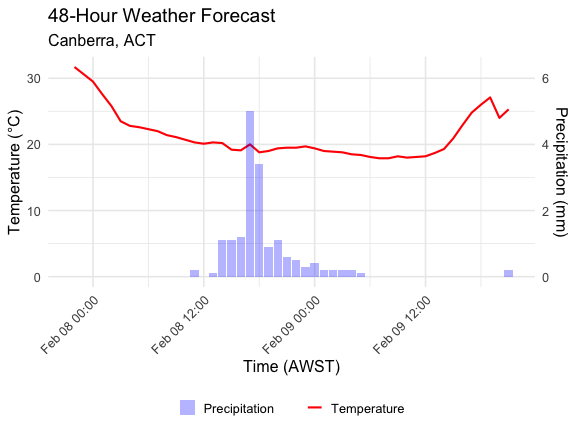
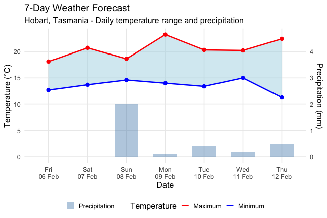
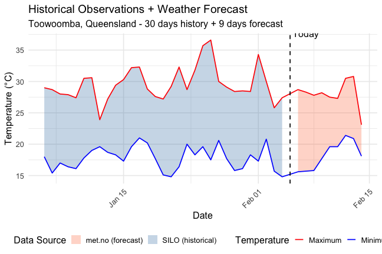
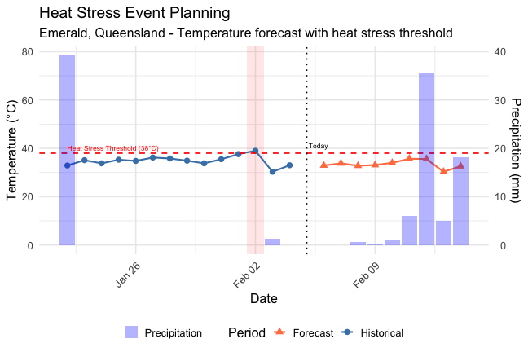

---
title: "weatherOz for the Locationforecast 2.0 (Norwegian Meteorologisk Institutt)"
author: "Rodrigo Pires"
output:
  rmarkdown::html_vignette:
    toc: true
vignette: >
  %\VignetteIndexEntry{weatherOz for met.no}
  %\VignetteEngine{knitr::rmarkdown_notangle}
  %\VignetteEncoding{UTF-8}
  %\VignetteDepends{ggplot2}
bibliography: bibliography.bib
---


## About MET Weather API Forecast Data

The [Norwegian Meteorological Institute](https://www.met.no/) provides global weather forecast data through their Locationforecast API.
The service uses high-resolution numerical weather prediction models and is available for locations worldwide, including Australia.
Forecasts extend up to 9 days into the future with hourly resolution for the first few days and lower temporal resolution for later periods.

The MET Weather API is free to use but requires proper identification through a User-Agent header containing a valid email address.
This is a requirement of MET Weather API's [Terms of Service](https://api.met.no/doc/TermsOfService) and ensures responsible use of the service.

All forecast times returned by {weatherOz} are converted to Australian Western Standard Time (AWST, Australia/Perth timezone) for consistency with other data sources in the package.

## A Note on API Keys

Unlike the DPIRD API and similar to SILO API, MET Weather API does not require a formal API key.
However, you must provide a valid email address which is used in the User-Agent header when making requests.
This email address should be yours and allows Norwegian Meteorological Institute to contact you if there are issues with your usage patterns.

For convenience, you can store your email in your .Renviron file using the format:

```r
METNO_API_KEY="your.email@example.com"
```

See [Chapter 8](https://rstats.wtf/r-startup.html#renviron) in "What They Forgot to Teach You About R" by Bryan _et al._ for more on storing details in your .Renviron if you are unfamiliar.

## Working With MET Weather API Forecast Data

Two primary functions are provided for accessing MET Weather API forecast data:

 * `get_metno_forecast()`, which returns hourly weather forecast data with complete metadata from the API response; and
 * `get_metno_daily_forecast()`, which returns daily aggregated forecast data for a specified number of days.

Three helper functions are also exported for advanced users:

 * `metno_timeseries_to_data_table()`, which converts the raw JSON timeseries to a tidy data.table;
 * `metno_resample_data_table()`, which aggregates hourly data to daily or other frequencies; and
 * `metno_get_dominant_symbol()`, which determines the most representative weather symbol for a period.

## Getting Hourly Forecast Data

The `get_metno_forecast()` function retrieves the complete hourly forecast for any location in Australia.
The function returns a list containing three elements: `data` (a data.table with hourly forecasts), `raw` (the complete parsed API response), and `metadata` (request information and cache-relevant headers).

### Example 1: Get Hourly Forecast for Perth

Retrieve the hourly forecast for Perth, Western Australia.


``` r
library(weatherOz)

perth_forecast <- get_metno_forecast(
  latitude = -31.95,
  longitude = 115.86,
  api_key = Sys.getenv("METNO_API_KEY")
)

# Inspect the structure
names(perth_forecast)
#> [1] "data"     "raw"      "metadata"

# View the first few rows of hourly data
head(perth_forecast$data)
#>                   time air_temperature relative_humidity wind_speed
#>                 <POSc>           <num>             <num>      <num>
#> 1: 2025-11-05 19:00:00            23.5              51.8        2.1
#> 2: 2025-11-05 20:00:00            23.6              52.5        3.2
#> 3: 2025-11-05 21:00:00            23.0              54.4        3.5
#> 4: 2025-11-05 22:00:00            22.3              58.5        4.4
#> 5: 2025-11-05 23:00:00            22.7              57.3        3.1
#> 6: 2025-11-06 00:00:00            23.5              53.5        2.3
#>    wind_from_direction cloud_area_fraction air_pressure_at_sea_level
#>                  <num>               <num>                     <num>
#> 1:               280.5                60.2                    1004.0
#> 2:               288.2                73.4                    1003.4
#> 3:               263.2                82.0                    1002.9
#> 4:               195.3                98.4                    1003.0
#> 5:               184.0               100.0                    1002.3
#> 6:               185.8               100.0                    1001.9
#>    precipitation_amount          symbol_code
#>                   <num>               <char>
#> 1:                  0.2 lightrainshowers_day
#> 2:                  0.7      rainshowers_day
#> 3:                  1.2 heavyrainshowers_day
#> 4:                  0.0               cloudy
#> 5:                  0.0     partlycloudy_day
#> 6:                  0.0     partlycloudy_day

# Check metadata
perth_forecast$metadata$status_code
#> [1] 200
perth_forecast$metadata$expires
#> [1] "2025-11-05 11:37:56 AWST"
```

### Example 2: Understanding the Metadata

The metadata returned includes useful information for caching and understanding the API response.


``` r
library(weatherOz)

forecast <- get_metno_forecast(
  latitude = -27.47,
  longitude = 153.03,
  api_key = Sys.getenv("METNO_API_KEY")
)

# When was this forecast retrieved?
forecast$metadata$retrieved_at
#> [1] "2025-11-05 11:06:39 AWST"

# When does this forecast expire (for caching purposes)?
forecast$metadata$expires
#> [1] "2025-11-05 11:37:56 AWST"

# When was the forecast last modified at the source?
forecast$metadata$last_modified
#> [1] "2025-11-05 11:06:39 AWST"
```

### Example 3: Working With Hourly Data

The hourly forecast data includes temperature, precipitation, wind, humidity, pressure, and cloud cover.


``` r
library(weatherOz)

forecast <- get_metno_forecast(
  latitude = -35.28,
  longitude = 149.13,
  api_key = Sys.getenv("METNO_API_KEY")
)

# Get the forecast data
hourly_data <- forecast$data

# Check the timezone
attr(hourly_data$time, "tzone")
#> [1] "Australia/Perth"

# Summary statistics for the next 24 hours
library(data.table)
next_24h <- hourly_data[1:24, ]

# Temperature range
range(next_24h$air_temperature, na.rm = TRUE)
#> [1]  4.8 20.0

# Total precipitation expected
sum(next_24h$precipitation_amount, na.rm = TRUE)
#> [1] 0

# Maximum wind speed
max(next_24h$wind_speed, na.rm = TRUE)
#> [1] 6.6
```

We can visualise the hourly forecast for the next 48 hours.


``` r
library(ggplot2)

# Get 48 hours of data
plot_data <- hourly_data[1:48, ]

# Create dual-axis plot for temperature and precipitation
ggplot(plot_data, aes(x = time)) +
  geom_line(aes(y = air_temperature, colour = "Temperature"),
            linewidth = 1) +
  geom_bar(aes(y = precipitation_amount * 5, fill = "Precipitation"),
           stat = "identity", alpha = 0.3) +
  scale_y_continuous(
    name = "Temperature (°C)",
    sec.axis = sec_axis(~ . / 5, name = "Precipitation (mm)")
  ) +
  scale_colour_manual(values = c("Temperature" = "red")) +
  scale_fill_manual(values = c("Precipitation" = "blue")) +
  labs(
    title = "48-Hour Weather Forecast",
    subtitle = "Canberra, ACT",
    x = "Time (AWST)",
    colour = NULL,
    fill = NULL
  ) +
  theme_minimal(base_size = 16) +
  theme(
    legend.position = "bottom",
    axis.text.x = element_text(angle = 45, hjust = 1)
  )
```

<div class="figure" style="text-align: center">

<p class="caption">plot of chunk hourly_forecast_plot</p>
</div>

## Getting Daily Forecast Data

The `get_metno_daily_forecast()` function provides a convenient way to obtain daily aggregated forecasts.
This function internally calls `get_metno_forecast()` and aggregates the hourly data into daily summaries.

Daily aggregations include:

 * Minimum and maximum temperatures
 * Total precipitation
 * Average wind speed and maximum wind gust
 * Average relative humidity
 * Average air pressure
 * Average cloud cover
 * Dominant weather symbol for the day

### Example 4: Get 7-Day Daily Forecast

Retrieve a 7-day daily forecast for Hobart, Tasmania.


``` r
library(weatherOz)

hobart_daily <- get_metno_daily_forecast(
  latitude = -42.88,
  longitude = 147.33,
  days = 7,
  api_key = Sys.getenv("METNO_API_KEY")
)

hobart_daily
#>          date min_temperature max_temperature total_precipitation
#>        <Date>           <num>           <num>               <num>
#> 1: 2025-11-06             8.9            13.8                 0.5
#> 2: 2025-11-07            10.5            17.8                 4.7
#> 3: 2025-11-08             7.4            10.9                14.8
#> 4: 2025-11-09             7.9            11.9                 0.7
#> 5: 2025-11-10             8.5            14.6                 0.2
#> 6: 2025-11-11             9.6            16.1                 5.2
#> 7: 2025-11-12             3.4             9.3                12.6
#>    avg_wind_speed max_wind_speed avg_relative_humidity avg_pressure
#>             <num>          <num>                 <num>        <num>
#> 1:       4.890476            7.5              71.20000     1005.024
#> 2:       4.283333            8.4              75.60000     1007.700
#> 3:       6.615789            8.3              95.75263     1008.732
#> 4:       3.500000            5.0              68.07500     1013.850
#> 5:       3.000000            4.7              68.35000     1012.475
#> 6:       2.750000            5.3              71.22500     1010.150
#> 7:       2.700000            3.6              94.02500     1007.675
#>    avg_cloud_fraction dominant_weather_symbol
#>                 <num>                  <char>
#> 1:           72.43333    lightrainshowers_day
#> 2:           98.70000               heavyrain
#> 3:          100.00000               heavyrain
#> 4:           51.95000               lightrain
#> 5:           81.62500                  cloudy
#> 6:           98.82500                    rain
#> 7:           82.02500               heavyrain
```

Visualise the 7-day forecast with temperature ranges and precipitation.


``` r
library(ggplot2)

# Add day labels
hobart_daily[, day_label := format(date, "%a\n%d %b")]

# Create plot
ggplot(hobart_daily, aes(x = date)) +
  geom_ribbon(aes(ymin = min_temperature, ymax = max_temperature),
              fill = "lightblue", alpha = 0.5) +
  geom_line(aes(y = max_temperature, colour = "Maximum"),
            linewidth = 1.2) +
  geom_line(aes(y = min_temperature, colour = "Minimum"),
            linewidth = 1.2) +
  geom_point(aes(y = max_temperature), colour = "red", size = 3) +
  geom_point(aes(y = min_temperature), colour = "blue", size = 3) +
  geom_bar(aes(y = total_precipitation * 5, fill = "Precipitation"),
           stat = "identity", alpha = 0.4, width = 0.6) +
  scale_y_continuous(
    name = "Temperature (°C)",
    sec.axis = sec_axis(~ . / 5, name = "Precipitation (mm)")
  ) +
  scale_colour_manual(values = c("Maximum" = "red", "Minimum" = "blue")) +
  scale_fill_manual(values = c("Precipitation" = "steelblue")) +
  scale_x_date(date_breaks = "1 day", date_labels = "%a\n%d %b") +
  labs(
    title = "7-Day Weather Forecast",
    subtitle = "Hobart, Tasmania - Daily temperature range and precipitation",
    x = "Date",
    colour = "Temperature",
    fill = NULL
  ) +
  theme_minimal(base_size = 16) +
  theme(
    legend.position = "bottom",
    panel.grid.minor = element_blank()
  )
```

<div class="figure" style="text-align: center">

<p class="caption">plot of chunk daily_forecast_plot</p>
</div>

### Example 5: Compare Daily Aggregations

Demonstrate the difference between hourly and daily aggregated data.


``` r
library(weatherOz)

# Get both hourly and daily forecasts
hourly <- get_metno_forecast(
  latitude = -34.93,
  longitude = 138.60,
  api_key = Sys.getenv("METNO_API_KEY")
)

daily <- get_metno_daily_forecast(
  latitude = -34.93,
  longitude = 138.60,
  days = 3,
  api_key = Sys.getenv("METNO_API_KEY")
)

# Compare temperature ranges for first day
first_day <- as.Date(hourly$data$time[1])
day1_hourly <- hourly$data[as.Date(time) == first_day, ]

# Hourly data statistics
cat("Day 1 from hourly data:\n")
#> Day 1 from hourly data:
cat("  Min temp:", min(day1_hourly$air_temperature, na.rm = TRUE), "°C\n")
#>   Min temp: 11.1 °C
cat("  Max temp:", max(day1_hourly$air_temperature, na.rm = TRUE), "°C\n")
#>   Max temp: 17.3 °C
cat("  Total precip:", sum(day1_hourly$precipitation_amount, na.rm = TRUE), "mm\n")
#>   Total precip: 0 mm

# Daily aggregated data
cat("\nDay 1 from daily aggregation:\n")
#> 
#> Day 1 from daily aggregation:
cat("  Min temp:", daily$min_temperature[1], "°C\n")
#>   Min temp: 11.1 °C
cat("  Max temp:", daily$max_temperature[1], "°C\n")
#>   Max temp: 17.3 °C
cat("  Total precip:", daily$total_precipitation[1], "mm\n")
#>   Total precip: 0 mm
```

## Combining Forecast with Historical Data

One of the most powerful features of {weatherOz} is the ability to combine forecast data from MET Weather API with historical observations from SILO or DPIRD.
This creates a continuous time series with historical observations and the nine-days forecast from the MET Weather API.

### Example 6: Combining MET Weather API Forecast with SILO Historical Data

Create a continuous 40-day dataset using 30 days of historical data and 9 days of forecast.


``` r
library(weatherOz)
library(data.table)

# Define location (Toowoomba, Qld)
lat <- -27.56
lon <- 151.95

# Get 30 days of historical data from SILO
end_date <- Sys.Date() - 1
start_date <- end_date - 30

historical <- get_data_drill(
  latitude = lat,
  longitude = lon,
  start_date = format(start_date, "%Y%m%d"),
  end_date = format(end_date, "%Y%m%d"),
  values = c("max_temp", "min_temp", "rain"),
  api_key = Sys.getenv("SILO_API_KEY")
)

# Get 9 days of forecast data from METNO
forecast <- get_metno_daily_forecast(
  latitude = lat,
  longitude = lon,
  days = 9,
  api_key = Sys.getenv("METNO_API_KEY")
)

# Prepare historical data for joining
historical_clean <- historical[, .(
  date = date,
  min_temp = air_tmin,
  max_temp = air_tmax,
  precipitation = rainfall,
  data_source = "SILO (historical)"
)]

# Prepare forecast data for joining
forecast_clean <- forecast[, .(
  date = date,
  min_temp = min_temperature,
  max_temp = max_temperature,
  precipitation = total_precipitation,
  data_source = "met.no (forecast)"
)]

# Combine datasets
combined <- rbind(historical_clean, forecast_clean)

# View the transition point
combined[(.N - 15):.N, ]
#>           date min_temp max_temp precipitation       data_source
#>         <Date>    <num>    <num>         <num>            <char>
#>  1: 2025-10-29     12.8     25.1          34.0 SILO (historical)
#>  2: 2025-10-30     15.0     27.9           0.0 SILO (historical)
#>  3: 2025-10-31     16.4     29.2           0.0 SILO (historical)
#>  4: 2025-11-01     16.9     29.5           2.1 SILO (historical)
#>  5: 2025-11-02     16.1     31.4           4.4 SILO (historical)
#>  6: 2025-11-03     18.9     31.5           0.0 SILO (historical)
#>  7: 2025-11-04     16.2     25.7           2.0 SILO (historical)
#>  8: 2025-11-06     10.7     23.9           0.0 met.no (forecast)
#>  9: 2025-11-07     12.0     23.4           0.0 met.no (forecast)
#> 10: 2025-11-08     13.4     24.6           0.0 met.no (forecast)
#> 11: 2025-11-09     17.7     29.1           5.5 met.no (forecast)
#> 12: 2025-11-10     15.4     21.0           7.5 met.no (forecast)
#> 13: 2025-11-11     11.0     18.6           3.5 met.no (forecast)
#> 14: 2025-11-12     11.2     23.7           0.0 met.no (forecast)
#> 15: 2025-11-13     15.6     26.5           0.0 met.no (forecast)
#> 16: 2025-11-14     16.9     23.0           1.1 met.no (forecast)
```

Check the transition from historical data to forecast.


``` r
library(ggplot2)

# Plot the combined dataset
ggplot(combined, aes(x = date)) +
  geom_ribbon(aes(ymin = min_temp, ymax = max_temp, fill = data_source),
              alpha = 0.3) +
  geom_line(aes(y = max_temp, colour = "Maximum"), linewidth = 0.8) +
  geom_line(aes(y = min_temp, colour = "Minimum"), linewidth = 0.8) +
  geom_vline(xintercept = as.numeric(Sys.Date()),
             linetype = "dashed", colour = "black", linewidth = 0.8) +
  annotate("text", x = Sys.Date(), y = max(combined$max_temp, na.rm = TRUE),
           label = "Today", vjust = -0.5, hjust = -0.1) +
  scale_fill_manual(values = c("SILO (historical)" = "steelblue",
                                "met.no (forecast)" = "coral")) +
  scale_colour_manual(values = c("Maximum" = "red", "Minimum" = "blue")) +
  labs(
    title = "Historical Observations + Weather Forecast",
    subtitle = "Toowoomba, Queensland - 30 days history + 9 days forecast",
    x = "Date",
    y = "Temperature (°C)",
    fill = "Data Source",
    colour = "Temperature"
  ) +
  theme_minimal(base_size = 16) +
  theme(
    legend.position = "bottom",
    axis.text.x = element_text(angle = 45, hjust = 1)
  )
```

<div class="figure" style="text-align: center">

<p class="caption">plot of chunk combined_historical_forecast_plot</p>
</div>

### Example 7: Combining MET Weather API Forecast with DPIRD Historical Data

For Western Australian locations, combine DPIRD observations with METNO forecasts.


``` r
library(weatherOz)
library(data.table)

# Define location (Northam, WA)
lat <- -31.65
lon <- 116.67

# Get recent DPIRD observations
dpird_data <- get_dpird_summaries(
  station_code = "NO",
  start_date = format(Sys.Date() - 14, "%Y%m%d"),
  end_date = format(Sys.Date() - 1, "%Y%m%d"),
  interval = "daily",
  values = c("airTemperature", "rainfall")
)

# Get METNO forecast
metno_data <- get_metno_daily_forecast(
  latitude = lat,
  longitude = lon,
  days = 7,
  api_key = Sys.getenv("METNO_API_KEY")
)

# Prepare DPIRD data
dpird_clean <- dpird_data[, .(
  date = as.Date(date),
  min_temp = air_tmin,
  max_temp = air_tmax,
  precipitation = rainfall,
  data_source = "DPIRD (observed)"
)]

# Prepare METNO data
metno_clean <- metno_data[, .(
  date = date,
  min_temp = min_temperature,
  max_temp = max_temperature,
  precipitation = total_precipitation,
  data_source = "met.no (forecast)"
)]

# Combine
combined <- rbind(dpird_clean, metno_clean)

combined
#>           date min_temp max_temp precipitation       data_source
#>         <Date>    <num>    <num>         <num>            <char>
#>  1: 2025-10-22      7.6     26.2           0.0  DPIRD (observed)
#>  2: 2025-10-23     10.7     25.3           0.0  DPIRD (observed)
#>  3: 2025-10-24      7.5     21.5           0.4  DPIRD (observed)
#>  4: 2025-10-25      8.5     23.9           1.2  DPIRD (observed)
#>  5: 2025-10-26      6.4     26.0           0.0  DPIRD (observed)
#>  6: 2025-10-27      6.9     28.7           0.0  DPIRD (observed)
#>  7: 2025-10-28      8.0     35.7           0.0  DPIRD (observed)
#>  8: 2025-10-29     12.2     23.1           0.0  DPIRD (observed)
#>  9: 2025-10-30     10.3     24.3           0.8  DPIRD (observed)
#> 10: 2025-10-31      7.0     26.9           0.0  DPIRD (observed)
#> 11: 2025-11-01     13.4     24.1           0.0  DPIRD (observed)
#> 12: 2025-11-02      4.9     27.1           0.0  DPIRD (observed)
#> 13: 2025-11-03      9.0     31.9           0.0  DPIRD (observed)
#> 14: 2025-11-04     16.7     33.6           0.0  DPIRD (observed)
#> 15: 2025-11-06     13.6     25.6           3.2 met.no (forecast)
#> 16: 2025-11-07     12.5     25.0           0.0 met.no (forecast)
#> 17: 2025-11-08     13.3     23.7           0.0 met.no (forecast)
#> 18: 2025-11-09     15.7     26.4           0.0 met.no (forecast)
#> 19: 2025-11-10     16.5     29.0           0.0 met.no (forecast)
#> 20: 2025-11-11     14.8     29.3           0.0 met.no (forecast)
#> 21: 2025-11-12     17.9     30.2           0.0 met.no (forecast)
#>           date min_temp max_temp precipitation       data_source
```

## Practical Use Case: Agricultural Planning

This example demonstrates how to use combined historical and forecast data for agricultural decision-making, specifically for irrigation scheduling ahead of predicted hot weather.

### Example 8: Heat Stress Event Planning

An irrigated crop farmer wants to identify upcoming heat stress events (days with maximum temperature > 38°C) and ensure adequate irrigation is in place.


``` r
library(weatherOz)
library(data.table)

# Location: Emerald, Queensland (agricultural region)
lat <- -23.53
lon <- 148.16

# Get recent historical context (14 days)
historical <- get_data_drill(
  latitude = lat,
  longitude = lon,
  start_date = format(Sys.Date() - 14, "%Y%m%d"),
  end_date = format(Sys.Date() - 1, "%Y%m%d"),
  values = c("max_temp", "min_temp", "rain", "evap_pan"),
  api_key = Sys.getenv("SILO_API_KEY")
)

# Get 9-day forecast
forecast <- get_metno_daily_forecast(
  latitude = lat,
  longitude = lon,
  days = 9,
  api_key = Sys.getenv("METNO_API_KEY")
)

# Prepare datasets
hist_prep <- historical[, .(
  date = date,
  max_temp = air_tmax,
  precipitation = rainfall,
  period = "Historical"
)]

fcst_prep <- forecast[, .(
  date = date,
  max_temp = max_temperature,
  precipitation = total_precipitation,
  period = "Forecast"
)]

# Combine
weather_data <- rbind(hist_prep, fcst_prep)

# Identify heat stress days (max temp > 38°C) in forecast period
heat_stress_days <- forecast[max_temperature > 38, .(
  date,
  max_temperature,
  days_ahead = as.numeric(date - Sys.Date())
)]

if (nrow(heat_stress_days) > 0) {
  cat("HEAT STRESS ALERT\n")
  cat("=================\n\n")
  cat("Heat stress conditions predicted on:\n")
  print(heat_stress_days)
  cat("\nRecommendation: Schedule irrigation 2-3 days before events to ensure\n")
  cat("adequate soil moisture for evaporative cooling.\n")
} else {
  cat("No heat stress events (>38°C) predicted in the next 9 days.\n")
}
#> No heat stress events (>38°C) predicted in the next 9 days.

# Calculate cumulative water balance
weather_data[, water_balance := precipitation]
weather_data[, cumulative_balance := cumsum(water_balance)]

# Show recent and upcoming water balance
weather_data[, .(date, max_temp, precipitation, cumulative_balance)]
#>           date max_temp precipitation cumulative_balance
#>         <Date>    <num>         <num>              <num>
#>  1: 2025-10-22     37.1           0.0                0.0
#>  2: 2025-10-23     40.0           0.0                0.0
#>  3: 2025-10-24     40.4           0.0                0.0
#>  4: 2025-10-25     38.7           0.5                0.5
#>  5: 2025-10-26     40.3          13.6               14.1
#>  6: 2025-10-27     36.7           0.0               14.1
#>  7: 2025-10-28     32.9           5.3               19.4
#>  8: 2025-10-29     35.5           0.0               19.4
#>  9: 2025-10-30     36.8           0.1               19.5
#> 10: 2025-10-31     38.0           0.0               19.5
#> 11: 2025-11-01     37.6           0.0               19.5
#> 12: 2025-11-02     39.4          10.3               29.8
#> 13: 2025-11-03     36.4           0.4               30.2
#> 14: 2025-11-04     32.9           0.4               30.6
#> 15: 2025-11-06     32.6           0.0               30.6
#> 16: 2025-11-07     33.3           0.0               30.6
#> 17: 2025-11-08     32.5           0.0               30.6
#> 18: 2025-11-09     35.8           0.0               30.6
#> 19: 2025-11-10     31.1          11.7               42.3
#> 20: 2025-11-11     31.2           0.3               42.6
#> 21: 2025-11-12     31.5           0.0               42.6
#> 22: 2025-11-13     32.4           7.9               50.5
#> 23: 2025-11-14     29.3           1.2               51.7
#>           date max_temp precipitation cumulative_balance
```

Visualise temperature trends and identify heat stress risk days.


``` r
library(ggplot2)

# Add heat stress indicator
weather_data[, heat_stress := max_temp > 38]

# Create plot
ggplot(weather_data, aes(x = date)) +
  geom_rect(data = weather_data[heat_stress == TRUE],
            aes(xmin = date - 0.5, xmax = date + 0.5,
                ymin = -Inf, ymax = Inf),
            fill = "red", alpha = 0.1) +
  geom_line(aes(y = max_temp, colour = period), linewidth = 1) +
  geom_point(aes(y = max_temp, colour = period, shape = period), size = 3) +
  geom_hline(yintercept = 38, linetype = "dashed", colour = "red",
             linewidth = 0.8) +
  geom_bar(aes(y = precipitation * 2, fill = "Precipitation"),
           stat = "identity", alpha = 0.3) +
  geom_vline(xintercept = as.numeric(Sys.Date()),
             linetype = "dotted", colour = "black", linewidth = 0.8) +
  annotate("text", x = Sys.Date(), y = max(weather_data$max_temp, na.rm = TRUE),
           label = "Today", vjust = -0.5, hjust = -0.1, size = 3) +
  annotate("text", x = min(weather_data$date), y = 38,
           label = "Heat Stress Threshold (38°C)", vjust = -0.5,
           hjust = 0, colour = "red", size = 3) +
  scale_y_continuous(
    name = "Temperature (°C)",
    sec.axis = sec_axis(~ . / 2, name = "Precipitation (mm)")
  ) +
  scale_colour_manual(values = c("Historical" = "steelblue",
                                  "Forecast" = "coral")) +
  scale_shape_manual(values = c("Historical" = 16, "Forecast" = 17)) +
  scale_fill_manual(values = c("Precipitation" = "blue")) +
  labs(
    title = "Heat Stress Event Planning",
    subtitle = "Emerald, Queensland - Temperature forecast with heat stress threshold",
    x = "Date",
    colour = "Period",
    shape = "Period",
    fill = NULL
  ) +
  theme_minimal(base_size = 16) +
  theme(
    legend.position = "bottom",
    axis.text.x = element_text(angle = 45, hjust = 1)
  )
```

<div class="figure" style="text-align: center">

<p class="caption">plot of chunk heat_stress_plot</p>
</div>

## Advanced Usage: Helper Functions

{weatherOz} exports helper functions that provide finer control over forecast data processing.

### Example 9: Custom Aggregation with metno_resample_data_table()

Use the helper functions to create custom temporal aggregations.


``` r
library(weatherOz)

# Get hourly forecast
forecast <- get_metno_forecast(
  latitude = -33.87,
  longitude = 151.21,
  api_key = Sys.getenv("METNO_API_KEY")
)

# Access the hourly data
hourly_data <- forecast$data

# Create daily aggregation manually
daily_aggregated <- metno_resample_data_table(hourly_data, freq = "daily")

# View the structure
str(daily_aggregated)
#> Classes 'data.table' and 'data.frame':	10 obs. of  10 variables:
#>  $ date                   : Date, format: "2025-11-06" "2025-11-07" ...
#>  $ min_temperature        : num  12.6 16.8 20.5 16.1 14.1 13.4 16.1 14.4 16.8 17.2
#>  $ max_temperature        : num  23.9 22.2 24.1 29 16.8 18.7 21.9 21.7 27.2 22.6
#>  $ total_precipitation    : num  0 0 0 11.9 0.3 0 0 0 0 0
#>  $ avg_wind_speed         : num  4.11 7.2 9.49 6.1 5.58 ...
#>  $ max_wind_speed         : num  7.4 10.6 12.6 7.2 8.7 3.8 6.5 4.9 6.9 5.8
#>  $ avg_relative_humidity  : num  62.2 65.6 70.8 72.6 70.2 ...
#>  $ avg_pressure           : num  1016 1015 1007 1005 1016 ...
#>  $ avg_cloud_fraction     : num  1.75 76.49 80.39 36.33 45.9 ...
#>  $ dominant_weather_symbol: chr  "fair_night" "partlycloudy_day" "cloudy" "heavyrainshowers_day" ...
#>  - attr(*, ".internal.selfref")=<externalptr>

# Compare with built-in function
daily_builtin <- get_metno_daily_forecast(
  latitude = -33.87,
  longitude = 151.21,
  days = 5,
  api_key = Sys.getenv("METNO_API_KEY")
)

# Results should be identical
all.equal(
  daily_aggregated[1:5, ],
  daily_builtin[1:5, ],
  check.attributes = FALSE
)
#> [1] TRUE
```

### Example 10: Understanding Weather Symbols

Weather symbols provide a categorical description of expected conditions.


``` r
library(weatherOz)

forecast <- get_metno_forecast(
  latitude = -37.81,
  longitude = 144.96,
  api_key = Sys.getenv("METNO_API_KEY")
)

# Extract unique weather symbols for the next 48 hours
symbols_48h <- unique(forecast$data[1:48, symbol_code])

cat("Weather symbols predicted in next 48 hours:\n")
#> Weather symbols predicted in next 48 hours:
print(symbols_48h)
#> [1] "cloudy"           "partlycloudy_day" "clearsky_night"   "fair_night"      
#> [5] "fair_day"         "clearsky_day"     "lightrain"        "rain"            
#> [9] "heavyrain"

# Get daily forecast to see dominant symbols
daily <- get_metno_daily_forecast(
  latitude = -37.81,
  longitude = 144.96,
  days = 5,
  api_key = Sys.getenv("METNO_API_KEY")
)

# Show dominant symbol for each day
daily[, .(date, dominant_weather_symbol)]
#>          date dominant_weather_symbol
#>        <Date>                  <char>
#> 1: 2025-11-06                  cloudy
#> 2: 2025-11-07               heavyrain
#> 3: 2025-11-08               heavyrain
#> 4: 2025-11-09                    rain
#> 5: 2025-11-10        partlycloudy_day
```

## Appendix: Field Descriptions

### Hourly Forecast Fields

The `get_metno_forecast()` function returns a data.table with the following fields:

<dl>
  <dt>time</dt><dd>POSIXct timestamp in AWST timezone (Australia/Perth)</dd>
  <dt>air_temperature (°C)</dt><dd>Air temperature at 2 metres above ground</dd>
  <dt>precipitation_amount (mm)</dt><dd>Precipitation amount for the 1-hour period</dd>
  <dt>precipitation_min (mm)</dt><dd>Minimum precipitation amount (lower bound of uncertainty)</dd>
  <dt>precipitation_max (mm)</dt><dd>Maximum precipitation amount (upper bound of uncertainty)</dd>
  <dt>relative_humidity (%)</dt><dd>Relative humidity at 2 metres above ground</dd>
  <dt>wind_speed (m/s)</dt><dd>Wind speed at 10 metres above ground</dd>
  <dt>wind_from_direction (degrees)</dt><dd>Wind direction (0-360°, meteorological convention)</dd>
  <dt>air_pressure_at_sea_level (hPa)</dt><dd>Air pressure reduced to mean sea level</dd>
  <dt>cloud_area_fraction (%)</dt><dd>Total cloud cover as percentage (0-100)</dd>
  <dt>fog_area_fraction (%)</dt><dd>Fog coverage as percentage (0-100)</dd>
  <dt>dew_point_temperature (°C)</dt><dd>Dew point temperature at 2 metres above ground</dd>
  <dt>symbol_code</dt><dd>METNO weather symbol code (categorical description)</dd>
</dl>

### Daily Forecast Fields

The `get_metno_daily_forecast()` function returns a data.table with the following aggregated fields:

<dl>
  <dt>date</dt><dd>Date of the forecast (Date class)</dd>
  <dt>min_temperature (°C)</dt><dd>Minimum temperature for the day</dd>
  <dt>max_temperature (°C)</dt><dd>Maximum temperature for the day</dd>
  <dt>total_precipitation (mm)</dt><dd>Total precipitation for the 24-hour period</dd>
  <dt>avg_wind_speed (m/s)</dt><dd>Average wind speed</dd>
  <dt>max_wind_speed (m/s)</dt><dd>Maximum wind speed (gust)</dd>
  <dt>avg_relative_humidity (%)</dt><dd>Average relative humidity</dd>
  <dt>avg_pressure (hPa)</dt><dd>Average air pressure at sea level</dd>
  <dt>avg_cloud_fraction (%)</dt><dd>Average cloud cover</dd>
  <dt>dominant_weather_symbol</dt><dd>Most frequently occurring weather symbol for the day</dd>
</dl>

### Weather Symbol Codes

The MET Weather API uses symbolic weather codes that describe expected conditions.
Common symbols include:

<dl>
  <dt>clearsky_day / clearsky_night</dt><dd>Clear sky conditions</dd>
  <dt>fair_day / fair_night</dt><dd>Fair weather with few clouds</dd>
  <dt>partlycloudy_day / partlycloudy_night</dt><dd>Partly cloudy conditions</dd>
  <dt>cloudy</dt><dd>Cloudy conditions</dd>
  <dt>lightrainshowers_day / lightrainshowers_night</dt><dd>Light rain showers</dd>
  <dt>rainshowers_day / rainshowers_night</dt><dd>Rain showers</dd>
  <dt>heavyrainshowers_day / heavyrainshowers_night</dt><dd>Heavy rain showers</dd>
  <dt>lightrain</dt><dd>Light rain</dd>
  <dt>rain</dt><dd>Rain</dd>
  <dt>heavyrain</dt><dd>Heavy rain</dd>
  <dt>lightrainandthunder</dt><dd>Light rain and thunder</dd>
  <dt>rainandthunder</dt><dd>Rain and thunder</dd>
  <dt>fog</dt><dd>Fog</dd>
</dl>

The full list of symbol codes is available in the [METNO Locationforecast documentation](https://api.met.no/weatherapi/locationforecast/2.0/documentation).

### Metadata Structure

The metadata element returned by `get_metno_forecast()` contains:

<dl>
  <dt>latitude</dt><dd>Request latitude (truncated to 4 decimal places)</dd>
  <dt>longitude</dt><dd>Request longitude (truncated to 4 decimal places)</dd>
  <dt>format</dt><dd>API format used ("compact" or "complete")</dd>
  <dt>status_code</dt><dd>HTTP status code (200 for success)</dd>
  <dt>retrieved_at</dt><dd>POSIXct timestamp when data was retrieved</dd>
  <dt>expires_raw</dt><dd>RFC 1123 formatted expiry time from Expires header</dd>
  <dt>expires</dt><dd>POSIXct expiry time (for caching logic)</dd>
  <dt>last_modified_raw</dt><dd>RFC 1123 formatted last modification time</dd>
  <dt>last_modified</dt><dd>POSIXct last modification time</dd>
</dl>

These metadata fields are particularly useful for implementing caching strategies and understanding when forecasts are updated at the source.

## References
