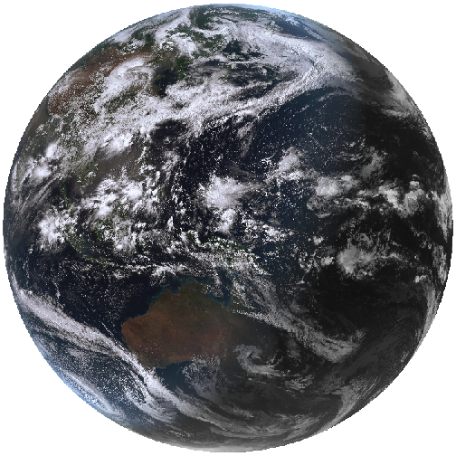

## Introduction

{wrapique} provides automated downloading, parsing, cleaning, and formatting
of weather data for Australia through API endpoints provided by the Department
of Primary Industries and Regional Development (DPIRD) of Western Australia,
and by the Science and Technology Division of the Queensland Government's
Department of Environment and Science (DES).
As well as Australian Government Bureau of Meteorology ('BOM') précis and
coastal forecasts, agriculture bulletin data, and downloading and importing
radar and satellite imagery files.
DPIRD weather data are accessed through public APIs provided by DPIRD,
<https://www.agric.wa.gov.au/weather-api-20>, providing access to weather
station data from DPIRD's own weather station network.
Australia-wide weather data are based on data from the Australian Bureau of
Meteorology (BOM) data and accessed through SILO (Scientific Information for
Land Owners) (Jeffery et al., 2001).
BOM also serves several types of data data as XML, JSON and SHTML files.
This package fetches these files, parses them and return a data frame.
Satellite and radar imagery files are also made available to the public via anonymous FTP.
{wrapique} provides functionality to query, fetch and create `terra::SpatRaster()` objects of the GeoTIFF imagery or a magick object of radar image.png files.

## Using {wrapique}

Several functions are provided by {wrapique} to retrieve Australian Bureau of Meteorology (BOM) data.
A family of functions retrieve weather data and return data frames;
 * `get_precis_forecast()`, which retrieves the précis (short) forecast;
 * `get_ag_bulletin()`, which retrieves the agriculture bulletin;
 * `get_coastal_forecast()`, which fetches coastal waters forecasts for each state; and
A second family of functions retrieve information pertaining to satellite and radar imagery, `get_available_imagery()` and the imagery itself, `_imagery()` for satellite, and `get_available_radar()` and `get_radar_imagery()` for radar images.
The last group functions provides internal functionality for {wrapique} itself; `update_forecast_towns()`, which updates an internal database of forecast locations distributed with the package, `update_ag_station_locations()`, which updates an internal database of the stations reporting ag bulletins and `find_forecast_towns()` and find_nearby_stations()` which returns either the closest forecast locations or the nearest weather stations with an ag bulletin to a given point in Australia.

## Using get_precis_forecast()

This function only takes one argument, `state`. The `state` parameter allows the user to select the forecast for just one state or a national forecast.
States or territories are specified using the official postal codes or full name with fuzzy matching performed via `agrep()`.

- **ACT** - Australian Capital Territory

- **NSW** - New South Wales

- **NT** - Northern Territory

- **QLD** - Queensland

- **SA** - South Australia

- **TAS** - Tasmania

- **VIC** - Victoria

- **WA** - Western Australia

- **AUS** - Australia, returns national forecast including all states, NT and ACT.

### Results

The function, `get_precis_forecast()`, will return a data frame of the weather forecast for the daily forecast for selected towns.
See Appendix 1 for a full description of the fields and values.

### Example

Following is an example fetching the forecast for Queensland.


```r
(QLD_forecast <- get_precis_forecast(state = "QLD"))
#>      index product_id state         town       aac       lat      lon elev
#>   1:     0   IDQ11295   QLD     Brisbane QLD_PT001 -27.48080 153.0389  8.1
#>   2:     1   IDQ11295   QLD     Brisbane QLD_PT001 -27.48080 153.0389  8.1
#>   3:     2   IDQ11295   QLD     Brisbane QLD_PT001 -27.48080 153.0389  8.1
#>   4:     3   IDQ11295   QLD     Brisbane QLD_PT001 -27.48080 153.0389  8.1
#>   5:     4   IDQ11295   QLD     Brisbane QLD_PT001 -27.48080 153.0389  8.1
#>  ---                                                                      
#> 787:     2   IDQ11295   QLD Port Douglas QLD_PT254 -16.48681 145.4635 70.4
#> 788:     3   IDQ11295   QLD Port Douglas QLD_PT254 -16.48681 145.4635 70.4
#> 789:     4   IDQ11295   QLD Port Douglas QLD_PT254 -16.48681 145.4635 70.4
#> 790:     5   IDQ11295   QLD Port Douglas QLD_PT254 -16.48681 145.4635 70.4
#> 791:     6   IDQ11295   QLD Port Douglas QLD_PT254 -16.48681 145.4635 70.4
#>         start_time_local end_time_local utc_offset      start_time_utc        end_time_utc
#>   1: 2023-03-09 12:05:54     2023-03-10      10:00 2023-03-09 02:05:54 2023-03-09 14:00:00
#>   2: 2023-03-10 00:00:00     2023-03-11      10:00 2023-03-09 14:00:00 2023-03-10 14:00:00
#>   3: 2023-03-11 00:00:00     2023-03-12      10:00 2023-03-10 14:00:00 2023-03-11 14:00:00
#>   4: 2023-03-12 00:00:00     2023-03-13      10:00 2023-03-11 14:00:00 2023-03-12 14:00:00
#>   5: 2023-03-13 00:00:00     2023-03-14      10:00 2023-03-12 14:00:00 2023-03-13 14:00:00
#>  ---                                                                                      
#> 787: 2023-03-11 00:00:00     2023-03-12      10:00 2023-03-10 14:00:00 2023-03-11 14:00:00
#> 788: 2023-03-12 00:00:00     2023-03-13      10:00 2023-03-11 14:00:00 2023-03-12 14:00:00
#> 789: 2023-03-13 00:00:00     2023-03-14      10:00 2023-03-12 14:00:00 2023-03-13 14:00:00
#> 790: 2023-03-14 00:00:00     2023-03-15      10:00 2023-03-13 14:00:00 2023-03-14 14:00:00
#> 791: 2023-03-15 00:00:00     2023-03-16      10:00 2023-03-14 14:00:00 2023-03-15 14:00:00
#>      minimum_temperature maximum_temperature lower_precipitation_limit
#>   1:                  NA                  29                        NA
#>   2:                  22                  28                         0
#>   3:                  22                  27                         8
#>   4:                  22                  30                         2
#>   5:                  22                  31                         0
#>  ---                                                                  
#> 787:                  23                  32                        NA
#> 788:                  24                  32                         0
#> 789:                  24                  33                         0
#> 790:                  23                  33                         0
#> 791:                  23                  32                         0
#>      upper_precipitation_limit               precis probability_of_precipitation
#>   1:                        NA Light shower or two.                           50
#>   2:                        15             Showers.                           80
#>   3:                        40             Showers.                           95
#>   4:                        20             Showers.                           90
#>   5:                        10             Showers.                           80
#>  ---                                                                            
#> 787:                        NA       Partly cloudy.                           20
#> 788:                         1     Possible shower.                           40
#> 789:                         2     Possible shower.                           40
#> 790:                         2     Possible shower.                           40
#> 791:                         5       Shower or two.                           50
```


## Using get_ag_bulletin()

`get_ag_bulletin()` only takes one argument, `state`.
The `state` parameter allows the user to select the bulletin for just one state or a national forecast.
States or territories are specified using the official postal codes or full name with fuzzy matching performed via `agrep()`.

- **NSW** - New South Wales

- **NT** - Northern Territory

- **QLD** - Queensland

- **SA** - South Australia

- **TAS** - Tasmania

- **VIC** - Victoria

- **WA** - Western Australia

- **AUS** - Australia, returns bulletin for all states and NT.

### Results

The function, `get_ag_bulletin()`, will return a data frame of the agriculture bulletin for selected stations.
See Appendix 3 for a full list and description of the fields and values.

### Example

Following is an example fetching the ag bulletin for Queensland.


```r
(QLD_bulletin <- get_ag_bulletin(state = "QLD"))
#>     product_id state dist                             name   wmo  site              station
#>  1:   IDQ60604   QLD   27                       WEIPA AERO 94170 27045                Weipa
#>  2:   IDQ60604   QLD   29                   MOUNT ISA AERO 94332 29127            Mount Isa
#>  3:   IDQ60604   QLD   30               GEORGETOWN AIRPORT 94274 30124   Georgetown Airport
#>  4:   IDQ60604   QLD   31                      CAIRNS AERO 94287 31011               Cairns
#>  5:   IDQ60604   QLD   31        WALKAMIN RESEARCH STATION 95284 31108             Walkamin
#>  6:   IDQ60604   QLD   31                  MAREEBA AIRPORT 95286 31210              Mareeba
#>  7:   IDQ60604   QLD   32          SOUTH JOHNSTONE EXP STN 95292 32037      South Johnstone
#>  8:   IDQ60604   QLD   32                  TOWNSVILLE AERO 94294 32040           Townsville
#>  9:   IDQ60604   QLD   32                 INGHAM COMPOSITE 95291 32078               Ingham
#> 10:   IDQ60604   QLD   33             AYR DPI RESEARCH STN 95295 33002                  Ayr
#> 11:   IDQ60604   QLD   33         COLLINSVILLE POST OFFICE 94360 33013         Collinsville
#> 12:   IDQ60604   QLD   33                       MACKAY M.O 94367 33119               Mackay
#> 13:   IDQ60604   QLD   35                TAMBO POST OFFICE 94355 35069                Tambo
#> 14:   IDQ60604   QLD   35                  EMERALD AIRPORT 94363 35264              Emerald
#> 15:   IDQ60604   QLD   36                   LONGREACH AERO 94346 36031            Longreach
#> 16:   IDQ60604   QLD   38                   BOULIA AIRPORT 94333 38003               Boulia
#> 17:   IDQ60604   QLD   38               BIRDSVILLE AIRPORT 95482 38026           Birdsville
#> 18:   IDQ60604   QLD   39                 ROCKHAMPTON AERO 94374 39083          Rockhampton
#> 19:   IDQ60604   QLD   39                 THANGOOL AIRPORT 94376 39089             Thangool
#> 20:   IDQ60604   QLD   39                   BUNDABERG AERO 94387 39128            Bundaberg
#> 21:   IDQ60604   QLD   40  UNIVERSITY OF QUEENSLAND GATTON 94562 40082               Gatton
#> 22:   IDQ60604   QLD   40                    BRISBANE AERO 94578 40842     Brisbane Airport
#> 23:   IDQ60604   QLD   40 LOGAN CITY WATER TREATMENT PLANT 95581 40854           Logan City
#> 24:   IDQ60604   QLD   41                       OAKEY AERO 94552 41359                Oakey
#> 25:   IDQ60604   QLD   41                    DALBY AIRPORT 94542 41522                Dalby
#> 26:   IDQ60604   QLD   41                          WARWICK 94555 41525              Warwick
#> 27:   IDQ60604   QLD   43             MITCHELL POST OFFICE 94514 43020             Mitchell
#> 28:   IDQ60604   QLD   43                     ROMA AIRPORT 94515 43091                 Roma
#> 29:   IDQ60604   QLD   43                ST GEORGE AIRPORT 94517 43109            St George
#> 30:   IDQ60604   QLD   44                 CHARLEVILLE AERO 94510 44021          Charleville
#> 31:   IDQ60604   QLD   45             THARGOMINDAH AIRPORT 95492 45025 Thargomindah Airport
#>     product_id state dist                             name   wmo  site              station
#>          obs_time_local        obs_time_utc time_zone      lat      lon  elev bar_ht start
#>  1: 2023-03-09 09:00:00 2023-03-08 23:00:00       EST -12.6778 141.9208  18.0   18.6  1972
#>  2: 2023-03-09 09:00:00 2023-03-08 23:00:00       EST -20.6778 139.4875 340.3  341.0  1966
#>  3: 2023-03-09 09:00:00 2023-03-08 23:00:00       EST -18.3039 143.5306 301.8  302.5  2004
#>  4: 2023-03-09 09:00:00 2023-03-08 23:00:00       EST -16.8736 145.7458   2.2    2.6  1941
#>  5: 2023-03-09 09:00:00 2023-03-08 23:00:00       EST -17.1347 145.4281 594.0     NA  1965
#>  6: 2023-03-09 09:00:00 2023-03-08 23:00:00       EST -17.0704 145.4293 471.9  473.1  2000
#>  7: 2023-03-09 09:00:00 2023-03-08 23:00:00       EST -17.6053 145.9972  18.3   18.6  1920
#>  8: 2023-03-09 09:00:00 2023-03-08 23:00:00       EST -19.2483 146.7661   4.3    4.6  1940
#>  9: 2023-03-09 09:00:00 2023-03-08 23:00:00       EST -18.6494 146.1769  11.8   12.5  1968
#> 10: 2023-03-09 09:00:00 2023-03-08 23:00:00       EST -19.6169 147.3758  17.0     NA  1951
#> 11: 2023-03-09 09:00:00 2023-03-08 23:00:00       EST -20.5533 147.8464 196.0     NA  1939
#> 12: 2023-03-09 09:00:00 2023-03-08 23:00:00       EST -21.1172 149.2169  30.3   30.3  1959
#> 13: 2023-03-09 09:00:00 2023-03-08 23:00:00       EST -24.8819 146.2564 395.1  397.4  1877
#> 14: 2023-03-09 09:00:00 2023-03-08 23:00:00       EST -23.5694 148.1756 189.4  190.1  1981
#> 15: 2023-03-09 09:00:00 2023-03-08 23:00:00       EST -23.4397 144.2828 192.2  192.5  1949
#> 16: 2023-03-09 09:00:00 2023-03-08 23:00:00       EST -22.9117 139.9039 161.8  158.3  1886
#> 17: 2023-03-09 09:00:00 2023-03-08 23:00:00       EST -25.8975 139.3472  46.6   47.0  2000
#> 18: 2023-03-09 09:00:00 2023-03-08 23:00:00       EST -23.3753 150.4775  10.4   10.5  1939
#> 19: 2023-03-09 09:00:00 2023-03-08 23:00:00       EST -24.4935 150.5709 193.1  193.8  1929
#> 20: 2023-03-09 09:00:00 2023-03-08 23:00:00       EST -24.9069 152.3230  30.8   31.5  1942
#> 21: 2023-03-09 09:00:00 2023-03-08 23:00:00       EST -27.5436 152.3375  89.0     NA  1897
#> 22: 2023-03-09 09:00:00 2023-03-08 23:00:00       EST -27.3917 153.1292   4.5    9.5  1992
#> 23: 2023-03-09 09:00:00 2023-03-08 23:00:00       EST -27.6839 153.1947  14.0     NA  1992
#> 24: 2023-03-09 09:00:00 2023-03-08 23:00:00       EST -27.4034 151.7413 405.7  407.1  1970
#> 25: 2023-03-09 09:00:00 2023-03-08 23:00:00       EST -27.1605 151.2633 345.9  346.3  1992
#> 26: 2023-03-09 09:00:00 2023-03-08 23:00:00       EST -28.2061 152.1003 475.4  475.8  1994
#> 27: 2023-03-09 09:00:00 2023-03-08 23:00:00       EST -26.4888 147.9777 336.5  338.0  1884
#> 28: 2023-03-09 09:00:00 2023-03-08 23:00:00       EST -26.5477 148.7710 307.4  307.8  1985
#> 29: 2023-03-09 09:00:00 2023-03-08 23:00:00       EST -28.0478 148.5957 198.5  199.1  1997
#> 30: 2023-03-09 09:00:00 2023-03-08 23:00:00       EST -26.4139 146.2558 301.6  303.3  1942
#> 31: 2023-03-09 09:00:00 2023-03-08 23:00:00       EST -27.9867 143.8150 130.9  131.4  1999
#>          obs_time_local        obs_time_utc time_zone      lat      lon  elev bar_ht start
#>      end     r   tn   tx  twd  ev   tg  sn solr   t5  t10  t20  t50   t1m  wr
#>  1: 2023 35.60 22.8 30.7  2.1  NA   NA  NA 20.5   NA   NA   NA   NA    NA  NA
#>  2: 2023 86.80 19.6 21.1  0.2  NA   NA  NA  4.3   NA   NA   NA   NA    NA  NA
#>  3: 2023    NA   NA   NA  1.8  NA   NA  NA 20.9   NA   NA   NA   NA    NA  NA
#>  4: 2023 41.40 24.8 30.8  2.1  NA   NA  NA 25.2   NA   NA   NA   NA    NA  NA
#>  5: 2023  6.00 20.5 30.5  3.5 4.8 20.8  NA 24.0   NA 25.5 26.3   NA    NA  81
#>  6: 2023  7.00 22.4 31.1  2.3  NA   NA  NA 25.3 27.2   NA 26.7   NA  26.8  97
#>  7: 2023 12.80 24.2 30.6  1.8  NA   NA  NA 24.3   NA   NA   NA   NA    NA  NA
#>  8: 2023 13.80 25.7 31.2  1.3  NA   NA  NA 22.6   NA   NA   NA   NA    NA  NA
#>  9: 2023 33.00 24.5 31.5  0.5  NA   NA  NA 22.0   NA   NA   NA   NA    NA  NA
#> 10: 2023  6.00 24.8 31.1   NA  NA   NA  NA 20.7   NA   NA   NA   NA    NA  NA
#> 11: 2023  1.80 23.3 30.6  3.2 4.0   NA  NA 15.9   NA   NA   NA   NA    NA  NA
#> 12: 2023  2.00 24.2 31.6  2.7  NA   NA  NA 19.6   NA   NA   NA   NA    NA  NA
#> 13: 2023  3.80 20.5 29.5  0.5 2.1 20.5  NA  9.0   NA   NA   NA   NA    NA  NA
#> 14: 2023 23.00 22.5 33.3  0.0  NA   NA  NA 18.8 26.0 27.1 29.3 29.1    NA 194
#> 15: 2023 54.40 20.1 23.5  0.1  NA   NA  NA  5.4   NA 25.0 26.6 30.5 -21.0  NA
#> 16: 2023  4.80 21.5 25.0  1.8 0.6 20.6  NA  7.9   NA   NA   NA   NA    NA  NA
#> 17: 2023  0.00 17.5 34.4 11.0  NA   NA  NA 25.2   NA   NA   NA   NA    NA  NA
#> 18: 2023  0.00 24.6 36.4  5.0  NA   NA  NA 16.4   NA   NA   NA   NA    NA  NA
#> 19: 2023  1.00 22.5 35.1  2.8  NA   NA  NA 21.8   NA   NA   NA   NA    NA  NA
#> 20: 2023  0.20 24.1 32.0  5.9  NA   NA  NA 22.1 28.4 28.6 28.8 28.4    NA  NA
#> 21: 2023  0.00 22.0 31.1   NA  NA   NA  NA  9.4   NA   NA   NA   NA    NA  NA
#> 22: 2023  0.01 24.0 29.2  5.7 3.7 22.5 0.6 11.8   NA   NA   NA   NA    NA 248
#> 23: 2023  0.00 24.4 31.2  3.3  NA   NA  NA  9.6   NA   NA   NA   NA    NA  NA
#> 24: 2023  0.00 20.6 30.2  4.0  NA   NA  NA  9.8   NA   NA   NA   NA    NA  NA
#> 25: 2023  0.40 22.0 30.6  3.0  NA   NA  NA 11.6 25.7   NA 26.6   NA    NA 226
#> 26: 2023  0.00 20.8 30.0  4.5  NA   NA  NA 11.9 25.9 26.0 26.8 26.5  25.7 112
#> 27: 2023  2.60 20.7 30.6  0.9  NA 20.0  NA  9.7   NA   NA   NA   NA    NA  NA
#> 28: 2023  0.60 21.2 30.4  1.6  NA   NA  NA  8.8 24.4 25.8 26.1 26.4  25.7  NA
#> 29: 2023  0.00 21.9 31.3 11.5  NA   NA  NA  7.3 29.1 29.5 30.5 31.6  31.8 115
#> 30: 2023  0.60 21.1 28.9  2.2  NA   NA  NA  7.5   NA   NA   NA   NA    NA  NA
#> 31: 2023  0.00 22.0 36.2 12.1  NA   NA  NA 24.7   NA   NA   NA   NA    NA  NA
#>      end     r   tn   tx  twd  ev   tg  sn solr   t5  t10  t20  t50   t1m  wr
```

## Using get_coastal_forecast()

This function only takes one argument, `state`.
The `state` parameter allows the user to select the forecast for just one state or a national forecast.
States or territories are specified using the official postal codes or full name with fuzzy matching performed via `agrep()`

- **ACT** - Australian Capital Territory

- **NSW** - New South Wales

- **NT** - Northern Territory

- **QLD** - Queensland

- **SA** - South Australia

- **TAS** - Tasmania

- **VIC** - Victoria

- **WA** - Western Australia

- **AUS** - Australia, returns national forecast including all states, NT and ACT.

### Results

The function, `get_coastal_forecast()`, will return a data frame of the coastal waters forecast for marine zones in each state.
See Appendix 6 for a full description of the fields and values.

### Example

Following is an example fetching the forecast for Queensland.


```r
(QLD_coastal_forecast <- get_coastal_forecast(state = "QLD"))
#>     index product_id    type state_code
#>  1:  <NA>   IDQ11290    <NA>        QLD
#>  2:  <NA>   IDQ11290    <NA>        QLD
#>  3:  <NA>   IDQ11290    <NA>        QLD
#>  4:  <NA>   IDQ11290    <NA>        QLD
#>  5:     0   IDQ11290    <NA>        QLD
#>  6:     1   IDQ11290    <NA>        QLD
#>  7:     2   IDQ11290    <NA>        QLD
#>  8:     0   IDQ11290    <NA>        QLD
#>  9:     1   IDQ11290    <NA>        QLD
#> 10:     2   IDQ11290    <NA>        QLD
#> 11:     0   IDQ11290 Coastal        QLD
#> 12:     1   IDQ11290 Coastal        QLD
#> 13:     2   IDQ11290 Coastal        QLD
#> 14:     0   IDQ11290    <NA>        QLD
#> 15:     1   IDQ11290    <NA>        QLD
#> 16:     2   IDQ11290    <NA>        QLD
#> 17:     0   IDQ11290    <NA>        QLD
#> 18:     1   IDQ11290    <NA>        QLD
#> 19:     2   IDQ11290    <NA>        QLD
#> 20:     0   IDQ11290    <NA>        QLD
#> 21:     1   IDQ11290    <NA>        QLD
#> 22:     2   IDQ11290    <NA>        QLD
#> 23:     0   IDQ11290    <NA>        QLD
#> 24:     1   IDQ11290    <NA>        QLD
#> 25:     2   IDQ11290    <NA>        QLD
#> 26:     0   IDQ11290    <NA>        QLD
#> 27:     1   IDQ11290    <NA>        QLD
#> 28:     2   IDQ11290    <NA>        QLD
#> 29:     0   IDQ11290    <NA>        QLD
#> 30:     1   IDQ11290    <NA>        QLD
#> 31:     2   IDQ11290    <NA>        QLD
#> 32:     0   IDQ11290   Local        QLD
#> 33:     1   IDQ11290   Local        QLD
#> 34:     2   IDQ11290   Local        QLD
#> 35:     0   IDQ11290    <NA>        QLD
#> 36:     1   IDQ11290    <NA>        QLD
#> 37:     2   IDQ11290    <NA>        QLD
#> 38:     0   IDQ11290    <NA>        QLD
#> 39:     1   IDQ11290    <NA>        QLD
#> 40:     2   IDQ11290    <NA>        QLD
#> 41:     0   IDQ11290   Local        QLD
#> 42:     1   IDQ11290   Local        QLD
#> 43:     2   IDQ11290   Local        QLD
#> 44:     0   IDQ11290    <NA>        QLD
#> 45:     1   IDQ11290    <NA>        QLD
#>                                                          dist_name pt_1_name pt_2_name
#>  1:                                                     Queensland      <NA>      <NA>
#>  2:                                 Queensland Gulf of Carpentaria      <NA>      <NA>
#>  3:                                               North Queensland      <NA>      <NA>
#>  4:                                               South Queensland      <NA>      <NA>
#>  5: South East Gulf of Carpentaria: QLD-NT Border to Cape Keerweer      <NA>      <NA>
#>  6: South East Gulf of Carpentaria: QLD-NT Border to Cape Keerweer      <NA>      <NA>
#>  7: South East Gulf of Carpentaria: QLD-NT Border to Cape Keerweer      <NA>      <NA>
#>  8:   North East Gulf of Carpentaria: Cape Keerweer to Crab Island      <NA>      <NA>
#>  9:   North East Gulf of Carpentaria: Cape Keerweer to Crab Island      <NA>      <NA>
#> 10:   North East Gulf of Carpentaria: Cape Keerweer to Crab Island      <NA>      <NA>
#> 11:                                                  Torres Strait      <NA>      <NA>
#> 12:                                                  Torres Strait      <NA>      <NA>
#> 13:                                                  Torres Strait      <NA>      <NA>
#> 14:                  Peninsula Coast: Sharp Point to Cape Melville      <NA>      <NA>
#> 15:                  Peninsula Coast: Sharp Point to Cape Melville      <NA>      <NA>
#> 16:                  Peninsula Coast: Sharp Point to Cape Melville      <NA>      <NA>
#> 17:              Cooktown Coast: Cape Melville to Cape Tribulation      <NA>      <NA>
#> 18:              Cooktown Coast: Cape Melville to Cape Tribulation      <NA>      <NA>
#> 19:              Cooktown Coast: Cape Melville to Cape Tribulation      <NA>      <NA>
#> 20:                     Cairns Coast: Cape Tribulation to Cardwell      <NA>      <NA>
#> 21:                     Cairns Coast: Cape Tribulation to Cardwell      <NA>      <NA>
#> 22:                     Cairns Coast: Cape Tribulation to Cardwell      <NA>      <NA>
#> 23:                            Townsville Coast: Cardwell to Bowen      <NA>      <NA>
#> 24:                            Townsville Coast: Cardwell to Bowen      <NA>      <NA>
#> 25:                            Townsville Coast: Cardwell to Bowen      <NA>      <NA>
#> 26:                             Mackay Coast: Bowen to St Lawrence      <NA>      <NA>
#> 27:                             Mackay Coast: Bowen to St Lawrence      <NA>      <NA>
#> 28:                             Mackay Coast: Bowen to St Lawrence      <NA>      <NA>
#> 29:                Capricornia Coast: St Lawrence to Burnett Heads      <NA>      <NA>
#> 30:                Capricornia Coast: St Lawrence to Burnett Heads      <NA>      <NA>
#> 31:                Capricornia Coast: St Lawrence to Burnett Heads      <NA>      <NA>
#> 32:                                                     Hervey Bay      <NA>      <NA>
#> 33:                                                     Hervey Bay      <NA>      <NA>
#> 34:                                                     Hervey Bay      <NA>      <NA>
#> 35:         Fraser Island Coast: Sandy Cape to Double Island Point      <NA>      <NA>
#> 36:         Fraser Island Coast: Sandy Cape to Double Island Point      <NA>      <NA>
#> 37:         Fraser Island Coast: Sandy Cape to Double Island Point      <NA>      <NA>
#> 38:     Sunshine Coast Waters: Double Island Point to Cape Moreton      <NA>      <NA>
#> 39:     Sunshine Coast Waters: Double Island Point to Cape Moreton      <NA>      <NA>
#> 40:     Sunshine Coast Waters: Double Island Point to Cape Moreton      <NA>      <NA>
#> 41:                                                    Moreton Bay      <NA>      <NA>
#> 42:                                                    Moreton Bay      <NA>      <NA>
#> 43:                                                    Moreton Bay      <NA>      <NA>
#> 44:                Gold Coast Waters: Cape Moreton to Point Danger      <NA>      <NA>
#> 45:                Gold Coast Waters: Cape Moreton to Point Danger      <NA>      <NA>
#>           aac    start_time_local      end_time_local utc_offset      start_time_utc
#>  1: QLD_FA001 2023-03-09 10:17:30 2023-03-09 10:17:30      10:00 2023-03-09 10:17:30
#>  2: QLD_FA002 2023-03-09 05:00:00 2023-03-09 05:00:00      10:00 2023-03-09 05:00:00
#>  3: QLD_FA003 2023-03-09 05:00:00 2023-03-09 05:00:00      10:00 2023-03-09 05:00:00
#>  4: QLD_FA004 2023-03-09 05:00:00 2023-03-09 05:00:00      10:00 2023-03-09 05:00:00
#>  5: QLD_MW001 2023-03-09 10:00:00 2023-03-09 10:00:00      10:00 2023-03-09 10:00:00
#>  6: QLD_MW001 2023-03-10 00:00:00 2023-03-10 00:00:00      10:00 2023-03-10 00:00:00
#>  7: QLD_MW001 2023-03-11 00:00:00 2023-03-11 00:00:00      10:00 2023-03-11 00:00:00
#>  8: QLD_MW002 2023-03-09 10:00:00 2023-03-09 10:00:00      10:00 2023-03-09 10:00:00
#>  9: QLD_MW002 2023-03-10 00:00:00 2023-03-10 00:00:00      10:00 2023-03-10 00:00:00
#> 10: QLD_MW002 2023-03-11 00:00:00 2023-03-11 00:00:00      10:00 2023-03-11 00:00:00
#> 11: QLD_MW003 2023-03-09 05:00:00 2023-03-09 05:00:00      10:00 2023-03-09 05:00:00
#> 12: QLD_MW003 2023-03-10 00:00:00 2023-03-10 00:00:00      10:00 2023-03-10 00:00:00
#> 13: QLD_MW003 2023-03-11 00:00:00 2023-03-11 00:00:00      10:00 2023-03-11 00:00:00
#> 14: QLD_MW004 2023-03-09 05:00:00 2023-03-09 05:00:00      10:00 2023-03-09 05:00:00
#> 15: QLD_MW004 2023-03-10 00:00:00 2023-03-10 00:00:00      10:00 2023-03-10 00:00:00
#> 16: QLD_MW004 2023-03-11 00:00:00 2023-03-11 00:00:00      10:00 2023-03-11 00:00:00
#> 17: QLD_MW005 2023-03-09 05:00:00 2023-03-09 05:00:00      10:00 2023-03-09 05:00:00
#> 18: QLD_MW005 2023-03-10 00:00:00 2023-03-10 00:00:00      10:00 2023-03-10 00:00:00
#> 19: QLD_MW005 2023-03-11 00:00:00 2023-03-11 00:00:00      10:00 2023-03-11 00:00:00
#> 20: QLD_MW006 2023-03-09 05:00:00 2023-03-09 05:00:00      10:00 2023-03-09 05:00:00
#> 21: QLD_MW006 2023-03-10 00:00:00 2023-03-10 00:00:00      10:00 2023-03-10 00:00:00
#> 22: QLD_MW006 2023-03-11 00:00:00 2023-03-11 00:00:00      10:00 2023-03-11 00:00:00
#> 23: QLD_MW007 2023-03-09 05:00:00 2023-03-09 05:00:00      10:00 2023-03-09 05:00:00
#> 24: QLD_MW007 2023-03-10 00:00:00 2023-03-10 00:00:00      10:00 2023-03-10 00:00:00
#> 25: QLD_MW007 2023-03-11 00:00:00 2023-03-11 00:00:00      10:00 2023-03-11 00:00:00
#> 26: QLD_MW008 2023-03-09 05:00:00 2023-03-09 05:00:00      10:00 2023-03-09 05:00:00
#> 27: QLD_MW008 2023-03-10 00:00:00 2023-03-10 00:00:00      10:00 2023-03-10 00:00:00
#> 28: QLD_MW008 2023-03-11 00:00:00 2023-03-11 00:00:00      10:00 2023-03-11 00:00:00
#> 29: QLD_MW009 2023-03-09 05:00:00 2023-03-09 05:00:00      10:00 2023-03-09 05:00:00
#> 30: QLD_MW009 2023-03-10 00:00:00 2023-03-10 00:00:00      10:00 2023-03-10 00:00:00
#> 31: QLD_MW009 2023-03-11 00:00:00 2023-03-11 00:00:00      10:00 2023-03-11 00:00:00
#> 32: QLD_MW010 2023-03-09 05:00:00 2023-03-09 05:00:00      10:00 2023-03-09 05:00:00
#> 33: QLD_MW010 2023-03-10 00:00:00 2023-03-10 00:00:00      10:00 2023-03-10 00:00:00
#> 34: QLD_MW010 2023-03-11 00:00:00 2023-03-11 00:00:00      10:00 2023-03-11 00:00:00
#> 35: QLD_MW011 2023-03-09 05:00:00 2023-03-09 05:00:00      10:00 2023-03-09 05:00:00
#> 36: QLD_MW011 2023-03-10 00:00:00 2023-03-10 00:00:00      10:00 2023-03-10 00:00:00
#> 37: QLD_MW011 2023-03-11 00:00:00 2023-03-11 00:00:00      10:00 2023-03-11 00:00:00
#> 38: QLD_MW012 2023-03-09 05:00:00 2023-03-09 05:00:00      10:00 2023-03-09 05:00:00
#> 39: QLD_MW012 2023-03-10 00:00:00 2023-03-10 00:00:00      10:00 2023-03-10 00:00:00
#> 40: QLD_MW012 2023-03-11 00:00:00 2023-03-11 00:00:00      10:00 2023-03-11 00:00:00
#> 41: QLD_MW013 2023-03-09 05:00:00 2023-03-09 05:00:00      10:00 2023-03-09 05:00:00
#> 42: QLD_MW013 2023-03-10 00:00:00 2023-03-10 00:00:00      10:00 2023-03-10 00:00:00
#> 43: QLD_MW013 2023-03-11 00:00:00 2023-03-11 00:00:00      10:00 2023-03-11 00:00:00
#> 44: QLD_MW014 2023-03-09 05:00:00 2023-03-09 05:00:00      10:00 2023-03-09 05:00:00
#> 45: QLD_MW014 2023-03-10 00:00:00 2023-03-10 00:00:00      10:00 2023-03-10 00:00:00
#>            end_time_utc                                                      forecast_seas
#>  1: 2023-03-09 10:17:30                                                               <NA>
#>  2: 2023-03-09 05:00:00                                                               <NA>
#>  3: 2023-03-09 05:00:00                                                               <NA>
#>  4: 2023-03-09 05:00:00                                                               <NA>
#>  5: 2023-03-09 10:00:00                                                     2 to 3 metres.
#>  6: 2023-03-10 00:00:00     1 to 2 metres, decreasing to 1 to 1.5 metres by early evening.
#>  7: 2023-03-11 00:00:00                                                    Around 1 metre.
#>  8: 2023-03-09 10:00:00       1.5 to 2 metres, increasing to 2 to 3 metres south of Weipa.
#>  9: 2023-03-10 00:00:00           1 to 1.5 metres, decreasing to 1 metre by early evening.
#> 10: 2023-03-11 00:00:00                                                    Around 1 metre.
#> 11: 2023-03-09 05:00:00                                                   1 to 1.5 metres.
#> 12: 2023-03-10 00:00:00                                                    Around 1 metre.
#> 13: 2023-03-11 00:00:00                                                     Below 1 metre.
#> 14: 2023-03-09 05:00:00     1 to 2 metres, decreasing to 1 to 1.5 metres by early evening.
#> 15: 2023-03-10 00:00:00              1 to 1.5 metres, decreasing to 1 metre around midday.
#> 16: 2023-03-11 00:00:00                                                     Below 1 metre.
#> 17: 2023-03-09 05:00:00    Around 1 metre, increasing to 1.5 to 2 metres outside the reef.
#> 18: 2023-03-10 00:00:00              1 to 1.5 metres, decreasing to 1 metre around midday.
#> 19: 2023-03-11 00:00:00                                                     Below 1 metre.
#> 20: 2023-03-09 05:00:00    Around 1 metre, increasing to 1 to 1.5 metres outside the reef.
#> 21: 2023-03-10 00:00:00                                                   1 to 1.5 metres.
#> 22: 2023-03-11 00:00:00                                                    Around 1 metre.
#> 23: 2023-03-09 05:00:00                                                    Around 1 metre.
#> 24: 2023-03-10 00:00:00                                                    Around 1 metre.
#> 25: 2023-03-11 00:00:00                                                     Below 1 metre.
#> 26: 2023-03-09 05:00:00                                                     Below 1 metre.
#> 27: 2023-03-10 00:00:00                                                     Below 1 metre.
#> 28: 2023-03-11 00:00:00                                                     Below 1 metre.
#> 29: 2023-03-09 05:00:00                                                     Below 1 metre.
#> 30: 2023-03-10 00:00:00                                                    Around 1 metre.
#> 31: 2023-03-11 00:00:00                                                     Below 1 metre.
#> 32: 2023-03-09 05:00:00                                                     Below 1 metre.
#> 33: 2023-03-10 00:00:00                                                    Around 1 metre.
#> 34: 2023-03-11 00:00:00                                                     Below 1 metre.
#> 35: 2023-03-09 05:00:00                                                     Below 1 metre.
#> 36: 2023-03-10 00:00:00 Below 1 metre, increasing to 1 to 1.5 metres during the afternoon.
#> 37: 2023-03-11 00:00:00         1 to 1.5 metres, decreasing to 1 metre during the morning.
#> 38: 2023-03-09 05:00:00      1 to 1.5 metres, decreasing below 1 metre during the morning.
#> 39: 2023-03-10 00:00:00 Below 1 metre, increasing to 1 to 1.5 metres during the afternoon.
#> 40: 2023-03-11 00:00:00      1 to 1.5 metres, decreasing below 1 metre during the morning.
#> 41: 2023-03-09 05:00:00                                                     Below 1 metre.
#> 42: 2023-03-10 00:00:00                                                     Below 1 metre.
#> 43: 2023-03-11 00:00:00                                                     Below 1 metre.
#> 44: 2023-03-09 05:00:00              1 to 1.5 metres, decreasing to 1 metre around midday.
#> 45: 2023-03-10 00:00:00                                                    Around 1 metre.
#>                                                                                            forecast_weather
#>  1:                                                                                                    <NA>
#>  2:                                                                                                    <NA>
#>  3:                                                                                                    <NA>
#>  4:                                                                                                    <NA>
#>  5:                                                            Partly cloudy. The chance of a thunderstorm.
#>  6:                                                                                          Partly cloudy.
#>  7:                                                                                           Mostly sunny.
#>  8:                                                             Mostly sunny. The chance of a thunderstorm.
#>  9: Mostly sunny. The chance of a thunderstorm offshore north of Cullen Point in the morning and afternoon.
#> 10:                                                                                                  Sunny.
#> 11:                                     Partly cloudy. 60% chance of showers. The chance of a thunderstorm.
#> 12:                                                            Partly cloudy. The chance of a thunderstorm.
#> 13:                                                                                          Partly cloudy.
#> 14:                                     Partly cloudy. 50% chance of showers. The chance of a thunderstorm.
#> 15:                                                                                                  Sunny.
#> 16:                                                                                           Mostly sunny.
#> 17:                                     Partly cloudy. 60% chance of showers. The chance of a thunderstorm.
#> 18:                                                                                                  Sunny.
#> 19:                                                                                           Mostly sunny.
#> 20:                                     Partly cloudy. 70% chance of showers. The chance of a thunderstorm.
#> 21:                                                                                                  Sunny.
#> 22:                                                                                                  Sunny.
#> 23:                                     Partly cloudy. 80% chance of showers. The chance of a thunderstorm.
#> 24:         Partly cloudy. 60% chance of showers. The chance of a thunderstorm south of Cape Bowling Green.
#> 25:                                                                                           Mostly sunny.
#> 26:                                     Partly cloudy. 80% chance of showers. The chance of a thunderstorm.
#> 27:                                     Partly cloudy. 80% chance of showers. The chance of a thunderstorm.
#> 28:                                                                   Partly cloudy. 50% chance of showers.
#> 29:                                     Partly cloudy. 50% chance of showers. The chance of a thunderstorm.
#> 30:                                     Partly cloudy. 80% chance of showers. The chance of a thunderstorm.
#> 31:                                     Partly cloudy. 70% chance of showers. The chance of a thunderstorm.
#> 32:                                     Partly cloudy. 50% chance of showers. The chance of a thunderstorm.
#> 33:                                            Cloudy. 80% chance of showers. The chance of a thunderstorm.
#> 34:                                     Partly cloudy. 80% chance of showers. The chance of a thunderstorm.
#> 35:                                                            Partly cloudy. The chance of a thunderstorm.
#> 36:                                            Cloudy. 80% chance of showers. The chance of a thunderstorm.
#> 37:                                     Partly cloudy. 80% chance of showers. The chance of a thunderstorm.
#> 38:                                                                          Cloudy. 50% chance of showers.
#> 39:                                    Cloudy. 80% chance of showers. The chance of a thunderstorm inshore.
#> 40:                                            Cloudy. 95% chance of showers. The chance of a thunderstorm.
#> 41:                                                                          Cloudy. 60% chance of showers.
#> 42:                                                                          Cloudy. 80% chance of showers.
#> 43:                                            Cloudy. 95% chance of showers. The chance of a thunderstorm.
#> 44:                                                                          Cloudy. 50% chance of showers.
#> 45:                                                                          Cloudy. 80% chance of showers.
#>                                                                                                                                                                          forecast_winds
#>  1:                                                                                                                                                                                <NA>
#>  2:                                                                                                                                                                                <NA>
#>  3:                                                                                                                                                                                <NA>
#>  4:                                                                                                                                                                                <NA>
#>  5:                                                                                                       West to southwesterly 20 to 25 knots, reaching up to 30 knots during the day.
#>  6:                                                                          West to southwesterly 15 to 20 knots tending west to northwesterly during the morning and early afternoon.
#>  7:                                                                                                       Northwesterly 10 to 15 knots decreasing to about 10 knots during the evening.
#>  8:                                                                                     Westerly 15 to 20 knots, reaching up to 30 knots offshore south of Cullen Point during the day.
#>  9:                        Westerly 10 to 15 knots, reaching up to 20 knots offshore south of Weipa during the morning and early afternoon. Winds turning northwesterly during the day.
#> 10:                                                                                                           Northwesterly about 10 knots increasing to 10 to 15 knots during the day.
#> 11:                                                                                         West to northwesterly 15 to 20 knots turning westerly 10 to 15 knots in the late afternoon.
#> 12:                                                                               Northwesterly 10 to 15 knots turning westerly below 10 knots in the late morning and early afternoon.
#> 13:                                                                                             West to northwesterly below 10 knots becoming east to southeasterly during the evening.
#> 14:                                                                                                                                                       Northwesterly 15 to 25 knots.
#> 15:                                                                                                Northwesterly 15 to 20 knots turning northerly 10 to 15 knots in the late afternoon.
#> 16:                                                                                          North to northwesterly 10 to 15 knots becoming variable about 10 knots during the morning.
#> 17:                                                                                                                                                       Northwesterly 15 to 25 knots.
#> 18:                                                                                                               Northwesterly 15 to 20 knots turning northerly in the late afternoon.
#> 19:                                                                                                               Northerly 10 to 15 knots decreasing to about 10 knots during the day.
#> 20:                                                                                                                                                           Northerly 15 to 20 knots.
#> 21:                                                                                                                                              North to northwesterly 15 to 20 knots.
#> 22:                                                                                North to northwesterly 10 to 15 knots becoming north to northeasterly about 10 knots during the day.
#> 23:                                                            North to northeasterly 10 to 15 knots, reaching up to 20 knots offshore north of Cape Bowling Green in the late evening.
#> 24:                                                                        Northerly 10 to 15 knots, reaching up to 20 knots offshore north of Cape Bowling Green early in the morning.
#> 25:                                                                                                           Northerly 10 to 15 knots decreasing to about 10 knots during the morning.
#> 26:                                                                                                                                                       Northeasterly 10 to 15 knots.
#> 27:                                                                                                                                                       Northeasterly 10 to 15 knots.
#> 28:                                                                                              North to northeasterly 10 to 15 knots decreasing to about 10 knots during the morning.
#> 29:                                                                                        North to northeasterly about 10 knots tending easterly 10 to 15 knots in the late afternoon.
#> 30:                                                                                               East to southeasterly 10 to 15 knots, reaching up to 20 knots inshore in the evening.
#> 31:                                                                              East to northeasterly 10 to 15 knots tending north to northeasterly below 10 knots during the morning.
#> 32:   North to northwesterly about 10 knots tending east to southeasterly 10 to 15 knots in the late afternoon then becoming south to southeasterly about 10 knots in the late evening.
#> 33:                                                                                                                       Southeasterly 15 to 20 knots turning easterly in the evening.
#> 34:                                                                                           Easterly 10 to 15 knots turning north to northeasterly below 10 knots during the morning.
#> 35:                                                                          North to northwesterly about 10 knots tending east to southeasterly 10 to 15 knots in the early afternoon.
#> 36:                                                                                                                                                            Easterly 15 to 20 knots.
#> 37:                                                                                                    Easterly 15 to 20 knots turning northeasterly 10 to 15 knots during the morning.
#> 38:                     Northwesterly 10 to 15 knots, reaching up to 20 knots offshore south of Maroochydore early in the morning. Winds shifting east to southeasterly in the evening.
#> 39:                                                                                         East to northeasterly about 10 knots becoming easterly 15 to 20 knots early in the morning.
#> 40:                                                                                                                 Easterly 10 to 15 knots turning northeasterly during the afternoon.
#> 41:                                                                                 North to northwesterly 10 to 15 knots becoming west to northwesterly about 10 knots in the morning.
#> 42: Variable below 10 knots, tending southeasterly during the morning, then becoming easterly 10 to 15 knots in the middle of the day. Winds tending northeasterly in the late evening.
#> 43:                                                                                                    Easterly 10 to 15 knots turning northeasterly below 10 knots during the evening.
#> 44:                                                                                                  Northwesterly 10 to 15 knots, reaching up to 20 knots offshore during the morning.
#> 45:                                                                  Variable below 10 knots becoming easterly 10 to 15 knots in the morning. Winds north to northwesterly before dawn.
#>                                                                                forecast_swell1
#>  1:                                                                                       <NA>
#>  2:                                                                                       <NA>
#>  3:                                                                                       <NA>
#>  4:                                                                                       <NA>
#>  5:                                                      North to northwesterly below 1 metre.
#>  6:                                                                   Northerly below 1 metre.
#>  7:                                                                          Below 0.5 metres.
#>  8:                                                              Northwesterly around 1 metre.
#>  9:                                                               Northwesterly below 1 metre.
#> 10:                                                               Northwesterly below 1 metre.
#> 11:                               Northwest to southwesterly around 1 metre west of Cape York.
#> 12:                                                  Northwest to southwesterly below 1 metre.
#> 13:                                                  Northwest to southwesterly below 1 metre.
#> 14:                                             Northwesterly around 1 metre outside the reef.
#> 15:                                             Northwesterly around 1 metre outside the reef.
#> 16:                                                                    Easterly below 1 metre.
#> 17:                                    North to northwesterly around 1 metre outside the reef.
#> 18:                                    North to northwesterly around 1 metre outside the reef.
#> 19:                                                                   Northerly below 1 metre.
#> 20:                                                                   Northerly below 1 metre.
#> 21:                                                                   Northerly below 1 metre.
#> 22:                                                                    Easterly below 1 metre.
#> 23:                                                       East to northeasterly below 1 metre.
#> 24: Northerly below 1 metre, increasing to around 1 metre outside the reef during the morning.
#> 25:                                                                   Northerly below 1 metre.
#> 26:                                                                    Easterly below 1 metre.
#> 27:                                                                    Easterly below 1 metre.
#> 28:                                                                    Easterly below 1 metre.
#> 29:                    Easterly below 1 metre inshore, increasing to 1 to 1.5 metres offshore.
#> 30:                     Easterly below 1 metre inshore, increasing to around 1 metre offshore.
#> 31:                    Easterly below 1 metre inshore, increasing to 1 to 1.5 metres offshore.
#> 32:                                                      North to northeasterly below 1 metre.
#> 33:                                                      North to northeasterly below 1 metre.
#> 34:                                                      North to northeasterly below 1 metre.
#> 35:                   Easterly around 1 metre inshore, increasing to 1 to 1.5 metres offshore.
#> 36:                                                                   Easterly around 1 metre.
#> 37:                   Easterly around 1 metre inshore, increasing to 1 to 1.5 metres offshore.
#> 38:                                                                   Easterly around 1 metre.
#> 39:                                                                    Easterly below 1 metre.
#> 40:                                                                   Easterly around 1 metre.
#> 41:                                                                                       <NA>
#> 42:                                                                                       <NA>
#> 43:                                                                                       <NA>
#> 44:                                                      East to northeasterly around 1 metre.
#> 45:                                                                   Easterly around 1 metre.
#>     forecast_swell2 forecast_caution
#>  1:            <NA>             <NA>
#>  2:            <NA>             <NA>
#>  3:            <NA>             <NA>
#>  4:            <NA>             <NA>
#>  5:            <NA>             <NA>
#>  6:            <NA>             <NA>
#>  7:            <NA>             <NA>
#>  8:            <NA>             <NA>
#>  9:            <NA>             <NA>
#> 10:            <NA>             <NA>
#> 11:            <NA>             <NA>
#> 12:            <NA>             <NA>
#> 13:            <NA>             <NA>
#> 14:            <NA>             <NA>
#> 15:            <NA>             <NA>
#> 16:            <NA>             <NA>
#> 17:            <NA>             <NA>
#> 18:            <NA>             <NA>
#> 19:            <NA>             <NA>
#> 20:            <NA>             <NA>
#> 21:            <NA>             <NA>
#> 22:            <NA>             <NA>
#> 23:            <NA>             <NA>
#> 24:            <NA>             <NA>
#> 25:            <NA>             <NA>
#> 26:            <NA>             <NA>
#> 27:            <NA>             <NA>
#> 28:            <NA>             <NA>
#> 29:            <NA>             <NA>
#> 30:            <NA>             <NA>
#> 31:            <NA>             <NA>
#> 32:            <NA>             <NA>
#> 33:            <NA>             <NA>
#> 34:            <NA>             <NA>
#> 35:            <NA>             <NA>
#> 36:            <NA>             <NA>
#> 37:            <NA>             <NA>
#> 38:            <NA>             <NA>
#> 39:            <NA>             <NA>
#> 40:            <NA>             <NA>
#> 41:            <NA>             <NA>
#> 42:            <NA>             <NA>
#> 43:            <NA>             <NA>
#> 44:            <NA>             <NA>
#> 45:            <NA>             <NA>
#>                                                         marine_forecast
#>  1:                                                                <NA>
#>  2:                                                                <NA>
#>  3:                                                                <NA>
#>  4:                                                                <NA>
#>  5: Strong Wind Warning for Thursday for South East Gulf of Carpentaria
#>  6:                                                                <NA>
#>  7:                                                                <NA>
#>  8: Strong Wind Warning for Thursday for North East Gulf of Carpentaria
#>  9:                                                                <NA>
#> 10:                                                                <NA>
#> 11:                                                                <NA>
#> 12:                                                                <NA>
#> 13:                                                                <NA>
#> 14:                                                                <NA>
#> 15:                                                                <NA>
#> 16:                                                                <NA>
#> 17:                                                                <NA>
#> 18:                                                                <NA>
#> 19:                                                                <NA>
#> 20:                                                                <NA>
#> 21:                                                                <NA>
#> 22:                                                                <NA>
#> 23:                                                                <NA>
#> 24:                                                                <NA>
#> 25:                                                                <NA>
#> 26:                                                                <NA>
#> 27:                                                                <NA>
#> 28:                                                                <NA>
#> 29:                                                                <NA>
#> 30:                                                                <NA>
#> 31:                                                                <NA>
#> 32:                                                                <NA>
#> 33:                                                                <NA>
#> 34:                                                                <NA>
#> 35:                                                                <NA>
#> 36:                                                                <NA>
#> 37:                                                                <NA>
#> 38:                                                                <NA>
#> 39:                                                                <NA>
#> 40:                                                                <NA>
#> 41:                                                                <NA>
#> 42:                                                                <NA>
#> 43:                                                                <NA>
#> 44:                                                                <NA>
#> 45:                                                                <NA>
#>     tropical_system_location forecast_waves
#>  1:                       NA             NA
#>  2:                       NA             NA
#>  3:                       NA             NA
#>  4:                       NA             NA
#>  5:                       NA             NA
#>  6:                       NA             NA
#>  7:                       NA             NA
#>  8:                       NA             NA
#>  9:                       NA             NA
#> 10:                       NA             NA
#> 11:                       NA             NA
#> 12:                       NA             NA
#> 13:                       NA             NA
#> 14:                       NA             NA
#> 15:                       NA             NA
#> 16:                       NA             NA
#> 17:                       NA             NA
#> 18:                       NA             NA
#> 19:                       NA             NA
#> 20:                       NA             NA
#> 21:                       NA             NA
#> 22:                       NA             NA
#> 23:                       NA             NA
#> 24:                       NA             NA
#> 25:                       NA             NA
#> 26:                       NA             NA
#> 27:                       NA             NA
#> 28:                       NA             NA
#> 29:                       NA             NA
#> 30:                       NA             NA
#> 31:                       NA             NA
#> 32:                       NA             NA
#> 33:                       NA             NA
#> 34:                       NA             NA
#> 35:                       NA             NA
#> 36:                       NA             NA
#> 37:                       NA             NA
#> 38:                       NA             NA
#> 39:                       NA             NA
#> 40:                       NA             NA
#> 41:                       NA             NA
#> 42:                       NA             NA
#> 43:                       NA             NA
#> 44:                       NA             NA
#> 45:                       NA             NA
#>  [ reached getOption("max.print") -- omitted 5 rows ]
```


## Using find_nearby_stations()

`sweep_for_stations()` only takes one argument, `latlon`, a length-2 numeric vector.
By default, this is Canberra (approximately).

### Results

This function will search for weather stations and return a data frame of all weather stations (in this package) sorted by distance from `latlon`, ascending.
The fields in the data frame are:

**name** - station name

**lat** - latitude (decimal degrees)

**lon** - longitude (decimal degrees)

**distance** - distance from provided `latlon` value (kilometres).

### Example 1

Following is an example sweeping for stations starting with Canberra.


```r
# Show only the first ten stations in the list
head(find_nearby_stations(
  latitude = -35.4,
  longitude = 149.2,
  distance_km = 10
))
#> Error: Provide a valid DPIRD API key.
#> Visit: https://www.agric.wa.gov.au/web-apis
```

## Using find_forecast_towns()

`find_forecast_towns()` only takes one argument, `latlon`, a length-2 numeric vector.
By default, this is Canberra (approximately).

### Results

This function will search for weather stations and return a data frame of all weather stations (in this package) sorted by distance from `latlon`, ascending.
The fields in the data frame are:

**name** - forecast town

**lat** - latitude (decimal degrees)

**lon** - longitude (decimal degrees)

**distance** - distance from provided `latlon` value (kilometres).

### Example

Following is an example sweeping for forecast towns starting with Canberra.


```r
# Show only the first ten towns in the list
head(find_forecast_towns(latitude = -35.3, longitude = 149.2, distance_km = 10))
#>          aac              town      lon       lat  elev   distance
#> 1: NSW_PT027          Canberra 149.2003 -35.30880 577.6  0.9787094
#> 2: NSW_PT235        Queanbeyan 149.2346 -35.34850 612.0  6.2389373
#> 3: NSW_PT329 Portable RFSACT03 149.3162 -35.31110 719.0 10.6153185
#> 4: NSW_PT281      Woden Valley 149.0845 -35.34844 610.0 11.7771502
#> 5: NSW_PT254         Belconnen 149.0677 -35.23538 570.0 13.9952635
#> 6: NSW_PT267         Gungahlin 149.1376 -35.18473 621.5 14.0125549
```

## Using the update functions

{wrapique} uses internal databases of station location data from BOM to provide location and other metadata, _e.g._ elevation, station names, WMO codes, etc. to make the process of querying for weather data faster.
These databases are created and packaged with {wrapique} for distribution and are updated with new releases.
Users have the option of updating these databases after installing {wrapique}.
While this option gives the users the ability to keep the databases up-to-date and gives {wrapique}'s authors flexibility in maintaining it, this also means that reproducibility may be affected since the same version of {wrapique} may have different databases on different machines.
If reproducibility is necessary, care should be taken to ensure that the version of the databases is the same across different machines.

The databases consist of three files, used by {wrapique}, `AAC_codes.rda`, `JSONurl_latlon_by_station_name.rda` and `stations_site_list.rda`.
These files can be located on your local system by using the following command,


```r
paste0(.libPaths(), "/wrapique/extdata")[1]
```

unless you have specified another location for library installations and installed {wrapique} there, in which case it would still be in `wrapique/extdata`.

### Using update_forecast_towns()

`update_forecast_towns()` downloads the latest précis forecast locations from the BOM server and updates {wrapique}'s internal database of towns used for forecast locations.
This database is distributed with the package to make the process faster when fetching the forecast.

### Example

Following is an example updating the précis forecast locations internal database.


```r
update_forecast_towns()
```

### Using update_station_locations

`update_station_locations()` downloads the latest station locations and metadata and updates {wrapique}'s internal databases that support the use of `get_current_weather()` and `get_ag_bulletin()`.
There is no need to use this unless you know that a station exists in BOM's database that is not available in the databases distributed with {wrapique}.

### Example

Following is an example updating the précis forecast locations internal database.


```r
update_station_locations()
```

## Using {wrapique} to retrieve satellite imagery

{wrapique} provides functionality to retrieve high-definition GeoTIFF satellite imagery provided by BOM through public FTP with the following types of imagery being available: i.) [Infrared images](http://www.bom.gov.au/australia/satellite/about_images.shtml#ir), ii.)
[Visible images](http://www.bom.gov.au/australia/satellite/about_images.shtml#vis) and iii.) [Clouds/surface composite](http://www.bom.gov.au/australia/satellite/about_images.shtml#cloud).

Valid BOM satellite Product IDs for GeoTIFF files include:

<table>
<tr><th>Product ID</th><th>Description</th><th>Type</th><th>Delete time</th></tr>
<tr><td>IDE00420</td><td>AHI cloud cover only 2km FD GEOS </td><td>Satellite</td><td style= "text-align: center;">24</td></tr>
<tr><td>IDE00421</td><td>AHI IR (Ch13) greyscale 2km FD GEOS </td><td>Satellite</td><td style= "text-align: center;">24</td></tr>
<tr><td>IDE00422</td><td>AHI VIS (Ch3) greyscale 2km FD GEOS </td><td>Satellite</td><td style= "text-align: center;">24</td></tr>
<tr><td>IDE00423</td><td>AHI IR (Ch13) Zehr 2km FD GEOS </td><td>Satellite</td><td style= "text-align: center;">24</td></tr>
<tr><td>IDE00425</td><td>AHI VIS (true colour) / IR (Ch13 greyscale) composite 1km FD GEOS </td><td>Satellite</td><td style= "text-align: center;">24</td></tr>
<tr><td>IDE00426</td><td>AHI VIS (true colour) / IR (Ch13 greyscale) composite 2km FD GEOS </td><td>Satellite</td><td style= "text-align: center;">24</td></tr>
<tr><td>IDE00427</td><td>AHI WV (Ch8) 2km FD GEOS </td><td>Satellite</td><td style= "text-align: center;">24</td></tr>
<tr><td>IDE00430</td><td>AHI cloud cover only 2km AUS equirect. </td><td>Satellite</td><td style= "text-align: center;">24</td></tr>
<tr><td>IDE00431</td><td>AHI IR (Ch13) greyscale 2km AUS equirect. </td><td>Satellite</td><td style= "text-align: center;">24</td></tr>
<tr><td>IDE00432</td><td>AHI VIS (Ch3) greyscale 2km AUS equirect. </td><td>Satellite</td><td style= "text-align: center;">24</td></tr>
<tr><td>IDE00433</td><td>AHI IR (Ch13) Zehr 2km AUS equirect. </td><td>Satellite</td><td style= "text-align: center;">24</td></tr>
<tr><td>IDE00435</td><td>AHI VIS (true colour) / IR (Ch13 greyscale) composite 1km AUS equirect. </td><td>Satellite</td><td style= "text-align: center;">24</td></tr>
<tr><td>IDE00436</td><td>AHI VIS (true colour) / IR (Ch13 greyscale) composite 2km AUS equirect. </td><td>Satellite</td><td style= "text-align: center;">24</td></tr>
<tr><td>IDE00437</td><td>AHI WV (Ch8) 2km AUS equirect. </td><td>Satellite</td><td style= "text-align: center;">24</td></tr>
<tr><td>IDE00439</td><td>AHI VIS (Ch3) greyscale 0.5km AUS equirect. </td><td>Satellite</td><td style= "text-align: center;">24</td></tr>
<tr><td colspan = 3><strong>Information gathered from Australian Bureau of Meteorology (BOM)</strong></td></tr>
</table>

### Using get_available_imagery()

`get_available_imagery()` only takes one argument, `product_id`, a BOM identifier for the imagery that you wish to check for available imagery.
Using this function will fetch a listing of BOM GeoTIFF satellite imagery from [ftp://ftp.bom.gov.au/anon/gen/gms/](ftp://ftp.bom.gov.au/anon/gen/gms/) to display which files are currently available for download.
These files are available at ten minute update frequency with a 24 hour delete time.
This function can be used see the most recent files available and then specify in the `_imagery()` function.
If no valid Product ID is supplied, defaults to all GeoTIFF images currently available.


```r
(avail <- get_available_imagery(product_id = "IDE00425"))
#> 
#> The following files are currently available for download:
#>   [1] "IDE00425.202303080410.tif" "IDE00425.202303080420.tif" "IDE00425.202303080430.tif"
#>   [4] "IDE00425.202303080440.tif" "IDE00425.202303080450.tif" "IDE00425.202303080500.tif"
#>   [7] "IDE00425.202303080510.tif" "IDE00425.202303080520.tif" "IDE00425.202303080530.tif"
#>  [10] "IDE00425.202303080540.tif" "IDE00425.202303080550.tif" "IDE00425.202303080600.tif"
#>  [13] "IDE00425.202303080610.tif" "IDE00425.202303080620.tif" "IDE00425.202303080630.tif"
#>  [16] "IDE00425.202303080640.tif" "IDE00425.202303080650.tif" "IDE00425.202303080700.tif"
#>  [19] "IDE00425.202303080710.tif" "IDE00425.202303080720.tif" "IDE00425.202303080730.tif"
#>  [22] "IDE00425.202303080740.tif" "IDE00425.202303080750.tif" "IDE00425.202303080800.tif"
#>  [25] "IDE00425.202303080810.tif" "IDE00425.202303080820.tif" "IDE00425.202303080830.tif"
#>  [28] "IDE00425.202303080840.tif" "IDE00425.202303080850.tif" "IDE00425.202303080900.tif"
#>  [31] "IDE00425.202303080910.tif" "IDE00425.202303080920.tif" "IDE00425.202303080930.tif"
#>  [34] "IDE00425.202303080940.tif" "IDE00425.202303080950.tif" "IDE00425.202303081000.tif"
#>  [37] "IDE00425.202303081010.tif" "IDE00425.202303081020.tif" "IDE00425.202303081030.tif"
#>  [40] "IDE00425.202303081040.tif" "IDE00425.202303081050.tif" "IDE00425.202303081100.tif"
#>  [43] "IDE00425.202303081110.tif" "IDE00425.202303081120.tif" "IDE00425.202303081130.tif"
#>  [46] "IDE00425.202303081140.tif" "IDE00425.202303081150.tif" "IDE00425.202303081200.tif"
#>  [49] "IDE00425.202303081210.tif" "IDE00425.202303081220.tif" "IDE00425.202303081230.tif"
#>  [52] "IDE00425.202303081240.tif" "IDE00425.202303081250.tif" "IDE00425.202303081300.tif"
#>  [55] "IDE00425.202303081310.tif" "IDE00425.202303081320.tif" "IDE00425.202303081330.tif"
#>  [58] "IDE00425.202303081340.tif" "IDE00425.202303081350.tif" "IDE00425.202303081400.tif"
#>  [61] "IDE00425.202303081410.tif" "IDE00425.202303081420.tif" "IDE00425.202303081430.tif"
#>  [64] "IDE00425.202303081450.tif" "IDE00425.202303081500.tif" "IDE00425.202303081510.tif"
#>  [67] "IDE00425.202303081520.tif" "IDE00425.202303081530.tif" "IDE00425.202303081540.tif"
#>  [70] "IDE00425.202303081550.tif" "IDE00425.202303081600.tif" "IDE00425.202303081610.tif"
#>  [73] "IDE00425.202303081620.tif" "IDE00425.202303081630.tif" "IDE00425.202303081640.tif"
#>  [76] "IDE00425.202303081650.tif" "IDE00425.202303081700.tif" "IDE00425.202303081710.tif"
#>  [79] "IDE00425.202303081720.tif" "IDE00425.202303081730.tif" "IDE00425.202303081740.tif"
#>  [82] "IDE00425.202303081750.tif" "IDE00425.202303081800.tif" "IDE00425.202303081810.tif"
#>  [85] "IDE00425.202303081820.tif" "IDE00425.202303081830.tif" "IDE00425.202303081840.tif"
#>  [88] "IDE00425.202303081850.tif" "IDE00425.202303081900.tif" "IDE00425.202303081910.tif"
#>  [91] "IDE00425.202303081920.tif" "IDE00425.202303081930.tif" "IDE00425.202303081940.tif"
#>  [94] "IDE00425.202303081950.tif" "IDE00425.202303082000.tif" "IDE00425.202303082010.tif"
#>  [97] "IDE00425.202303082020.tif" "IDE00425.202303082030.tif" "IDE00425.202303082040.tif"
#> [100] "IDE00425.202303082050.tif" "IDE00425.202303082100.tif" "IDE00425.202303082110.tif"
#> [103] "IDE00425.202303082120.tif" "IDE00425.202303082130.tif" "IDE00425.202303082140.tif"
#> [106] "IDE00425.202303082150.tif" "IDE00425.202303082200.tif" "IDE00425.202303082210.tif"
#> [109] "IDE00425.202303082220.tif" "IDE00425.202303082230.tif" "IDE00425.202303082240.tif"
#> [112] "IDE00425.202303082250.tif" "IDE00425.202303082300.tif" "IDE00425.202303082310.tif"
#> [115] "IDE00425.202303082320.tif" "IDE00425.202303082330.tif" "IDE00425.202303082340.tif"
#> [118] "IDE00425.202303082350.tif" "IDE00425.202303090000.tif" "IDE00425.202303090010.tif"
#> [121] "IDE00425.202303090020.tif" "IDE00425.202303090030.tif" "IDE00425.202303090040.tif"
#> [124] "IDE00425.202303090050.tif" "IDE00425.202303090100.tif" "IDE00425.202303090110.tif"
#> [127] "IDE00425.202303090120.tif" "IDE00425.202303090130.tif" "IDE00425.202303090140.tif"
#> [130] "IDE00425.202303090150.tif" "IDE00425.202303090200.tif" "IDE00425.202303090210.tif"
#> [133] "IDE00425.202303090220.tif" "IDE00425.202303090230.tif" "IDE00425.202303090250.tif"
#> [136] "IDE00425.202303090300.tif" "IDE00425.202303090310.tif" "IDE00425.202303090320.tif"
#> [139] "IDE00425.202303090330.tif" "IDE00425.202303090340.tif" "IDE00425.202303090350.tif"
#> [142] "IDE00425.202303090400.tif" "IDE00425.202303090410.tif" "IDE00425.202303090420.tif"
#>   [1] "IDE00425.202303080410.tif" "IDE00425.202303080420.tif" "IDE00425.202303080430.tif"
#>   [4] "IDE00425.202303080440.tif" "IDE00425.202303080450.tif" "IDE00425.202303080500.tif"
#>   [7] "IDE00425.202303080510.tif" "IDE00425.202303080520.tif" "IDE00425.202303080530.tif"
#>  [10] "IDE00425.202303080540.tif" "IDE00425.202303080550.tif" "IDE00425.202303080600.tif"
#>  [13] "IDE00425.202303080610.tif" "IDE00425.202303080620.tif" "IDE00425.202303080630.tif"
#>  [16] "IDE00425.202303080640.tif" "IDE00425.202303080650.tif" "IDE00425.202303080700.tif"
#>  [19] "IDE00425.202303080710.tif" "IDE00425.202303080720.tif" "IDE00425.202303080730.tif"
#>  [22] "IDE00425.202303080740.tif" "IDE00425.202303080750.tif" "IDE00425.202303080800.tif"
#>  [25] "IDE00425.202303080810.tif" "IDE00425.202303080820.tif" "IDE00425.202303080830.tif"
#>  [28] "IDE00425.202303080840.tif" "IDE00425.202303080850.tif" "IDE00425.202303080900.tif"
#>  [31] "IDE00425.202303080910.tif" "IDE00425.202303080920.tif" "IDE00425.202303080930.tif"
#>  [34] "IDE00425.202303080940.tif" "IDE00425.202303080950.tif" "IDE00425.202303081000.tif"
#>  [37] "IDE00425.202303081010.tif" "IDE00425.202303081020.tif" "IDE00425.202303081030.tif"
#>  [40] "IDE00425.202303081040.tif" "IDE00425.202303081050.tif" "IDE00425.202303081100.tif"
#>  [43] "IDE00425.202303081110.tif" "IDE00425.202303081120.tif" "IDE00425.202303081130.tif"
#>  [46] "IDE00425.202303081140.tif" "IDE00425.202303081150.tif" "IDE00425.202303081200.tif"
#>  [49] "IDE00425.202303081210.tif" "IDE00425.202303081220.tif" "IDE00425.202303081230.tif"
#>  [52] "IDE00425.202303081240.tif" "IDE00425.202303081250.tif" "IDE00425.202303081300.tif"
#>  [55] "IDE00425.202303081310.tif" "IDE00425.202303081320.tif" "IDE00425.202303081330.tif"
#>  [58] "IDE00425.202303081340.tif" "IDE00425.202303081350.tif" "IDE00425.202303081400.tif"
#>  [61] "IDE00425.202303081410.tif" "IDE00425.202303081420.tif" "IDE00425.202303081430.tif"
#>  [64] "IDE00425.202303081450.tif" "IDE00425.202303081500.tif" "IDE00425.202303081510.tif"
#>  [67] "IDE00425.202303081520.tif" "IDE00425.202303081530.tif" "IDE00425.202303081540.tif"
#>  [70] "IDE00425.202303081550.tif" "IDE00425.202303081600.tif" "IDE00425.202303081610.tif"
#>  [73] "IDE00425.202303081620.tif" "IDE00425.202303081630.tif" "IDE00425.202303081640.tif"
#>  [76] "IDE00425.202303081650.tif" "IDE00425.202303081700.tif" "IDE00425.202303081710.tif"
#>  [79] "IDE00425.202303081720.tif" "IDE00425.202303081730.tif" "IDE00425.202303081740.tif"
#>  [82] "IDE00425.202303081750.tif" "IDE00425.202303081800.tif" "IDE00425.202303081810.tif"
#>  [85] "IDE00425.202303081820.tif" "IDE00425.202303081830.tif" "IDE00425.202303081840.tif"
#>  [88] "IDE00425.202303081850.tif" "IDE00425.202303081900.tif" "IDE00425.202303081910.tif"
#>  [91] "IDE00425.202303081920.tif" "IDE00425.202303081930.tif" "IDE00425.202303081940.tif"
#>  [94] "IDE00425.202303081950.tif" "IDE00425.202303082000.tif" "IDE00425.202303082010.tif"
#>  [97] "IDE00425.202303082020.tif" "IDE00425.202303082030.tif" "IDE00425.202303082040.tif"
#> [100] "IDE00425.202303082050.tif" "IDE00425.202303082100.tif" "IDE00425.202303082110.tif"
#> [103] "IDE00425.202303082120.tif" "IDE00425.202303082130.tif" "IDE00425.202303082140.tif"
#> [106] "IDE00425.202303082150.tif" "IDE00425.202303082200.tif" "IDE00425.202303082210.tif"
#> [109] "IDE00425.202303082220.tif" "IDE00425.202303082230.tif" "IDE00425.202303082240.tif"
#> [112] "IDE00425.202303082250.tif" "IDE00425.202303082300.tif" "IDE00425.202303082310.tif"
#> [115] "IDE00425.202303082320.tif" "IDE00425.202303082330.tif" "IDE00425.202303082340.tif"
#> [118] "IDE00425.202303082350.tif" "IDE00425.202303090000.tif" "IDE00425.202303090010.tif"
#> [121] "IDE00425.202303090020.tif" "IDE00425.202303090030.tif" "IDE00425.202303090040.tif"
#> [124] "IDE00425.202303090050.tif" "IDE00425.202303090100.tif" "IDE00425.202303090110.tif"
#> [127] "IDE00425.202303090120.tif" "IDE00425.202303090130.tif" "IDE00425.202303090140.tif"
#> [130] "IDE00425.202303090150.tif" "IDE00425.202303090200.tif" "IDE00425.202303090210.tif"
#> [133] "IDE00425.202303090220.tif" "IDE00425.202303090230.tif" "IDE00425.202303090250.tif"
#> [136] "IDE00425.202303090300.tif" "IDE00425.202303090310.tif" "IDE00425.202303090320.tif"
#> [139] "IDE00425.202303090330.tif" "IDE00425.202303090340.tif" "IDE00425.202303090350.tif"
#> [142] "IDE00425.202303090400.tif" "IDE00425.202303090410.tif" "IDE00425.202303090420.tif"
```

### Using get_satellite_imagery()

`get_satellite_imagery()` fetches BOM satellite GeoTIFF imagery, returning a SpatRaster object and takes two arguments.
Files are available at ten minute update frequency with a 24 hour delete time.
It is suggested to check file availability first by using `get_available_imagery()`.
The arguments are:

- `product_id`, a character value of the BOM product ID to download.
Alternatively, a vector of values from `get_available_imagery()` may be used here.
This argument is mandatory.

- `scans` a numeric value for the number of scans to download, starting with the most recent and progressing backwards, *e.g.*, `1` - the most recent single scan available , `6` - the most recent hour available, `12` - the most recent 2 hours available, etc.
Negating will return the oldest files first.
Defaults to 1.
This argument is optional.


```r
# Specify product ID and scans
i <- get_satellite_imagery(product_id = "IDE00425", scans = 1)

# Same, but use "avail" from prior to specify images for download
i <- get_satellite_imagery(product_id = avail, scans = 1)
```

`terra::plot()` has been re-exported to simplify visualising these files while using {wrapique}.


```r
plot(i)
```



## Using {wrapique} to retrieve radar imagery

{wrapique} provides functionality to retrieve the latest radar imagery provided by BOM through public FTP.
These are the latest snapshots for each radar locations at various radar ranges _e.g._, 512km, 256km, 128km and 64km for some stations.

### Using get_available_radar()

`get_available_radar()` fetches the available radar imagery from the BOM FTP and returns a data frame for reference.
This data frame contains the product_id, which is required when using the `get_radar_imagery()` function.
The files available are the latest `.png` files of BOM radar imagery which are typically updated each 6-10 minutes. Only the most recent image is retrieved for each radar location.
There are usually several radar ranges available for each radar location, such as 512km, 256km, 128km and possibly 64km.
The arguments are:

* `radar_id`  which is the BOM radar ID number; this defaults to 'all' which will return a data frame of all radar IDs in Australia.


```r
x <- get_available_radar()
head(x)
#>    product_id LocationID range     Name Longitude Latitude Radar_id                Full_Name
#> 1:     IDR641         64 512km Adelaide  138.4689 -34.6169       64 Adelaide (Buckland Park)
#> 2:     IDR642         64 256km Adelaide  138.4689 -34.6169       64 Adelaide (Buckland Park)
#> 3:     IDR643         64 128km Adelaide  138.4689 -34.6169       64 Adelaide (Buckland Park)
#> 4:     IDR644         64  64km Adelaide  138.4689 -34.6169       64 Adelaide (Buckland Park)
#> 5:     IDR311         31 512km   Albany  117.8163 -34.9418       31                   Albany
#> 6:     IDR312         31 256km   Albany  117.8163 -34.9418       31                   Albany
#>    IDRnn0name IDRnn1name State    Type Group_ Status Archive
#> 1:     BuckPk BucklandPk    SA Doppler    Yes Public  BuckPk
#> 2:     BuckPk BucklandPk    SA Doppler    Yes Public  BuckPk
#> 3:     BuckPk BucklandPk    SA Doppler    Yes Public  BuckPk
#> 4:     BuckPk BucklandPk    SA Doppler    Yes Public  BuckPk
#> 5:     Albany     Albany    WA Doppler    Yes Public  Albany
#> 6:     Albany     Albany    WA Doppler    Yes Public  Albany
```

### Using get_radar_imagery()

`get_radar_imagery()` fetches the latest BOM radar imagery for a given product ID.
The files available are the latest `.png` files of BOM radar imagery, which are typically updated each 6-10 minutes.
Only the most recent image is retrieved for each radar location.
There are usually several radar ranges available for each radar location, such as 512km, 256km, 128km and possibly 64km.
The only argument is:

* `product_id` the BOM product_id associated with each radar imagery file.
These can be obtained from the `get_available_radar()` function.
This value must be specified and the function will accept only one at a time.


```r
y <- get_radar_imagery(product_id = "IDR032")
#> file downloaded to:/var/folders/hc/tft3s5bn48gb81cs99mycyf00000gn/T//Rtmplq6JMY/file9676fa28d57.png
plot(y)
```


## References

[Australian Bureau of Meteorology (BOM) Weather Data Services](http://www.bom.gov.au/catalogue/data-feeds.shtml)

[Australian Bureau of Meteorology (BOM) FTP Public Products](http://www.bom.gov.au/catalogue/anon-ftp.shtml)

[Australian Bureau of Meteorology (BOM) Weather Data Services Agriculture Bulletins](http://www.bom.gov.au/catalogue/observations/about-agricultural.shtml)

[Australian Bureau of Meteorology (BOM) Weather Data Services Observation of Rainfall](http://www.bom.gov.au/climate/how/observations/rain-measure.shtml)

[Australian Bureau of Meteorology (BOM) High-definition satellite images](http://www.bom.gov.au/australia/satellite/index.shtml)

Stephen J. Jeffrey, John O. Carter, Keith B. Moodie, Alan R. Beswick, Using spatial interpolation to construct a comprehensive archive of Australian climate data, _Environmental Modelling & Software_, Volume 16, Issue 4, 2001,
pages 309-330, ISSN 1364-8152, [DOI: 10.1016/S1364-8152(01)00008-1](https://doi.org/10.1016/S1364-8152(01)00008-1).

## Appendix 1 - Output from get_precis_forecast()

The function, `get_precis_forecast()`, will return a data frame of the 7 day short forecast with the following fields:

<table>
<tr><th>Field Name</th><th>Description</th></tr>
<tr><td>index</td><td>Forecast index number, 0 = current day ... 7 day</td></tr>
<tr><td>product_id</td><td>BOM Product ID from which the data are derived</td>
</tr>
<tr><td>state</td><td>State name (postal code abbreviation)</td></tr>
<tr><td>town</td><td>Town name for forecast location</td></tr>
<tr><td>aac</td><td>AMOC Area Code, _e.g._, WA_MW008, a unique identifier for
each location</td></tr>
<tr><td>lat</td><td>Latitude of named location (decimal degrees)</td></tr>
<tr><td>lon</td><td>Longitude of named location (decimal degrees)</td></tr>
<tr><td>elev</td><td>Elevation of named location (metres)</td></tr>
<tr><td>start_time_local</td><td>Start of forecast date and time in local
TZ</td></tr>
<tr><td>end_time_local</td><td>End of forecast date and time in local
TZ</td></tr>
<tr><td>UTC_offset</td><td> Hours offset from difference in hours and minutes
from Coordinated Universal Time (UTC) for `start_time_local` and
`end_time_local`</td></tr>
<tr><td>start_time_utc</td><td>Start of forecast date and time in UTC</td></tr>
<tr><td>end_time_utc</td><td>End of forecast date and time in UTC</td></tr>
<tr><td>maximum_temperature</td><td>Maximum forecast temperature (degrees
Celsius)</td></tr>
<tr><td>minimum_temperature</td><td>Minimum forecast temperature (degrees
Celsius)</td></tr>
<tr><td>lower_precipitation_limit</td><td>Lower forecast precipitation limit
(millimetres)</td></tr>
<tr><td>upper_precipitation_limit</td><td>Upper forecast precipitation limit
(millimetres)</td></tr>
<tr><td>precis</td><td>Précis forecast (a short summary, less than 30
characters)</td></tr>
<tr><td>probability_of_precipitation</td><td>Probability of precipitation
(percent)</td></tr>
</table>

## Appendix 2 - Output from get_ag_bulletin()

The function, `get_ag_bulletin()`, will return a data frame of the agriculture bulletin with the following fields:

<table>
<tr><th>Field Name</th><th>Description</th></tr>
<tr><td>product_id</td><td>BOM Product ID from which the data are derived</td>
</tr>
<tr><td>state</td><td>State name (postal code abbreviation)</td></tr>
<tr><td>dist</td><td>BOM rainfall district</td></tr>
<tr><td>name</td><td>Full station name (some stations have been retired so
"station" will be same, this is the full designation</td></tr>
<tr><td>wmo</td><td>World Meteorological Organization number (unique ID used
worldwide)</td></tr>
<tr><td>site</td><td>Unique BOM identifier for each station</td></tr>
<tr><td>station</td><td>Station name</td></tr>
<tr><td>obs-time-local</td><td>Observation time</td></tr>
<tr><td>obs-time-utc</td><td>Observation time (time in UTC)</td></tr>
<tr><td>time-zone</td><td>Time zone for observation</td></tr>
<tr><td>lat</td><td>Latitude (decimal degrees)</td></tr>
<tr><td>lon</td><td>Longitude (decimal degrees)</td></tr>
<tr><td>elev_m</td><td>Station elevation (metres)</td></tr>
<tr><td>bar_ht</td><td>Bar height (metres)</td></tr>
<tr><td>station</td><td>BOM station name</td></tr>
<tr><td>start</td><td>Year data collection starts</td></tr>
<tr><td>end</td><td>Year data collection ends (will always be current)</td></tr>
<tr><td>r</td><td>Rain to 9am (millimetres). <em>Trace will be reported as
0.01</em></td></tr>
<tr><td>tn</td><td>Minimum temperature (degrees Celsius)</td></tr>
<tr><td>tx</td><td>Maximum temperature (degrees Celsius)</td></tr>
<tr><td>twd</td><td>Wet bulb depression (degrees Celsius)</td></tr>
<tr><td>ev</td><td>Evaporation (millimetres)</td></tr>
<tr><td>tg</td><td>Terrestrial minimum temperature (degrees Celsius)</td></tr>
<tr><td>sn</td><td>Sunshine (hours)</td></tr>
<tr><td>solr</td><td>Solar Radiation MJ/sq m</td></tr>
<tr><td>t5</td><td>5cm soil temperature (degrees Celsius)</td></tr>
<tr><td>t10</td><td>10cm soil temperature (degrees Celsius)</td></tr>
<tr><td>t20</td><td>20cm soil temperature (degrees Celsius)</td></tr>
<tr><td>t50</td><td>50cm soil temperature (degrees Celsius)</td></tr>
<tr><td>t1m</td><td>1m soil temperature (degrees Celsius)</td></tr>
<tr><td>wr</td><td>Wind run (kilometres)</td></tr>
</table>

## Appendix 3 - Output from get_weather_bulletin()

The function `get_weather_bulletin()` returns a data frame of weather observations for 0900 or 1500 for a nominated state.
Observations differ between states, but contain some or all of the following fields.
All units are metric (temperatures in Celsius; wind speeds in kilometres per hour; rainfall amounts in millimetres; pressure in hectoPascals).
"AWS" in a station name denotes observations from an Automatic Weather Station.


<table>
<tr><th>Field Name</th><th>Description</th></tr>
<tr><td>stations</td><td>Name of observing station</td></tr>
<tr><td>cld8ths</td><td>Octas (eights) of cloud (0-8); `NA` indicates sky obscured</td></tr>
<tr><td>wind_dir</td><td>Direction from which wind blows (16 compass directions,
measured at height of 10m)</td></tr>
<tr><td>wind_speed_kmh</td><td</td></tr>
<tr><td>temp / temp_c_dry/_terr</td><td>Ambient dry air temperature measured at height of 1.2 metres</td></tr>
<tr><td>temp_c_dew</td><td>Dew-point temperature measured at height of 1.2 metres</td></tr>
<tr><td>temp_c_max</td><td>Maximum temperature for last 24 hours (0900 bulletin) or 6 hours (1500 bulletin).</td></tr>
<tr><td>temp_c_min</td><td>Minimum temperature for last 24 hours (0900 bulletin only)</td></tr>
<tr><td>temp_c_gr</td><td>Wet bulb temperature measured at height of 1.2 metres</td></tr>
<tr><td>rhpercent</td><td>Relative humidity</td></tr>
<tr><td>barhpa / mslpresshpa</td><td>Barometric pressure</td></tr>
<tr><td>rain_mm</td><td>Total rainfall since previous bulletin (`NA` denotes amount less than 1mm)</td></tr>
<tr><td>days</td><td>If present, denotes number of days since previous bulletin</td></tr>
<tr><td>weather</td><td>Description of current weather</td></tr>
<tr><td>seastate (QLD only)</td><td>See below for description</td></tr>
</table><br>


Seastate is described by a text string formed from the three components of (sea state, swell, direction). Sea state is denoted "C" (Calm), "SM" (Smooth), "SL" (Slight), "M" (Moderate), "R" (Rough), "VR" (Very Rough), "H" (High), "VH" (Very High), or "PH" (Phenomenal). Swell is denoted "LS" (Low Short), "LA" (Low
Average), "LL" (Low Long), "MS" (Moderate Short), "MA" (Mod Average), "ML" (Mod Long), "HS" (Heavy Short), "HA" (heavy Average), "HL" (Heavy Long), or "C" (Confused).
Direction denotes direction from which the swell is coming.

Names of rainfall and temperature variables for some states include prefixes or suffixes defining the time period over which observations apply (for example, "temp_c_6hmax" for maximum temperature between 0980 and 1500, or "temp_c_9ammin" for minimum temperature observed at 9am yet included in 1500 bulletin).


## Appendix 4 - Output from get_coastal_forecast()

The output of `get_coastal_forecast()` will return a data frame with coastal waters forecast values of each area within the given state with the following fields:

<table>
<tr><th>Field Name</th><th>Description</th></tr>
<tr><td>index</td><td>Forecast index number.  0 = current day </td></tr>
<tr><td>product_id</td><td>BOM Product ID from which the data are derived</td></tr>
<tr><td>type</td><td>Forecast Region type e.g. Coastal</td></tr>
<tr><td>state_code</td><td>State name (postal code abbreviation)</td></tr>
<tr><td>dist_name</td><td>Name of forecast district</td></tr>
<tr><td>pt_1_name</td><td>Start of forecast district</td></tr>
<tr><td>pt_2_name</td><td>End of forecast district</td></tr>
<tr><td>aac</td><td>AMOC Area Code, _e.g._, WA_MW008, a unique identifier for each location</td></tr>
<tr><td>start_time_local</td><td>Start of forecast date and time in local TZ</td></tr>
<tr><td>end_time_local</td><td>End of forecast date and time in local TZ</td></tr>
<tr><td>UTC_offset</td><td>Hours offset from difference in hours and minutes from Coordinated Universal Time (UTC) for `start_time_local` and `end_time_local`</td></tr>
<tr><td>start_time_utc</td><td>Start of forecast date and time in UTC</td></tr>
<tr><td>end_time_utc</td><td>End of forecast date and time in UTC</td></tr>
<tr><td>forecast_seas</td><td>Forecast sea conditions</td></tr>
<tr><td>forecast_weather</td><td>Forecast weather summary</td></tr>
<tr><td>forecast_winds</td><td>Forecast winds summary</td></tr>
<tr><td>forecast_swell1</td><td>Forecast primary swell summary</td></tr>
<tr><td>forecast_swell2</td><td>Forecast seondary swell summary (not always provided)</td></tr>
<tr><td>forecast_caution</td><td>Forecast caution issued (not always provided)</td></tr>
<tr><td>marine_forecast</td><td>Additional marine forecast warning information (not always provided)</td></tr>
</table><br>

## Appendix 5 - Map of station locations


```r
if (requireNamespace("ggplot2", quietly = TRUE) &&
    requireNamespace("ggthemes", quietly = TRUE) &&
    requireNamespace("maps", quietly = TRUE) &&
    requireNamespace("mapproj", quietly = TRUE) &&
    requireNamespace("gridExtra", quietly = TRUE) &&
    requireNamespace("grid", quietly = TRUE)) {
  library(ggplot2)
  library(mapproj)
  library(ggthemes)
  library(maps)
  library(data.table)
  library(grid)
  library(gridExtra)
  load(system.file("extdata", "stations_site_list.rda", package = "wrapique"))
  setDT(stations_site_list)

  Aust_stations <-
    stations_site_list[(!(state %in% c("ANT", "null"))) & !grepl("VANUATU|HONIARA", name)]

  Aust_map <- map_data("world", region = "Australia")

  BOM_stations <- ggplot(Aust_stations, aes(x = lon, y = lat)) +
    geom_polygon(data = Aust_map, aes(x = long, y = lat, group = group),
                 color = grey(0.7),
                 fill = NA) +
    geom_point(color = "red",
               size = 0.05) +
    coord_map(ylim = c(-45, -5),
              xlim = c(96, 167)) +
    theme_map() +
    labs(title = "BOM Station Locations",
         subtitle = "Australia, outlying islands and buoys (excl. Antarctic stations)",
         caption = "Data: Australia Bureau of Meteorology (BOM)\n
         and NaturalEarthdata, http://naturalearthdata.com")

  # Using the gridExtra and grid packages add a neatline to the map
  grid.arrange(BOM_stations, ncol = 1)
  grid.rect(width = 0.98,
            height = 0.98,
            gp = grid::gpar(lwd = 0.25,
                            col = "black",
                            fill = NA))
}
```


